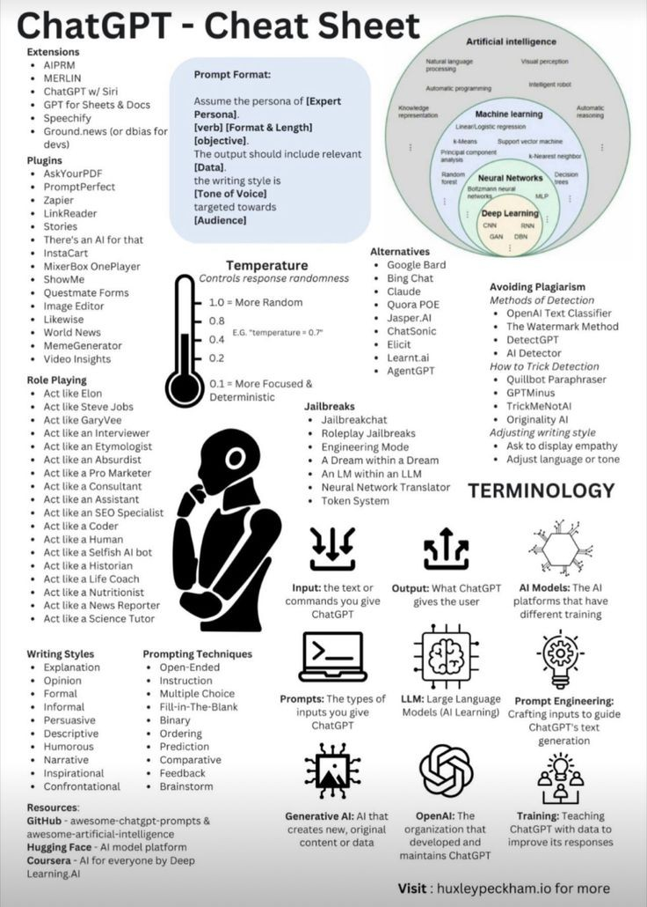

**Source:** [https://twitter.com/i/web/status/1878601021469192572](https://twitter.com/i/web/status/1878601021469192572)
**Original Post Date:** 2025-05-28 06:26:37

# Mastering ChatGPT: Advanced Techniques for Extensions, Plugins, and Prompt Engineering

## Introduction
Large Language Models (LLMs) like ChatGPT have revolutionized conversational AI. This guide provides a structured approach to maximize interaction effectiveness through advanced features including extensions, plugins, specialized personas, writing styles, and prompt engineering techniques.

This knowledge base covers optimization strategies for both novice and experienced users, from basic functionality to cutting-edge customization methods.

## Extensions and Plugin Ecosystem

ChatGPT's ecosystem extends beyond core functionality through various extensions like AIPRM, MERLIN, and GPT for Sheets & Docs. These tools enhance productivity by integrating ChatGPT with existing workflows.

Plugins expand capabilities into specialized domains - AskYourPDF enables document analysis, Zapier connects to automation workflows, and LinkReader processes web content.

> **Note/Tip:** Verify plugin compatibility before integration

> **Note/Tip:** Monitor API usage for cost-effective implementation

## Advanced Prompt Engineering

Structured prompts follow the format: 'Assume persona of [Expert], [verb] [objective]. Include [format & length], use [tone], target [audience]'

Adjust temperature parameter (0.1-1.0) to balance deterministic responses versus creative output

```text/plain
Assume persona of engineering expert.
Analyze system architecture.
Format: 5 bullet points
Tone: Technical
Audience: Senior developers
```

## Ethical Use and Plagiarism Management

Tools like OpenAI Text Classifier, Watermark Method, and DetectGPT help verify original content

Adjust writing style through prompts to ensure authenticity while maintaining desired tone

1. Use plagiarism detection tools for verification
1. Request style adjustments in prompts
1. Implement watermarking where applicable

## Role-Based Interaction and Writing Styles

Utilize personas like 'Act like an Engineer' or 'Act like a Science Tutor' for specialized responses

Choose from 13 distinct writing styles including Formal, Persuasive, Descriptive, and Humorous

> **Note/Tip:** Select roles that align with target audience expertise

> **Note/Tip:** Balance style selection with content requirements

## Technical Alternatives and Resources

Explore alternatives like Google Bard, Claude, or Jasper AI for comparison

Access learning resources via GitHub repositories, Hugging Face models, and Coursera courses

## Key Takeaways

- Structured prompts yield more reliable results than unguided queries
- Temperature parameter significantly influences output randomness vs determinism
- Ethical considerations are crucial when using jailbreak techniques or alternative AI models
- Extension and plugin ecosystem enables integration with existing workflows

## Conclusion
Mastery of ChatGPT requires understanding its advanced features, ethical boundaries, and technical limitations. This guide provides a framework for optimizing interactions through strategic use of extensions, plugins, prompt engineering, and careful consideration of output quality and authenticity.

## External References

- [OpenAI Documentation](https://platform.openai.com/docs/introduction)
- [Hugging Face Model Hub](https://huggingface.co/models)


## Media

**Image Description:** The image is a comprehensive "Cheat Sheet" for **ChatGPT**, a large language model developed by OpenAI. The sheet is designed to provide users with a detailed overview of how to effectively use ChatGPT, including its features, techniques, and best practices. Below is a detailed breakdown of the image:

---

### **Main Sections and Content**

#### **1. Title**
- The title at the top reads: **"ChatGPT - Cheat Sheet"**.
- This indicates that the sheet is a guide to help users optimize their interactions with ChatGPT.

---

#### **2. Extensions**
- A list of extensions that can be used with ChatGPT:
  - **AIPRM**
  - **MERLIN**
  - **ChatGPT w/ Siri**
  - **GPT for Sheets & Docs**
  - **Speechify**
  - **Ground.news (or dbias for devs)**

---

#### **3. Plugins**
- A list of plugins that can enhance the functionality of ChatGPT:
  - **AskYourPDF**
  - **PromptYourPrompt**
  - **PromptPerfect**
  - **Zapier**
  - **Linker**
  - **LinkReader**
  - **InstaCart**
  - **MixerBox OnePlayer**
  - **ShowMe**
  - **ShowMe Forms**
  - **Questmate Forms**
  - **Image Editor**
  - **Video Insights**

---

#### **4. Role Playing**
- A list of personas or roles that ChatGPT can adopt:
  - **Act like Elon**
  - **Act like Steve Jobs**
  - **Act like Gary Vee**
  - **Act like an Interviewer**
  - **Act like an Etymologist**
  - **Act like an Absurdist**
  - **Act like an Engineer**
  - **Act like a Dream within a Dream**
  - **Act like a Consultant**
  - **Act like a Pro Marketer**
  - **Act like a Nutritionist**
  - **Act like a News Reporter**
  - **Act like a Human**
  - **Act like a Selfish AI bot**
  - **Act like a Historian**
  - **Act like a Life Coach**
  - **Act like a Science Tutor**

---

#### **5. Writing Styles**
- A list of writing styles that can be requested from ChatGPT:
  - **Explanation**
  - **Opinion**
  - **Formal**
  - **Informal**
  - **Persuasive**
  - **Descriptive**
  - **Humorous**
  - **Narrative**
  - **Comparative**
  - **Predictive**
  - **Inspirational**
  - **Confrontational**
  - **Brainstorm**

---

#### **6. Prompt Format**
- A section detailing the recommended format for prompts:
  - **Assume the persona of [Expert Personal].**
  - **[verb] [objective].**
  - **[Format & Length]**
  - **[Data].**
  - **[Tone of Voice].**
  - **[Audience].**

---

#### **7. Temperature**
- A visual representation of the temperature parameter, which controls the randomness of responses:
  - **1.0 = More Random**
  - **0.1 = More Focused & Deterministic**
  - A thermometer graphic illustrates the range.

---

#### **8. Alternatives**
- A list of alternative AI models or tools:
  - **Google Bard**
  - **Claude**
  - **Quora**
  - **Jasper AI**
  - **ChatSonic**
  - **Elicit**
  - **Learnt.ai**
  - **AgentGPT**

---

#### **9. Avoiding Plagiarism**
- A section on methods to detect and avoid plagiarism:
  - **Methods of Detection:**
    - **OpenAI Text Classifier**
    - **The Watermark Method**
    - **DetectGPT**
    - **Quillbot Minus Paraphraser**
    - **GPTMinus**
    - **TrickMeNotAI**
    - **Originality AI**
  - **Adjusting Writing Style:**
    - **Ask for display language or tone adjustments.**

---

#### **10. Jailbreaks**
- A list of techniques or prompts to "jailbreak" ChatGPT (i.e., bypass its limitations):
  - **Jailbreak Chat**
  - **Roleplay Jailbreaks**
  - **Engineering Mode**
  - **A Dream within a Dream**
  - **An LM within an LLM**
  - **Neural Network Translator**

---

#### **11. Terminology**
- Definitions of key terms related to AI and ChatGPT:
  - **Input:** The text or commands given to ChatGPT.
  - **Output:** The response generated by ChatGPT.
  - **AI Models:** The AI systems that power ChatGPT.
  - **LLM (Large Language Model):** A type of AI model.
  - **Prompt Engineering:** Crafting inputs to guide ChatGPT's responses.
  - **Generative AI:** AI that creates new, original content.
  - **OpenAI:** The organization behind ChatGPT.
  - **Training:** The process of teaching AI models.

---

#### **12. Writing Styles and Prompting Techniques**
- A section detailing writing styles and prompting techniques:
  - **Writing Styles:**
    - Explanation, Opinion, Formal, Informal, Persuasive, Descriptive, Humorous, Narrative, Comparative, Predictive, Inspirational, Confrontational.
  - **Prompting Techniques:**
    - Open-Ended, Instruction, Multiple Choice, Fill-In-The-Blank, Binary, Ordering, Prediction, Feedback.

---

#### **13. Resources**
- A list of resources for further learning and development:
  - **GitHub:** Repositories for ChatGPT prompts and AI model development.
  - **Hugging Face:** AI model platform.
  - **Coursera:** AI courses for everyone by Deep Learning.

---

#### **14. Visual Elements**
- **Icons and Graphics:**
  - A thermometer graphic for the temperature parameter.
  - A human-like figure with a thought bubble, representing the concept of prompting.
  - Icons for input/output, AI models, and training processes.
  - A circular diagram illustrating the hierarchy of AI concepts (e.g., Natural Language Processing, Machine Learning, Neural Networks, Deep Learning).

---

#### **15. Footer**
- A call to action at the bottom:
  - **Visit: huxleypeekham.io for more.**

---

### **Overall Design**
- The sheet is well-organized into sections, with clear headings and bullet points.
- Visual elements like icons and graphics are used to enhance understanding and break up the text.
- The content is structured to cover a wide range of topics, from basic usage to advanced techniques.

This cheat sheet serves as a comprehensive guide for users looking to maximize their interaction with ChatGPT, covering everything from basic features to advanced strategies.
