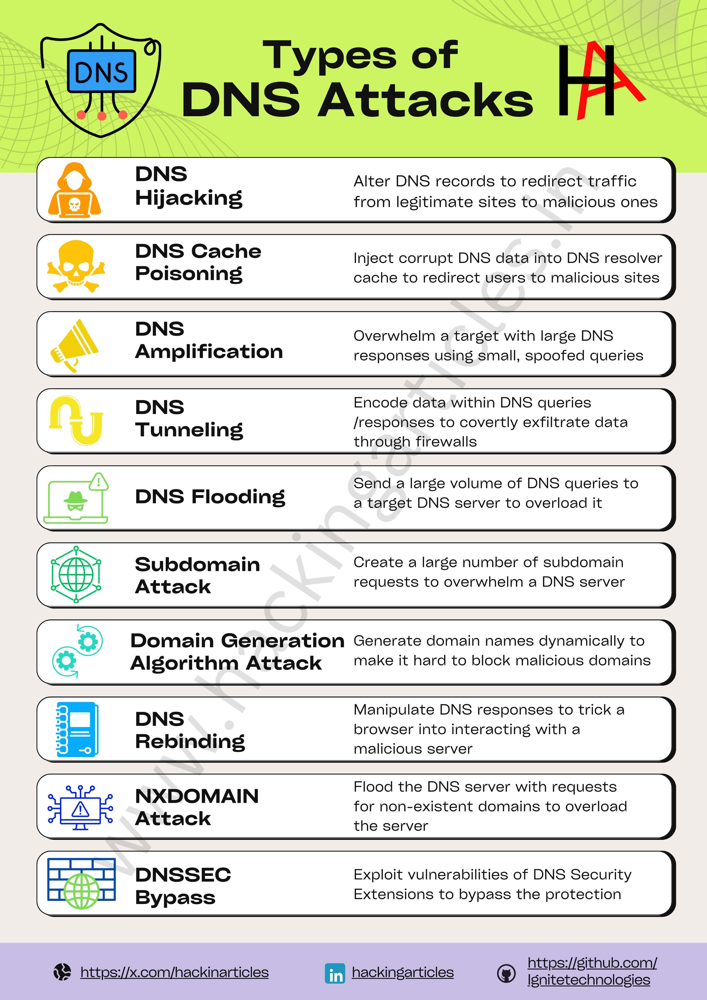

**Source:** [https://twitter.com/i/web/status/1926154369541574751](https://twitter.com/i/web/status/1926154369541574751)
**Original Post Date:** 2025-05-28 09:27:17

# Comprehensive Guide to DNS Attack Types: Understanding Threats and Defenses

## Introduction
DNS (Domain Name System) security is fundamental to network infrastructure integrity. This guide examines twelve major DNS attack types, their mechanisms, and defensive approaches. Understanding these attacks helps organizations implement robust protection against sophisticated cyber threats targeting DNS infrastructure.

## Overview of DNS Attacks

DNS attacks exploit vulnerabilities in the Domain Name System to disrupt services or compromise data integrity. These attacks can be classified into categories based on their objectives: denial-of-service (DoS), data theft, and infrastructure manipulation.

Attackers typically target DNS due to its critical role in network communication, making successful exploitation particularly damaging.

## Key Attack Types

1. DNS Hijacking: Malicious redirection of traffic through record tampering

2. DNS Cache Poisoning: Corrupt data injection into resolver caches

3. DNS Amplification: Exploitation of DNS query response size differences

4. DNS Tunneling: Data exfiltration via DNS queries and responses

1. DNS Flooding
1. Subdomain Attack
1. Domain Generation Algorithm (DGA)
1. DNS Rebinding
1. NXDOMAIN Attacks
1. DNSSEC Bypass

> **Note/Tip:** Regular DNS record audits help detect hijacking attempts

> **Note/Tip:** Implementation of DNSSEC strengthens security against cache poisoning

> **Note/Tip:** Rate limiting can mitigate amplification attacks

> **Note/Tip:** Monitoring for unusual subdomain patterns aids early detection

## Mitigation Strategies

Effective defense requires a multi-layered approach: implementing DNSSEC, deploying WAF solutions, and monitoring traffic patterns.

Organizations should regularly update their security policies to address emerging threats and maintain robust incident response procedures.

## Key Takeaways

- DNS attacks pose significant risks to network infrastructure stability
- Implementation of DNSSEC is crucial for modern security architectures
- Comprehensive monitoring and rate limiting are essential defensive measures
- Regular audits help identify potential vulnerabilities before exploitation

## Conclusion
Understanding these attack types enables organizations to implement targeted defenses. Continuous vigilance, regular updates, and robust security policies remain critical in protecting DNS infrastructure against evolving threats.

## External References

- [X Profile](https://x.com/hackinarticles)
- [LinkedIn Page](hackingarticles)
- [GitHub Repository](https://github.com/IgniteTechnologies)

## Media

**Image Description:** ### Description of the Image

The image is an infographic titled **"Types of DNS Attacks"**, which provides an overview of various DNS (Domain Name System) attack vectors. The infographic is visually organized with a clean, structured layout, using icons, text, and color coding to highlight different types of attacks. Below is a detailed breakdown:

---

#### **Header Section**
- **Title**: The main title, **"Types of DNS Attacks"**, is prominently displayed at the top in bold, black text.
- **DNS Logo**: To the left of the title, there is a shield-shaped icon with the acronym **"DNS"** in a blue box. The shield has a red outline with several red dots connected by lines, symbolizing a network or attack surface.
- **Background**: The background is a gradient of light green, giving the infographic a professional and clean look.

---

#### **Attack Types**
The infographic lists **12 types of DNS attacks**, each presented in a separate section with an icon, title, and description. Below is a detailed breakdown of each section:

1. **DNS Hijacking**
   - **Icon**: A silhouette of a person with a skull and crossbones, indicating a malicious actor.
   - **Description**: "Alter DNS records to redirect traffic from legitimate sites to malicious ones."
   - **Purpose**: This attack involves modifying DNS records to redirect users to malicious websites.

2. **DNS Cache Poisoning**
   - **Icon**: A skull and crossbones symbol, indicating a dangerous attack.
   - **Description**: "Inject corrupt DNS data into DNS resolver cache to redirect users to malicious sites."
   - **Purpose**: This attack involves poisoning the DNS cache to redirect users to malicious sites.

3. **DNS Amplification**
   - **Icon**: A megaphone, symbolizing amplification or amplification of traffic.
   - **Description**: "Overwhelm a target with large DNS responses using small, spoofed queries."
   - **Purpose**: This attack uses small queries to generate large responses, overwhelming the target server.

4. **DNS Tunneling**
   - **Icon**: A chain link, symbolizing data being tunneled or hidden.
   - **Description**: "Encode data within DNS queries/responses to covertly exfiltrate data through firewalls."
   - **Purpose**: This attack uses DNS queries to tunnel data, bypassing firewalls and other security measures.

5. **DNS Flooding**
   - **Icon**: A laptop with a red exclamation mark, indicating a denial-of-service attack.
   - **Description**: "Send a large volume of DNS queries to a target DNS server to overload it."
   - **Purpose**: This attack floods the DNS server with queries, causing it to become unresponsive.

6. **Subdomain Attack**
   - **Icon**: A globe with a grid pattern, indicating domain-related activity.
   - **Description**: "Create a large number of subdomain requests to overwhelm a DNS server."
   - **Purpose**: This attack involves generating a large number of subdomain requests to overload the DNS server.

7. **Domain Generation Algorithm (DGA) Attack**
   - **Icon**: A gear, symbolizing algorithmic generation.
   - **Description**: "Generate domain names dynamically to make it hard to block malicious domains."
   - **Purpose**: This attack uses algorithms to generate new domain names, making it difficult for security systems to block them.

8. **DNS Rebinding**
   - **Icon**: A computer monitor, indicating browser-based attacks.
   - **Description**: "Manipulate DNS responses to trick a browser into interacting with a malicious server."
   - **Purpose**: This attack involves manipulating DNS responses to redirect a browser to a malicious server.

9. **NXDOMAIN Attack**
   - **Icon**: A warning triangle with an exclamation mark, indicating a dangerous attack.
   - **Description**: "Flood the DNS server with requests for non-existent domains to overload the server."
   - **Purpose**: This attack floods the DNS server with requests for non-existent domains, causing it to become overwhelmed.

10. **DNSSEC Bypass**
    - **Icon**: A globe with a shield, indicating security-related issues.
    - **Description**: "Exploit vulnerabilities of DNS Security Extensions to bypass protection."
    - **Purpose**: This attack exploits vulnerabilities in DNSSEC (Domain Name System Security Extensions) to bypass security measures.

---

#### **Footer Section**
- **Social Media Links**: At the bottom, there are links to social media platforms:
  - **X (formerly Twitter)**: `[https://x.com/hackinarticles`](https://x.com/hackinarticles`)
  - **LinkedIn**: `hackingarticles`
  - **GitHub**: `[https://github.com/IgniteTechnologies`](https://github.com/IgniteTechnologies`)
- **Brand Name**: The text **"IgniteTechnologies"** is displayed, indicating the creator or publisher of the infographic.

---

#### **Design Elements**
- **Color Coding**: Each attack type is accompanied by a distinct icon with a specific color (e.g., orange for hijacking, yellow for poisoning, etc.), making the infographic visually engaging and easy to navigate.
- **Typography**: The text is clear and concise, using a mix of bold and regular fonts to emphasize key points.
- **Layout**: The sections are evenly spaced, with a clean and organized structure that enhances readability.

---

### Summary
The infographic provides a comprehensive overview of **12 types of DNS attacks**, each explained with a brief description and an icon. The design is visually appealing, with a focus on clarity and ease of understanding. The footer includes links to social media and the brand name, indicating the source of the content. This infographic is a valuable resource for understanding the various ways DNS systems can be exploited.
