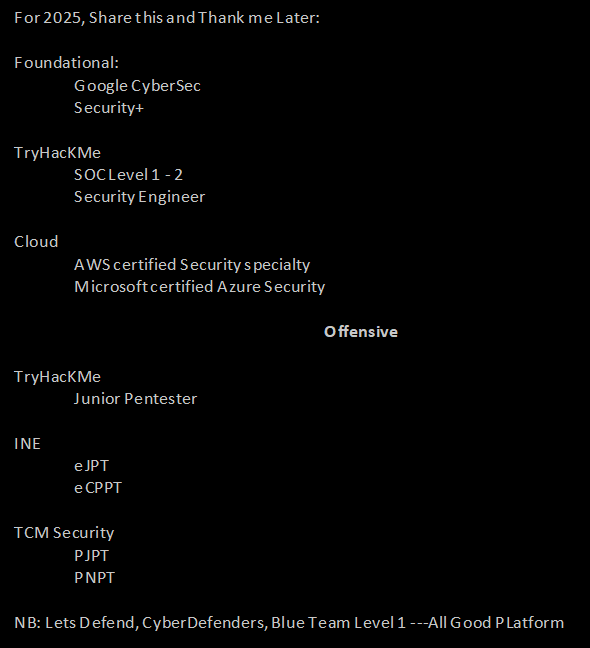

**Source:** [https://twitter.com/i/web/status/1867620426492653977](https://twitter.com/i/web/status/1867620426492653977)
**Original Post Date:** 2025-05-27 15:37:37

# Cybersecurity Threat Prediction Trends & Skills Roadmap: A Comprehensive Guide for 2025

## Introduction
The landscape of cyber threats continues to evolve rapidly, making proactive threat prediction crucial for modern organizations. This guide provides a structured roadmap of cybersecurity certifications and training programs specifically relevant for professionals aiming to enhance their threat prediction capabilities in 2025. From foundational security concepts to specialized cloud security and offensive techniques, this knowledge base item maps out the essential skills needed to stay ahead of emerging cyber threats.

## Foundational Cybersecurity Skills

The foundation of threat prediction begins with core cybersecurity principles. The CompTIA Security+ certification provides comprehensive coverage of security concepts, risk management, and incident response procedures essential for understanding threat vectors.

Google's CyberSec program complements foundational knowledge with practical applications, offering hands-on experience in identifying and mitigating common cyber threats.

- Security+ certification covers 10 key domains of cybersecurity
- Emphasizes threat identification and risk assessment methodologies
- Provides framework for understanding attack surfaces

> **Note/Tip:** Begin with Security+ before advancing to specialized certifications

> **Note/Tip:** Practice real-world scenarios using Google's CyberSec labs

## Cloud Security Specializations

In 2025, cloud environments remain critical targets for cyber threats. The AWS Certified Security - Specialty and Microsoft Certified: Azure Security certifications address platform-specific security challenges.

These specialized credentials demonstrate mastery of securing cloud infrastructure, essential for predicting and mitigating cloud-based threats.

- AWS certification covers IAM, encryption, and compliance frameworks
- Azure Security focuses on hybrid cloud security architectures
- Both certifications emphasize automated threat detection

> **Note/Tip:** Focus on understanding service-specific attack surfaces

> **Note/Tip:** Study recent breaches in public clouds for real-world context

## Offensive Security and Threat Intelligence

Understanding how attackers operate is crucial for effective threat prediction. The TryHackMe Junior Pentester program provides structured penetration testing knowledge, while INE's eJPT/eCPPT certifications offer advanced ethical hacking skills.

TCM Security's PJPT/PNPT programs focus on practical penetration testing scenarios relevant to 2025 security landscapes.

- Junior Pentester program covers basic exploitation techniques
- eJPT focuses on network and system vulnerability assessment
- eCPPT provides advanced offensive security methodologies

> **Note/Tip:** Practice regularly in controlled environments like TryHackMe

> **Note/Tip:** Stay updated with emerging attack vectors and tools

## Blue Team Operations and Threat Response

The Let's Defend platform, CyberDefenders community, and Blue Team Level 1 training provide essential defensive skills. These resources focus on SOC operations, incident response, and threat hunting.

Understanding both offensive and defensive perspectives is crucial for comprehensive threat prediction.

- SOC Level 1 covers basic security monitoring and alert handling
- Blue Team training emphasizes proactive threat detection
- CyberDefenders community offers practical incident response scenarios

> **Note/Tip:** Develop SIEM skills for effective threat hunting

> **Note/Tip:** Study historical incidents to identify recurring patterns

## Key Takeaways

- Master foundational security concepts before specializing in cloud or offensive security domains.
- Balance defensive and offensive knowledge for comprehensive threat prediction capabilities.
- Leverage practical platforms like TryHackMe and Let's Defend for real-world scenario practice.
- Stay current with emerging attack vectors through specialized certifications and continuous learning.

## Conclusion
The ever-evolving nature of cyber threats demands a multi-faceted approach to threat prediction. By following this roadmap, professionals can develop a robust skill set that combines foundational knowledge, cloud security expertise, offensive security understanding, and defensive capabilities. This comprehensive approach will be crucial for identifying and mitigating emerging threats in the 2025 cybersecurity landscape.

## External References

- [CompTIA Security+](https://www.comptia.org/certifications/security)
- [TryHackMe Platform](https://tryhackme.com/)
- [AWS Certified Security - Specialty](https://aws.amazon.com/training-certification/certification/aws-certified-security-specialty/)
- [Microsoft Azure Security Certification](https://docs.microsoft.com/en-us/learn/certifications/microsoft-azure-security-engineer)

## Media

**Image Description:** The image is a text-based document that outlines a structured list of cybersecurity certifications, training programs, and resources, categorized into different sections. The content appears to be organized to guide individuals interested in pursuing a career in cybersecurity, particularly focusing on foundational, cloud, and offensive security skills. Below is a detailed breakdown of the image:

### **Header**
- The text begins with a note:  
  **"For 2025, Share this and Thank me Later:"**  
  This suggests that the content is intended to be informative and valuable for future reference, encouraging sharing and appreciation.

### **Main Sections**
The document is divided into several sections, each focusing on a specific area of cybersecurity:

#### **1. Foundational**
- **Google CyberSec Security+**:  
  This section highlights foundational cybersecurity certifications and training programs.  
  - **Google CyberSec**: Likely refers to Google's cybersecurity training or certification programs.  
  - **Security+**: A widely recognized certification from CompTIA that covers fundamental cybersecurity concepts and practices.

#### **2. TryHackMe**
- **SOC Level 1 - 2**:  
  - **SOC Level 1**: Refers to a Security Operations Center (SOC) Level 1 certification or training, which is typically an introductory course for SOC analysts.  
  - **SOC Level 2**: Likely a more advanced certification or training for SOC analysts, building on the foundational skills from Level 1.  
- **Security Engineer**:  
  This suggests a role or certification related to security engineering, which involves designing and implementing secure systems.

#### **3. Cloud**
- **AWS Certified Security - Specialty**:  
  This is a certification from Amazon Web Services (AWS) that focuses on securing AWS environments. It is a specialized certification for cloud security professionals.  
- **Microsoft Certified: Azure Security**:  
  This is a certification from Microsoft that focuses on securing Azure environments. It is designed for professionals who manage and secure Azure-based systems.

#### **4. Offensive**
- **TryHackMe**:  
  - **Junior Pentester**:  
    This section focuses on offensive security skills, specifically penetration testing.  
    - **Junior Pentester**: Likely refers to a beginner-level penetration tester, indicating training or certification for those starting in ethical hacking or penetration testing.

#### **5. INE**
- **eJPT**:  
  - **eJPT**: Likely refers to an "Ethical Hacker Junior Pentester" certification or training program from INE (Institute of Network Engineers).  
- **eCPPT**:  
  - **eCPPT**: Likely refers to an "Ethical Hacker Certified Penetration Tester" certification or training program from INE. This is a more advanced certification compared to eJPT.

#### **6. TCM Security**
- **PJPT**:  
  - **PJPT**: Likely refers to a "Penetration Tester" certification or training program from TCM Security.  
- **PNPT**:  
  - **PNPT**: Likely refers to a "Penetration Tester" certification or training program from TCM Security, possibly a more advanced or specialized version.

### **Footer**
- **NB (Note)**:  
  - **Let's Defend, CyberDefenders, Blue Team Level 1 -- All Good Platform**:  
    This section mentions resources or platforms related to blue team (defensive) cybersecurity.  
    - **Let's Defend**: Likely a platform or initiative focused on defensive cybersecurity.  
    - **CyberDefenders**: Refers to a community or resource for cybersecurity defenders.  
    - **Blue Team Level 1**: Indicates a beginner-level training or certification for blue team operations.  
    - **All Good Platform**: Suggests a comprehensive platform offering various cybersecurity resources.

### **Overall Structure and Purpose**
The document serves as a roadmap for individuals looking to advance in cybersecurity, covering foundational, cloud, and offensive security skills. It lists certifications, training programs, and resources from reputable organizations such as Google, AWS, Microsoft, INE, and TCM Security. The inclusion of both defensive (blue team) and offensive (penetration testing) skills highlights a balanced approach to cybersecurity education.

### **Key Technical Details**
- **Certifications**:  
  - CompTIA Security+  
  - AWS Certified Security - Specialty  
  - Microsoft Certified: Azure Security  
  - INE eJPT and eCPPT  
  - TCM Security PJPT and PNPT  
- **Training Platforms**:  
  - TryHackMe  
  - INE  
  - TCM Security  
  - Let's Defend, CyberDefenders, Blue Team Level 1  
- **Roles and Levels**:  
  - SOC Level 1 and 2  
  - Security Engineer  
  - Junior Pentester  
  - Penetration Tester (various levels)  

### **Visual Presentation**
- The text is presented in a clean, black-and-white format with a hierarchical structure.  
- Indentations and bullet points are used to organize the content logically.  
- The use of acronyms (e.g., SOC, eJPT, eCPPT) is common, reflecting the technical nature of the content.

### **Conclusion**
The image is a comprehensive guide for aspiring cybersecurity professionals, providing a structured list of certifications, training programs, and resources across foundational, cloud, and offensive security domains. It emphasizes a balanced approach to learning both defensive and offensive skills, making it a valuable resource for individuals looking to advance in the field.
