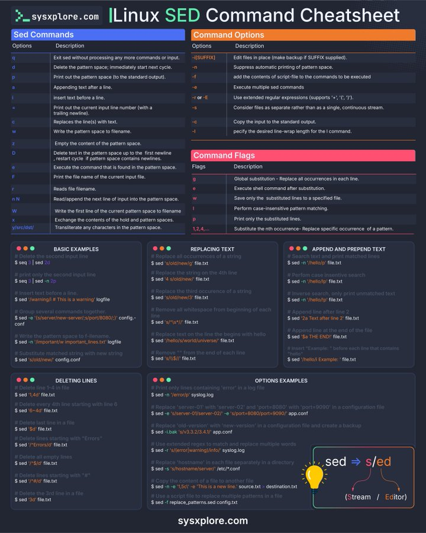

# linux_command_sysadmins_tweet

**Tweet URL:** [https://x.com/thatstraw/status/1881322615945777273](https://x.com/thatstraw/status/1881322615945777273)

**Tweet Text:** Linux sed command for sysadmins

**Image 1 Description:** The infographic, titled "Linux SED Command Cheatsheet," presents a comprehensive guide to using the Sed command in Linux. The cheat sheet is divided into several sections, each focusing on a specific aspect of the Sed command.

**Sed Commands**

*   **Options**
    *   `q`: Exit without processing any more commands or input.
    *   `d`: Delete the pattern space; immediately start the next cycle.
    *   `p`: Print out the pattern space (to the standard output).
    *   `a`: Append text after a line.
*   **Command Options**
    *   `SUFFIX`: Edit files in place (make backup if SUFFIX supplied).
    *   `-n`: Suppress automatic printing of pattern space.
    *   `-f FILE`: Add the contents of script-file to the commands to be executed.

**Basic Examples**

*   `sed 's/old/new/g' file.txt` - Replace all occurrences of "old" with "new" in the file named "file.txt".
*   `sed '/pattern/d' file.txt` - Delete lines that contain the pattern.
*   `sed '1,3d' file.txt` - Delete lines 1 through 3.

**Command Flags**

*   `-r`: Enable extended regular expressions.
*   `-i`: Edit files in place (make backup if SUFFIX supplied).
*   `-n`: Suppress automatic printing of pattern space.
*   `-f FILE`: Add the contents of script-file to the commands to be executed.

**Basic Examples with Flags**

*   `sed -r 's/old/new/g' file.txt` - Replace all occurrences of "old" with "new" in the file named "file.txt", using extended regular expressions.
*   `sed -i '/pattern/d' file.txt` - Delete lines that contain the pattern, editing files in place (make backup if SUFFIX supplied).
*   `sed -n '1,3d' file.txt` - Delete lines 1 through 3, suppressing automatic printing of pattern space.

**Deleting Lines**

*   `sed '/pattern/d' file.txt` - Delete lines that contain the pattern.
*   `sed '1,3d' file.txt` - Delete lines 1 through 3.

**Replacing Text**

*   `sed 's/old/new/g' file.txt` - Replace all occurrences of "old" with "new" in the file named "file.txt".
*   `sed '/pattern/s/old/new/' file.txt` - Replace all occurrences of "old" with "new" on lines that contain the pattern.

**Replacing Text with Flags**

*   `sed -r 's/old/new/g' file.txt` - Replace all occurrences of "old" with "new" in the file named "file.txt", using extended regular expressions.
*   `sed -i '/pattern/s/old/new/' file.txt` - Replace all occurrences of "old" with "new" on lines that contain the pattern, editing files in place (make backup if SUFFIX supplied).

**Replacing Text from Beginning to End**

*   `sed 's/old/new/g' file.txt` - Replace all occurrences of "old" with "new" in the file named "file.txt".
*   `sed '/pattern/s/old/new/' file.txt` - Replace all occurrences of "old" with "new" on lines that contain the pattern.

**Replacing Text from Beginning to End with Flags**

*   `sed -r 's/old/new/g' file.txt` - Replace all occurrences of "old" with "new" in the file named "file.txt", using extended regular expressions.
*   `sed -i '/pattern/s/old/new/' file.txt` - Replace all occurrences of "old" with "new" on lines that contain the pattern, editing files in place (make backup if SUFFIX supplied).

**Replacing Text from Beginning to End**

*   `sed 's/old/new/g' file.txt` - Replace all occurrences of "old" with "new" in the file named "file.txt".
*   `sed '/pattern/s/old/new/' file.txt` - Replace all occurrences of "old" with "new" on lines that contain the pattern.

**Replacing Text from Beginning to End with Flags**

*   `sed -r 's/old/new/g' file.txt` - Replace all occurrences of "old" with "new" in the file named "file.txt", using extended regular expressions.
*   `sed -i '/pattern/s/old/new/' file.txt` - Replace all occurrences of "old" with "new" on lines that contain the pattern, editing files in place (make backup if SUFFIX supplied).

