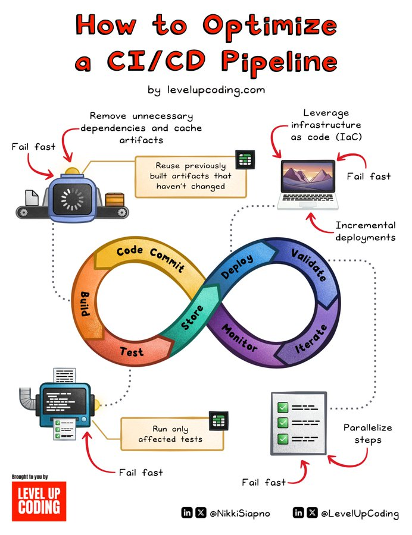

# pipelines_optimize_their_performance

**Tweet URL:** [https://x.com/NikkiSiapno/status/1880865586378571960](https://x.com/NikkiSiapno/status/1880865586378571960)

**Tweet Text:** CI/CD pipelines — How do you optimize their performance?

The first step in optimizing any system is to analyze its processes and identify the bottlenecks and inefficiencies.

A common culprit and one of the most impactful factors for CI/CD pipeline performance is build times.

Whether it's local development or CI/CD pipelines, we've all experienced the pains of slow build times.

But there is a simple solution.

Optimize your build process with a caching tool.

Depot Cache is a tool that I've been very impressed with.

— It caches and reuses build artifacts, saving time across local development and CI/CD pipelines.

— Up to 1,000% faster builds

—  Integrates with almost any CI tool (eg; GitHub Actions, Jenkins, etc)

—  Globally distributed caching ensures fast, consistent performance from anywhere

By eliminating redundant work, Depot Cache speeds up builds dramatically and reduces compute time in CI/CD environments. 

The result? Faster pipelines that lower cloud costs.

Not to mention a better developer experience and more time for better uses than waiting for builds to finish!

It's super simple as well. Simply configure an endpoint and a token, and your builds are ready to go — locally and in your pipelines.

Depot is free to try. Our link will give you a month for free.

Check it out: [https://lucode.co/depot-cache-z7td…](https://lucode.co/depot-cache-z7td…)

Another common cause of poor performance is the lack of parallelism. Identify processes running in sequence and determine if they can run in parallel.

The order of test execution also impacts performance. Balance early feedback with efficiency, and where possible, run only tests relevant to the changes—but avoid overcomplicating your test suite.

Lastly, ensure your infrastructure can support the pipeline with adequate resources and scalability.

An optimized CI/CD pipeline is crucial for productivity, so invest time to ensure it runs smoothly and efficiently.

~~
Thank you to our partner 
@depotdev
 who keeps our content free to the community.

**Image 1 Description:** The infographic, titled "How to Optimize a CI/CD Pipeline," presents a comprehensive guide to optimizing Continuous Integration (CI) and Continuous Deployment (CD) pipelines. The title is prominently displayed in red text at the top of the image.

**Visual Representation:**

The infographic features a central infinity symbol, divided into two loops that intersect with each other. Each loop represents a different phase in the CI/CD pipeline:

*   **Build Loop:** This loop is colored orange and contains the following steps:
    *   Build
    *   Test
    *   Code Commit
*   **Deploy Loop:** This loop is colored purple and includes the following stages:
    *   Deploy
    *   Validate
    *   Monitor

**Key Takeaways:**

The infographic provides several key takeaways for optimizing a CI/CD pipeline:

*   Remove unnecessary dependencies and cache artifacts to improve build efficiency.
*   Reuse previously built artifacts that haven't changed to reduce rebuild times.
*   Leverage infrastructure as code (IaC) to automate provisioning and configuration of infrastructure resources.
*   Fail fast by detecting errors early in the pipeline to prevent downstream failures.
*   Run only affected tests to minimize test execution time.
*   Parallelize steps to optimize resource utilization and reduce overall build time.

**Additional Tips:**

The infographic also offers additional tips for optimizing a CI/CD pipeline:

*   Use automated testing tools to ensure code quality and catch errors early.
*   Implement continuous monitoring and logging to track pipeline performance and identify bottlenecks.
*   Utilize containerization technologies like Docker to package applications and dependencies efficiently.

**Conclusion:**

In conclusion, the infographic provides a clear and concise guide to optimizing a CI/CD pipeline. By following these best practices, organizations can improve their build efficiency, reduce test execution time, and enhance overall code quality. The visual representation of the infinity symbol makes it easy to understand the different phases involved in a CI/CD pipeline and how they intersect with each other. Overall, this infographic is a valuable resource for anyone looking to optimize their CI/CD pipeline and improve their software development process.

