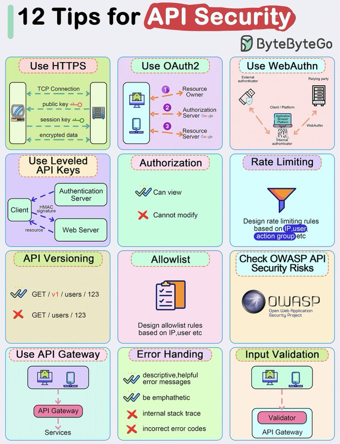

# tips_security_tweet_text

**Tweet URL:** [https://x.com/alexxubyte/status/1875950678922924142](https://x.com/alexxubyte/status/1875950678922924142)

**Tweet Text:** Top 12 Tips for API Security

**Image 1 Description:** The image presents a comprehensive guide to API security, featuring 12 tips for ensuring the safety and integrity of application programming interfaces (APIs). The infographic is divided into 12 distinct sections, each focusing on a specific aspect of API security.

*   **Use HTTPS**
    *   This section emphasizes the importance of using HTTPS (Hypertext Transfer Protocol Secure) to encrypt data transmitted between clients and servers.
    *   It highlights the benefits of using HTTPS, including:
        +   Encryption of sensitive data
        +   Protection against eavesdropping and tampering
        +   Verification of identity through certificates
*   **Use OAuth2**
    *   This section discusses the use of OAuth 2.0 (Open Authorization) for secure authentication and authorization.
    *   It explains how OAuth 2.0 works, including:
        +   Client registration and authorization
        +   Token issuance and validation
        +   Scope management and delegation
*   **Use WebAuthn**
    *   This section introduces Web Authentication (WebAuthn), a modern authentication standard that provides strong security for APIs.
    *   It highlights the benefits of using WebAuthn, including:
        +   Passwordless authentication
        +   Public key-based authentication
        +   Support for multiple authentication methods
*   **Use Leveled API Keys**
    *   This section discusses the use of leveled API keys to manage access and authorization in APIs.
    *   It explains how leveled API keys work, including:
        +   Key hierarchy and scoping
        +   Access control and permissions
        +   Revocation and rotation
*   **Authorization**
    *   This section focuses on authorization mechanisms for APIs, including:
        +   Role-based access control (RBAC)
        +   Attribute-based access control (ABAC)
        +   OAuth 2.0 scopes and permissions
*   **Rate Limiting**
    *   This section discusses the importance of rate limiting in API security, including:
        +   IP blocking and throttling
        +   Request limiters and quotas
        +   Traffic shaping and policing
*   **API Versioning**
    *   This section emphasizes the need for versioning APIs to manage backwards compatibility and ensure smooth upgrades.
    *   It highlights best practices for API versioning, including:
        +   Semantic versioning (SemVer)
        +   API gateways and proxies
        +   Deprecation and removal of old versions
*   **Allowlisting**
    *   This section discusses the use of allowlisting to restrict access to APIs based on IP addresses or other criteria.
    *   It explains how allowlisting works, including:
        +   IP filtering and blocking
        +   DNS-based filtering
        +   Cloud-based security services
*   **Error Handling**
    *   This section focuses on error handling mechanisms for APIs, including:
        +   Error codes and messages
        +   Logging and monitoring
        +   Alerting and notification systems
*   **Input Validation**
    *   This section emphasizes the importance of input validation in API security, including:
        +   Data type checking and sanitization
        +   SQL injection protection
        +   Cross-site scripting (XSS) prevention
*   **API Gateway**
    *   This section discusses the role of API gateways in securing APIs, including:
        +   Traffic management and routing
        +   Authentication and authorization
        +   Rate limiting and quota management

In summary, this infographic provides a comprehensive guide to API security, covering topics such as HTTPS, OAuth 2.0, WebAuthn, leveled API keys, authorization, rate limiting, API versioning, allowlisting, error handling, input validation, and API gateways. By following these tips, developers can ensure the safety and integrity of their APIs and protect against common threats and vulnerabilities.

