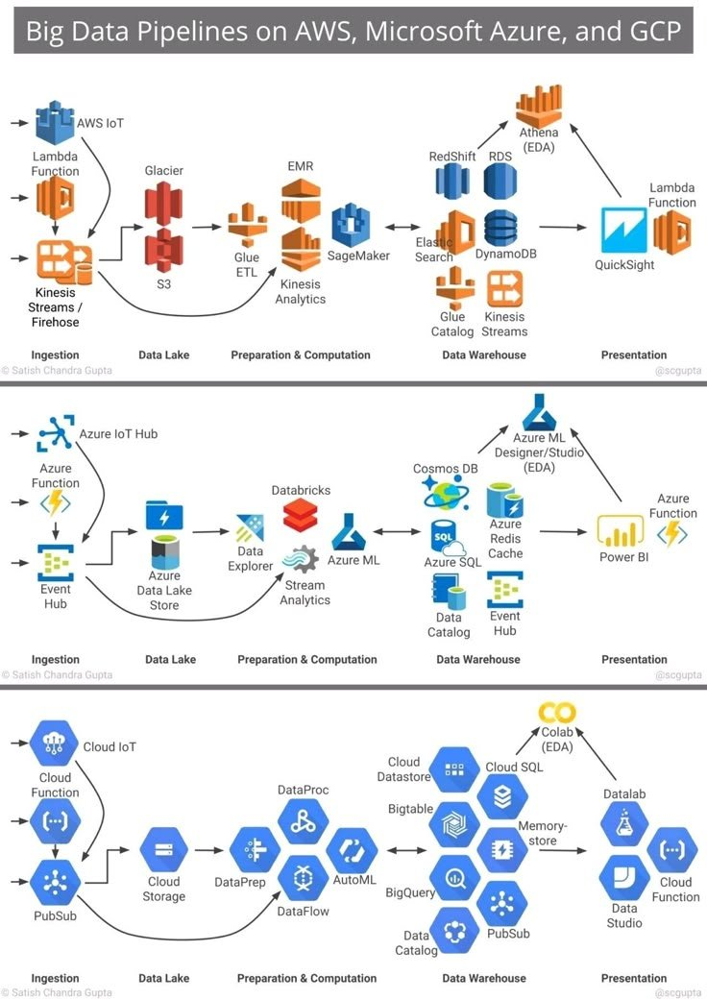

# Big Data Pipelines

## Description
Big Data piplines on AWS, Microsoft Azure and GCP...

## Content
Big Data piplines on AWS, Microsoft Azure and GCP

## Category Information

- Main Category: data_engineering
- Sub Category: big_data
- Item Name: big_data_pipelines

## Source

- Original Tweet: [https://twitter.com/i/web/status/1889525335919587604](https://twitter.com/i/web/status/1889525335919587604)
- Date: 2025-02-20 15:36:34

## Media

### Media 1

**Description:** The image presents a comprehensive overview of big data pipelines on AWS, Microsoft Azure, and Google Cloud Platform (GCP). The infographic is divided into three sections, each representing one of the cloud providers.

*   **AWS Section**
    *   The top section focuses on Amazon Web Services (AWS).
        *   It includes various tools and services such as Athena (EDA), Redshift, RDS, DynamoDB, QuickSight, Lambda Function, S3, EMR, SageMaker, Kinesis Analytics, Glue ETL, Firehose.
    *   The section is organized into four main categories: Ingestion, Data Lake, Preparation & Computation, and Data Warehouse.
        *   In the ingestion category, it highlights the use of S3 as a data lake and Lambda Function for data processing.
        *   The preparation & computation category showcases EMR for big data processing and SageMaker for machine learning model training.
        *   Finally, the data warehouse section features Redshift and QuickSight for data analysis and visualization.
*   **Azure Section**
    *   The middle section is dedicated to Microsoft Azure.
        *   It includes various tools and services such as Cosmos DB, Redis Cache, SQL Server, Event Hub, Power BI, Databricks, Data Lake Store, Stream Analytics, AutoML, BigQuery, PubSub.
    *   Similar to the AWS section, this one is also organized into four main categories: Ingestion, Data Lake, Preparation & Computation, and Data Warehouse.
        *   In the ingestion category, it highlights the use of Event Hub for real-time data processing and Cosmos DB for NoSQL database management.
        *   The preparation & computation category showcases Databricks for big data processing and AutoML for automated machine learning model training.
        *   Finally, the data warehouse section features SQL Server for relational databases and Power BI for business intelligence and analytics.
*   **GCP Section**
    *   The bottom section focuses on Google Cloud Platform (GCP).
        *   It includes various tools and services such as BigQuery, PubSub, Dataflow, AutoML, Colab (EDA), Datalab, Cloud Function, Cloud Storage, Cloud Dataproc.
    *   Like the previous sections, this one is also organized into four main categories: Ingestion, Data Lake, Preparation & Computation, and Data Warehouse.
        *   In the ingestion category, it highlights the use of PubSub for messaging and BigQuery for big data processing.
        *   The preparation & computation category showcases AutoML for automated machine learning model training and Colab (EDA) for exploratory data analysis.
        *   Finally, the data warehouse section features Datalab for collaborative development and Cloud Function for serverless computing.

In summary, the infographic provides a detailed comparison of big data pipelines on AWS, Microsoft Azure, and Google Cloud Platform. Each section highlights the unique tools and services offered by each cloud provider, organized into four main categories: ingestion, data lake, preparation & computation, and data warehouse.

*Last updated: 2025-02-20 15:36:34*