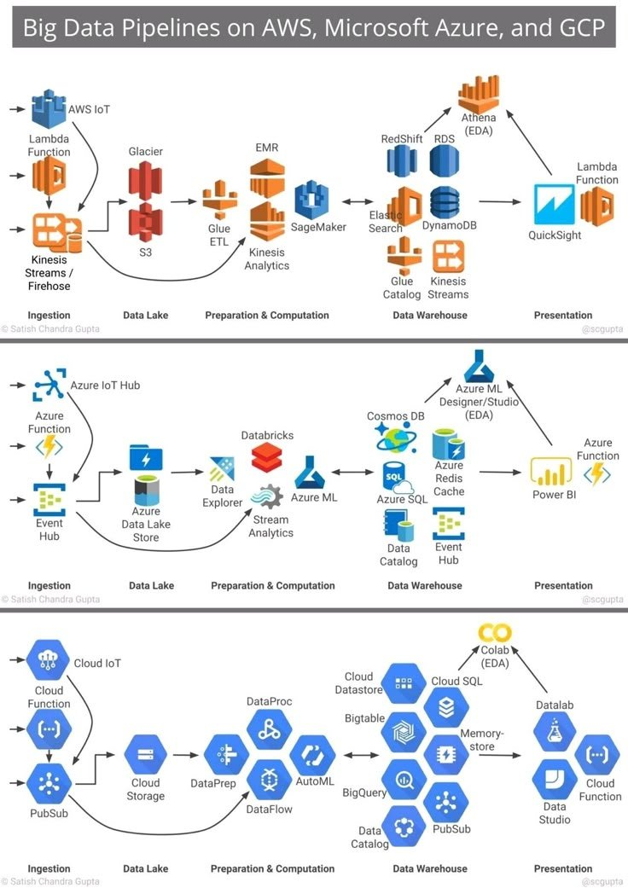

Big data pipelines are a crucial component of modern data engineering, enabling organizations to process, analyze, and visualize large volumes of data from various sources. This knowledge base entry provides an overview of big data pipelines on Amazon Web Services (AWS), Microsoft Azure, and Google Cloud Platform (GCP), highlighting the unique tools and services offered by each cloud provider.

## Technical Content
Big data pipelines involve a series of processes, including ingestion, data lake management, preparation and computation, and data warehousing. The following sections delve into the specifics of each cloud provider's offerings in these areas.

### AWS Big Data Pipelines
AWS provides a wide range of tools and services for building big data pipelines. These can be broadly categorized into four main areas:
* **Ingestion**: AWS offers several services for ingesting data, including S3 for data lakes and Lambda Function for real-time data processing.
* **Data Lake**: S3 is used as a data lake, providing a centralized repository for storing raw, unprocessed data.
* **Preparation & Computation**: EMR is utilized for big data processing, while SageMaker is employed for machine learning model training.
* **Data Warehouse**: Redshift and QuickSight are used for data analysis and visualization.

Example: A company using AWS might ingest log data from their web application into S3, process it using Lambda Function, and then store the processed data in Redshift for analysis with QuickSight.

### Azure Big Data Pipelines
Microsoft Azure also offers a comprehensive set of tools and services for big data pipelines, categorized as follows:
* **Ingestion**: Event Hub is used for real-time data processing, and Cosmos DB is utilized for NoSQL database management.
* **Data Lake**: Data Lake Store provides a centralized repository for raw, unprocessed data.
* **Preparation & Computation**: Databricks is employed for big data processing, and AutoML is used for automated machine learning model training.
* **Data Warehouse**: SQL Server is used for relational databases, and Power BI is utilized for business intelligence and analytics.

Example: An organization on Azure might ingest IoT sensor data into Event Hub, process it using Databricks, and then analyze the processed data with Power BI.

### GCP Big Data Pipelines
Google Cloud Platform provides a robust set of tools and services for big data pipelines, including:
* **Ingestion**: PubSub is used for messaging, and BigQuery is employed for big data processing.
* **Data Lake**: Cloud Storage serves as a centralized repository for raw, unprocessed data.
* **Preparation & Computation**: AutoML is utilized for automated machine learning model training, and Colab (EDA) is used for exploratory data analysis.
* **Data Warehouse**: Datalab is employed for collaborative development, and Cloud Function is used for serverless computing.

Example: A startup on GCP might ingest social media data into PubSub, process it using BigQuery, and then train a machine learning model with AutoML.

## Key Takeaways and Best Practices
When designing big data pipelines on AWS, Azure, or GCP, consider the following best practices:
* **Choose the right tools**: Select services that align with your specific use case and requirements.
* **Optimize for cost**: Ensure that your pipeline is cost-effective by choosing the appropriate pricing model and optimizing resource utilization.
* **Monitor and maintain**: Regularly monitor your pipeline's performance and maintain it to ensure data quality and integrity.

## References
This knowledge base entry references various tools and technologies from AWS, Microsoft Azure, and GCP. For more information on these services, refer to the official documentation of each cloud provider:
* [AWS Documentation](https://aws.amazon.com/documentation/)
* [Microsoft Azure Documentation](https://docs.microsoft.com/en-us/azure/)
* [GCP Documentation](https://cloud.google.com/docs)
## Source

- Original Tweet: [https://twitter.com/i/web/status/1889525335919587604](https://twitter.com/i/web/status/1889525335919587604)
- Date: 2025-02-20 16:43:19

## Media

### Media 1

**Description:** The image presents a comprehensive overview of big data pipelines on AWS, Microsoft Azure, and Google Cloud Platform (GCP). The infographic is divided into three sections, each representing one of the cloud providers.

*   **AWS Section**
    *   The top section focuses on Amazon Web Services (AWS).
        *   It includes various tools and services such as Athena (EDA), Redshift, RDS, DynamoDB, QuickSight, Lambda Function, S3, EMR, SageMaker, Kinesis Analytics, Glue ETL, Firehose.
    *   The section is organized into four main categories: Ingestion, Data Lake, Preparation & Computation, and Data Warehouse.
        *   In the ingestion category, it highlights the use of S3 as a data lake and Lambda Function for data processing.
        *   The preparation & computation category showcases EMR for big data processing and SageMaker for machine learning model training.
        *   Finally, the data warehouse section features Redshift and QuickSight for data analysis and visualization.
*   **Azure Section**
    *   The middle section is dedicated to Microsoft Azure.
        *   It includes various tools and services such as Cosmos DB, Redis Cache, SQL Server, Event Hub, Power BI, Databricks, Data Lake Store, Stream Analytics, AutoML, BigQuery, PubSub.
    *   Similar to the AWS section, this one is also organized into four main categories: Ingestion, Data Lake, Preparation & Computation, and Data Warehouse.
        *   In the ingestion category, it highlights the use of Event Hub for real-time data processing and Cosmos DB for NoSQL database management.
        *   The preparation & computation category showcases Databricks for big data processing and AutoML for automated machine learning model training.
        *   Finally, the data warehouse section features SQL Server for relational databases and Power BI for business intelligence and analytics.
*   **GCP Section**
    *   The bottom section focuses on Google Cloud Platform (GCP).
        *   It includes various tools and services such as BigQuery, PubSub, Dataflow, AutoML, Colab (EDA), Datalab, Cloud Function, Cloud Storage, Cloud Dataproc.
    *   Like the previous sections, this one is also organized into four main categories: Ingestion, Data Lake, Preparation & Computation, and Data Warehouse.
        *   In the ingestion category, it highlights the use of PubSub for messaging and BigQuery for big data processing.
        *   The preparation & computation category showcases AutoML for automated machine learning model training and Colab (EDA) for exploratory data analysis.
        *   Finally, the data warehouse section features Datalab for collaborative development and Cloud Function for serverless computing.

In summary, the infographic provides a detailed comparison of big data pipelines on AWS, Microsoft Azure, and Google Cloud Platform. Each section highlights the unique tools and services offered by each cloud provider, organized into four main categories: ingestion, data lake, preparation & computation, and data warehouse.

*Last updated: 2025-02-20 16:43:19*