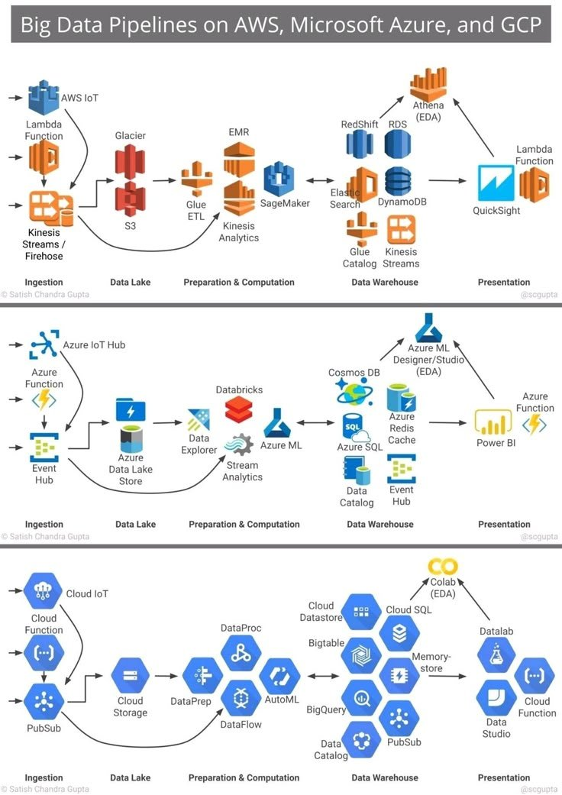

**Source:** [https://twitter.com/i/web/status/1889525335919587604](https://twitter.com/i/web/status/1889525335919587604)
**Original Post Date:** 2025-05-28 02:48:50

# Cloud Platform Big Data Pipeline Architecture: AWS vs Azure vs GCP

## Introduction
Big data pipelines are critical infrastructure components for modern data-driven applications. This knowledge base item provides a comprehensive analysis of how AWS, Azure, and GCP implement these pipelines, comparing key services at each stage from data collection to presentation. Understanding these differences enables informed platform selection based on specific architectural requirements.

## Ingestion Layer Comparison

All platforms offer robust real-time ingestion capabilities through specialized services. AWS uses Kinesis Streams/Firehose and IoT for data streaming, Azure leverages Event Hub and IoT Hub, while GCP utilizes Pub/Sub.

Serverless processing is available across all platforms: AWS Lambda, Azure Functions, and GCP Cloud Functions enable event-driven architectures without managing infrastructure.

- AWS Kinesis Streams/Firehose for real-time streaming
- Azure Event Hub for high-throughput ingestion
- GCP Pub/Sub for decoupled messaging

> **Note/Tip:** Consider stream volume and latency requirements when selecting an ingestion service.

> **Note/Tip:** Use serverless processing to reduce operational overhead.

## Data Lake Architecture

Each platform provides scalable object storage for raw data: AWS S3, Azure Data Lake Store, and GCP Cloud Storage. These form the foundation of enterprise-scale data lakes.

Long-term archival solutions are available through AWS Glacier, Azure Archive Storage, and GCP Coldline.

1. Design for immutable storage patterns to optimize costs
1. Implement proper access controls at the object level

## Processing and Computation

Big data processing frameworks are supported across all platforms: AWS EMR, Azure Databricks, and GCP DataProc. Each enables Hadoop, Spark, and other distributed computing paradigms.

Machine learning capabilities vary: AWS SageMaker, Azure ML, and GCP AutoML provide different levels of automation for model training.

- EMR offers managed Hadoop/Spark clusters
- Databricks provides unified analytics platform
- DataProc enables serverless Spark processing

## Analytics and Visualization

Each platform offers comprehensive data warehousing solutions: AWS Redshift, Azure SQL DW, and GCP BigQuery. These provide optimized query performance for large datasets.

Visualization tools differ by platform but all support interactive dashboards: AWS QuickSight, Azure Power BI, and GCP Data Studio.

## Key Takeaways

- Choose ingestion services based on data velocity and volume requirements
- Data lake storage should be designed for immutability and scalability
- Processing frameworks selection depends on existing ecosystem compatibility
- Analytics capabilities should align with specific query patterns and performance needs

## Conclusion
Understanding the nuances of big data pipeline implementation across AWS, Azure, and GCP is crucial for architecting scalable solutions. Each platform offers unique strengths in different areas, requiring careful evaluation based on specific use case requirements.

## External References

- [AWS Big Data Reference Architecture](https://aws.amazon.com/architecture/well-architected/framework/big-data/)
- [Azure Big Data Solutions Guide](https://azure.microsoft.com/en-us/solutions/data-and-analytics/azure-big-data-solution/)
- [GCP BigQuery Documentation](https://cloud.google.com/bigquery/docs)

## Media

**Image Description:** The image is a detailed comparison of **Big Data Data Pipelines** on three major cloud platforms: **AWS**, **Microsoft Azure**, and **Google Cloud Platform (GCP)**. It illustrates the typical stages of a big data pipeline, including **Ingestion**, **Data Lake**, **Preparation & Computation**, **Data Warehouse**, and **Presentation**. Each stage is represented with specific services offered by the respective cloud providers. Below is a detailed breakdown of the image:

---

### **Overall Structure**
The image is divided into three sections, each representing one of the cloud platforms:
1. **AWS** (Top section)
2. **Microsoft Azure** (Middle section)
3. **Google Cloud Platform (GCP)** (Bottom section)

Each section follows the same flow of stages in a big data pipeline:
- **Ingestion**: Data collection and initial processing.
- **Data Lake**: Storage of raw data.
- **Preparation & Computation**: Data transformation, processing, and analysis.
- **Data Warehouse**: Structured storage for analytics.
- **Presentation**: Visualization and reporting.

---

### **AWS Section**
#### **Ingestion**
- **AWS IoT**: Handles IoT data ingestion.
- **Kinesis Streams / Firehose**: Real-time data streaming and batch data ingestion.
- **Lambda IoT**: Serverless functions for IoT data processing.

#### **Data Lake**
- **S3 (Simple Storage Service)**: Primary storage for raw data.
- **Glacier**: Long-term archival storage for less frequently accessed data.
- **ETL (Extract, Transform, Load)**: Data transformation process.

#### **Preparation & Computation**
- **EMR (Elastic MapReduce)**: Big data processing framework for Hadoop, Spark, etc.
- **Glue**: ETL service for data preparation and cataloging.
- **SageMaker**: Machine learning platform for model training and deployment.

#### **Data Warehouse**
- **RedShift**: Fully managed data warehouse for analytics.
- **RDS (Relational Database Service)**: Managed relational databases.
- **DynamoDB**: NoSQL database for fast and scalable storage.
- **Elasticsearch**: Search and analytics engine.

#### **Presentation**
- **Athena**: Interactive SQL queries on S3 data.
- **QuickSight**: Business intelligence and visualization tool.

---

### **Microsoft Azure Section**
#### **Ingestion**
- **Azure IoT Hub**: Handles IoT data ingestion.
- **Event Hub**: Real-time data streaming and ingestion.
- **Azure Function**: Serverless functions for event-driven processing.

#### **Data Lake**
- **Azure Data Lake Store**: Primary storage for raw data.
- **Databricks**: Unified analytics platform for big data processing.
- **Azure Data Explorer**: Interactive analytics for large-scale data.

#### **Preparation & Computation**
- **Databricks**: Big data processing and analytics.
- **Azure ML (Machine Learning)**: Platform for model training and deployment.
- **Azure SQL**: Managed relational database.
- **Azure Redis Cache**: In-memory data store for caching.

#### **Data Warehouse**
- **Cosmos DB**: Globally distributed NoSQL database.
- **Azure SQL Data Warehouse**: Managed data warehouse for analytics.

#### **Presentation**
- **Power BI**: Business intelligence and visualization tool.
- **Azure Designer ML**: Studio for machine learning model development.

---

### **Google Cloud Platform (GCP) Section**
#### **Ingestion**
- **Cloud IoT**: Handles IoT data ingestion.
- **Pub/Sub**: Real-time data streaming and messaging.
- **Cloud Function**: Serverless functions for event-driven processing.

#### **Data Lake**
- **Cloud Storage**: Primary storage for raw data.
- **DataFlow**: Data processing pipeline for batch and streaming data.
- **DataPrep**: Data preparation and transformation tool.

#### **Preparation & Computation**
- **DataProc**: Big data processing framework for Hadoop, Spark, etc.
- **AutoML**: Automated machine learning for model training.
- **BigQuery**: Fully managed data warehouse for analytics.
- **Bigtable**: NoSQL database for large-scale storage.

#### **Data Warehouse**
- **Cloud SQL**: Managed relational database.
- **Memory-Store**: In-memory data store for caching.
- **Datalab**: Interactive data science and machine learning environment.

#### **Presentation**
- **Colab (Google Colaboratory)**: Jupyter notebook environment for data analysis and visualization.
- **Data Studio**: Business intelligence and visualization tool.

---

### **Key Observations**
1. **Ingestion Layer**: All platforms offer robust IoT data ingestion and real-time streaming capabilities.
2. **Data Lake Layer**: Each platform provides scalable storage solutions for raw data (e.g., S3, Data Lake Store, Cloud Storage).
3. **Preparation & Computation Layer**: All platforms support big data processing frameworks (e.g., EMR, Databricks, DataProc) and machine learning services (e.g., SageMaker, Azure ML, AutoML).
4. **Data Warehouse Layer**: Each platform offers managed data warehouses (e.g., RedShift, SQL Data Warehouse, BigQuery) and NoSQL databases (e.g., DynamoDB, Cosmos DB, Bigtable).
5. **Presentation Layer**: All platforms provide visualization and reporting tools (e.g., QuickSight, Power BI, Data Studio).

---

### **Visual Representation**
- **Icons and Colors**: Each service is represented by a unique icon and color, making it easy to distinguish between services across platforms.
- **Arrows**: Arrows indicate the flow of data between stages and services.
- **Consistent Structure**: The flow of the pipeline is consistent across all three platforms, highlighting the similarities in the big data pipeline architecture.

---

### **Conclusion**
The image provides a comprehensive comparison of how AWS, Azure, and GCP handle big data pipelines, showcasing the services and tools available at each stage. It is a valuable resource for understanding the ecosystem of big data solutions offered by these cloud providers.
