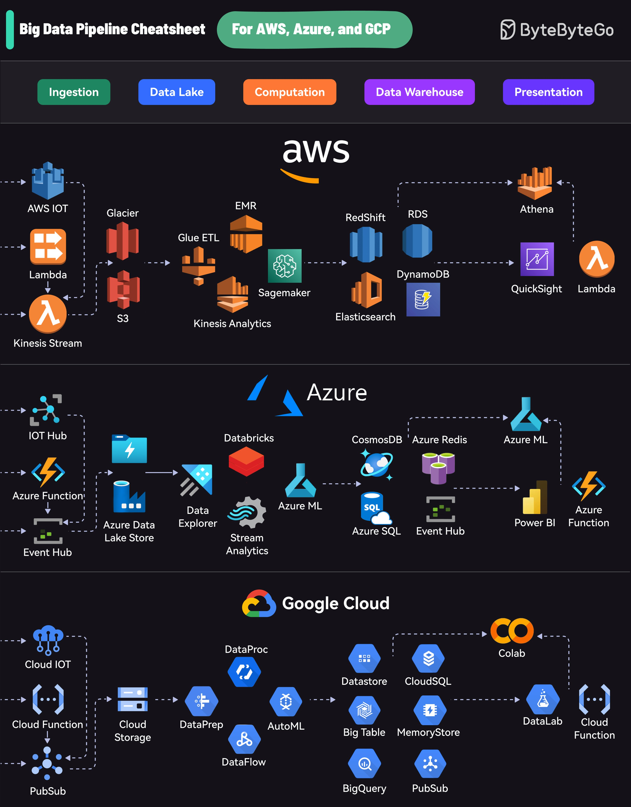

**Source:** [https://twitter.com/i/web/status/1872514002468929826](https://twitter.com/i/web/status/1872514002468929826)
**Original Post Date:** 2025-05-28 04:52:17

# Big Data Pipeline Services Across AWS, Azure, and GCP

## Introduction
In modern enterprise architectures, building efficient big data pipelines is crucial for processing and analyzing large-scale datasets. This knowledge base article provides an expert-level comparison of pipeline components across AWS, Azure, and GCP, focusing on six critical stages: Ingestion, Data Lake Storage, Computation, Data Warehouse, and Presentation (twice). Understanding these ecosystems enables architects to make informed decisions when designing scalable data solutions.

## AWS Pipeline Components

AWS offers a comprehensive suite of services for big data pipelines. The ingestion layer leverages AWS IoT for device data, Lambda for serverless processing, and Kinesis Stream for real-time streaming. Data Lake storage primarily uses S3 with Glacier for archival needs.

Computation is handled through Glue ETL for batch processing, EMR for Hadoop/Spark workloads, and SageMaker for machine learning tasks. The presentation layer combines Athena for SQL queries on S3 data and QuickSight for visualization.

- Ingestion: IoT, Lambda, Kinesis Stream
- Data Lake: S3, Glacier
- Computation: Glue ETL, EMR, SageMaker
- Presentation: Athena, QuickSight

> **Note/Tip:** Consider S3 Lifecycle policies for cost optimization in data lake storage

## Azure Pipeline Components

Azure's pipeline services focus on integration and hybrid scenarios. IoT Hub handles device data, Event Hub processes real-time streams, and Azure Functions provides serverless compute capabilities.

The computation layer utilizes Databricks for analytics and Azure ML for machine learning workflows. Data storage leverages Cosmos DB for global distribution and Azure SQL for relational workloads.

- Ingestion: IoT Hub, Event Hub, Functions
- Data Lake: Azure Data Lake Store
- Computation: Databricks, Azure ML
- Presentation: Power BI

> **Note/Tip:** Leverage Azure Synapse for unified analytics across data sources

## GCP Pipeline Components

Google Cloud's approach emphasizes simplicity and scalability. Pub/Sub handles real-time streaming, DataProc manages big data processing, and BigQuery offers serverless SQL analytics.

The platform integrates well with AI/ML through AutoML and offers cost-effective storage solutions via Cloud Storage. Interactive analysis is supported by Colab notebooks and DataLab.

- Ingestion: Pub/Sub, Functions
- Data Lake: Cloud Storage
- Computation: DataProc, BigQuery ML
- Presentation: Colab, DataLab

> **Note/Tip:** Utilize BigQuery's partitioning and clustering for query performance optimization

## Key Takeaways

- Each cloud provider offers similar service categories but with unique implementation approaches
- Data ingestion patterns differ by platform (Kinesis vs Event Hub vs Pub/Sub)
- Computation frameworks vary significantly in terms of flexibility and cost model
- Cross-platform knowledge enables optimal cloud selection based on specific use cases

## Conclusion
Understanding the ecosystem differences between AWS, Azure, and GCP is crucial for designing efficient big data pipelines. Architects should evaluate their specific requirements against each provider's strengths to make informed decisions about platform selection and service usage.

## External References

- [AWS Big Data Services](https://aws.amazon.com/big-data/)
- [Azure Big Data Analytics](https://azure.microsoft.com/en-us/services/data-management-analytics/)
- [GCP BigQuery Overview](https://cloud.google.com/bigquery)

## Media

**Image Description:** ### Description of the Image

The image is a comprehensive **Big Data Pipeline Cheatsheet** designed for **AWS, Azure, and GCP (Google Cloud Platform)**. It provides an overview of the key services and tools used in each cloud provider's ecosystem for building and managing big data pipelines. The pipeline is divided into six main stages: **Ingestion**, **Data Lake**, **Computation**, **Data Warehouse**, **Presentation**, and **Presentation**. Each stage is represented by a colored box at the top of the image, and the services are organized under each cloud provider (AWS, Azure, and GCP).

---

### **Main Structure and Layout**

1. **Header Section:**
   - The title at the top reads: **"Big Data Pipeline Cheatsheet"**.
   - It specifies that the cheatsheet is for **AWS, Azure, and GCP**.
   - The logo of **ByteByteGo** is present in the top-right corner.

2. **Pipeline Stages:**
   - The stages are represented by colored boxes at the top:
     - **Ingestion** (Green)
     - **Data Lake** (Blue)
     - **Computation** (Orange)
     - **Data Warehouse** (Purple)
     - **Presentation** (Purple)

3. **Cloud Providers:**
   - The image is divided into three sections, each representing one of the cloud providers:
     - **AWS**
     - **Azure**
     - **Google Cloud**

---

### **Detailed Breakdown by Cloud Provider**

#### **1. AWS Section**
   - **Ingestion:**
     - **AWS IoT**: Handles IoT data ingestion.
     - **Lambda**: Serverless compute for event-driven workflows.
     - **Kinesis Stream**: Real-time data streaming service.
   - **Data Lake:**
     - **S3 (Simple Storage Service)**: Primary storage for data lakes.
     - **Glacier**: Long-term archival storage.
   - **Computation:**
     - **Glue ETL**: Extract, Transform, Load (ETL) service.
     - **EMR (Elastic MapReduce)**: Big data processing framework.
     - **SageMaker**: Machine learning platform.
   - **Data Warehouse:**
     - **Redshift**: Data warehousing service.
     - **RDS (Relational Database Service)**: Managed relational databases.
     - **DynamoDB**: NoSQL database.
   - **Presentation:**
     - **Athena**: Interactive SQL queries on S3.
     - **QuickSight**: Business intelligence and visualization.
     - **Lambda**: For serverless compute in the presentation layer.

#### **2. Azure Section**
   - **Ingestion:**
     - **IoT Hub**: Handles IoT data ingestion.
     - **Event Hub**: Real-time data streaming service.
     - **Azure Function**: Serverless compute for event-driven workflows.
   - **Data Lake:**
     - **Azure Data Lake Store**: Primary storage for data lakes.
   - **Computation:**
     - **Databricks**: Big data processing and analytics.
     - **Azure ML (Machine Learning)**: Machine learning platform.
   - **Data Warehouse:**
     - **Cosmos DB**: Globally distributed database.
     - **Azure Redis**: In-memory data store.
     - **Azure SQL**: Managed relational databases.
   - **Presentation:**
     - **Power BI**: Business intelligence and visualization.
     - **Azure Function**: For serverless compute in the presentation layer.

#### **3. Google Cloud Section**
   - **Ingestion:**
     - **Cloud IoT**: Handles IoT data ingestion.
     - **Cloud Function**: Serverless compute for event-driven workflows.
     - **Pub/Sub**: Real-time data streaming service.
   - **Data Lake:**
     - **Cloud Storage**: Primary storage for data lakes.
   - **Computation:**
     - **DataProc**: Big data processing framework.
     - **DataPrep**: Data preparation and cleaning.
     - **AutoML**: Automated machine learning.
     - **BigQuery**: Data warehousing and analytics.
   - **Data Warehouse:**
     - **Datastore**: NoSQL database.
     - **Cloud SQL**: Managed relational databases.
     - **MemoryStore**: In-memory data store.
   - **Presentation:**
     - **DataLab**: Interactive data analysis.
     - **Colab**: Collaborative Jupyter notebooks.
     - **Cloud Function**: For serverless compute in the presentation layer.

---

### **Key Observations**
1. **Common Services Across Providers:**
   - All three providers offer services for **data ingestion**, **data lake storage**, **computation**, **data warehousing**, and **presentation**.
   - Each provider has its own set of tools and services, but they serve similar purposes.

2. **Ingestion Layer:**
   - AWS uses **Kinesis Stream**, Azure uses **Event Hub**, and Google Cloud uses **Pub/Sub** for real-time data streaming.
   - Serverless compute is handled by **Lambda** in AWS, **Azure Function** in Azure, and **Cloud Function** in Google Cloud.

3. **Data Lake Layer:**
   - AWS uses **S3**, Azure uses **Azure Data Lake Store**, and Google Cloud uses **Cloud Storage** as the primary data lake storage.

4. **Computation Layer:**
   - AWS uses **EMR** and **SageMaker**, Azure uses **Databricks** and **Azure ML**, and Google Cloud uses **DataProc** and **AutoML** for big data processing and machine learning.

5. **Data Warehouse Layer:**
   - AWS uses **Redshift**, Azure uses **Cosmos DB** and **Azure SQL**, and Google Cloud uses **BigQuery** and **Cloud SQL** for data warehousing.

6. **Presentation Layer:**
   - AWS uses **Athena** and **QuickSight**, Azure uses **Power BI**, and Google Cloud uses **DataLab** and **Colab** for data visualization and analysis.

---

### **Visual Elements**
- **Icons and Logos:** Each service is represented by a unique icon or logo, making it visually distinct.
- **Arrows and Connections:** Arrows indicate the flow of data and dependencies between services.
- **Color Coding:** Different stages of the pipeline are color-coded for easy identification.

---

### **Purpose**
The image serves as a quick reference guide for developers and data engineers to understand the key services and tools available in AWS, Azure, and GCP for building big data pipelines. It highlights the similarities and differences in the approaches taken by each cloud provider.

---

This detailed breakdown provides a clear and comprehensive understanding of the image's content and structure. Let me know if you need further clarification!
