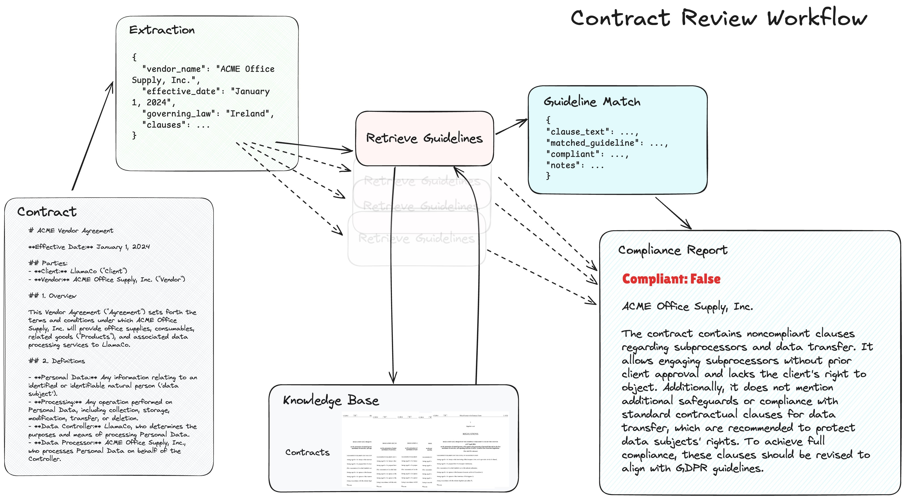

**Source:** [https://twitter.com/i/web/status/1867990509899461033](https://twitter.com/i/web/status/1867990509899461033)
**Original Post Date:** 2025-05-28 07:20:00

# Automated Contract Clause Extraction for GDPR Compliance

## Introduction
This article presents a technical approach to automating the extraction and review of contract clauses with specific focus on GDPR compliance. The system utilizes structured JSON data representation, markdown-formatted contracts, and systematic guideline matching to identify non-compliant terms. This knowledge is crucial for engineering teams building automated legal document processing systems.

## Data Extraction Architecture

The extraction process begins by parsing contract documents into a structured JSON format containing key metadata fields such as vendor information, effective dates, and governing laws. This standardization enables consistent data handling throughout the review workflow.

Contract clauses are parsed from markdown-formatted sections, allowing for efficient tokenization and analysis using NLP techniques.

_Standardized JSON structure for storing contract metadata and clauses_

```json
{
  "vendor_name": "ACME Office Supply, Inc.",
  "effective_date": "January 1, 2024",
  "governing_law": "Ireland",
  "clauses": [],
  "parties": {
    "client": "LlamaCo",
    "vendor": "ACME Office Supply, Inc."
  }
}
```

## Compliance Matching Workflow

The matching process involves retrieving relevant GDPR guidelines from a knowledge base, comparing them against extracted clauses using semantic analysis techniques.

Key compliance checks include data processor responsibilities, subprocessor permissions, and data subject rights protection.

- Subprocessor approval requirements
- Data transfer safeguards
- Personal Data definition alignment
- Processor accountability measures

> **Note/Tip:** Implement fuzzy matching for clauses that are semantically similar but not exact matches.

> **Note/Tip:** Cache frequently accessed guidelines to improve performance.

## System Implementation Considerations

The system should handle contract versioning, maintain an audit trail of compliance checks, and generate detailed reports for legal teams.

Error handling is crucial for cases where clauses cannot be clearly classified or when guidelines are ambiguous.

```python
def match_clause_against_guideline(clause_text: str, guideline_id: str) -> bool:
    # Perform semantic analysis
    similarity_score = calculate_similarity(clause_text, guideline_text)
    return similarity_score > COMPLIANCE_THRESHOLD
```

## Key Takeaways

- Structured data formats enable consistent automated processing of legal documents.
- GDPR compliance requires specific attention to subprocessor permissions and data subject rights.
- Systematic clause matching with guidelines provides scalable compliance verification.

## Conclusion
This automated contract review system demonstrates the intersection of technical infrastructure and legal requirements. By standardizing data formats and implementing systematic compliance checks, organizations can efficiently maintain GDPR compliance across their vendor contracts.

## External References

- [GDPR Article 28: Processor Obligations](https://gdpr.eu/article-28-data-processor-obligations/)
- [NLP-Based Document Analysis](https://www.nltk.org/api/nltk.tokenize.html)


## Media

**Image Description:** The image depicts a **Contract Review Workflow** diagram, which outlines a systematic process for reviewing contracts against compliance guidelines, particularly focusing on GDPR (General Data Protection Regulation) compliance. Below is a detailed description of the image, highlighting its main components and technical details:

---

### **Main Components of the Diagram**

1. **Extraction**
   - **Purpose**: This is the starting point where data is extracted from the contract.
   - **Details**:
     - The extracted data is represented in JSON format.
     - Key fields include:
       - `vendor_name`: "ACME Office Supply, Inc."
       - `effective_date`: "January 1, 2024"
       - `governing_law`: "Ireland"
       - `clauses`: A placeholder for the contract clauses.
     - This step involves parsing the contract to extract relevant metadata and clauses.

2. **Contract**
   - **Purpose**: This section represents the actual contract document being reviewed.
   - **Details**:
     - The contract is titled **"ACME Vendor Agreement"**.
     - Key sections include:
       - **Effective Date**: January 1, 2024.
       - **Parties**: LlamaCo (Client) and ACME Office Supply, Inc. (Vendor).
       - **Overview**: Describes the agreement's purpose, which involves ACME Office Supply providing office supplies and associated data processing services to LlamaCo.
       - **Definitions**: Includes terms such as:
         - **Personal Data**: Any information relating to an identified or identifiable natural person.
         - **Processing**: Any operation performed on Personal Data.
         - **Data Controller**: LlamaCo, which determines the purposes and means of processing Personal Data.
         - **Data Processor**: ACME Office Supply, Inc., which processes Personal Data on behalf of the Data Controller.
     - The contract text is structured in a markdown-like format, making it easy to parse and analyze.

3. **Knowledge Base**
   - **Purpose**: This serves as a repository of guidelines, regulations, and compliance standards.
   - **Details**:
     - The knowledge base contains a collection of guidelines, likely including GDPR-related compliance requirements.
     - It is used as a reference to evaluate the extracted contract clauses against compliance standards.

4. **Retrieve Guidelines**
   - **Purpose**: This step involves fetching relevant guidelines from the knowledge base.
   - **Details**:
     - The guidelines are retrieved based on the extracted metadata (e.g., governing law, clauses).
     - This step ensures that the correct set of guidelines is applied for the review process.

5. **Guideline Match**
   - **Purpose**: This step compares the extracted contract clauses against the retrieved guidelines.
   - **Details**:
     - The comparison is performed to identify whether the contract clauses comply with the guidelines.
     - Key fields in the output include:
       - `clause_text`: The text of the contract clause being evaluated.
       - `matched_guideline`: The specific guideline against which the clause is being compared.
       - `compliant`: A boolean value indicating whether the clause is compliant (`True` or `False`).
       - `notes`: Additional comments or explanations regarding the compliance status.
     - This step is crucial for identifying non-compliant clauses.

6. **Compliance Report**
   - **Purpose**: This is the final output of the workflow, summarizing the compliance status of the contract.
   - **Details**:
     - The report highlights the vendor name ("ACME Office Supply, Inc.") and the compliance status.
     - **Compliance Status**: The report indicates that the contract is **not compliant** (`Compliant: False`).
     - **Reasons for Non-Compliance**:
       - The contract contains clauses that allow engaging subprocessors without prior client approval.
       - It lacks safeguards or compliance with standard contractual clauses for data transfer.
       - It does not protect data subjects' rights adequately.
     - Recommendations are provided to revise the clauses to align with GDPR guidelines.

---

### **Technical Details and Workflow Flow**
1. **Data Flow**:
   - The workflow is depicted as a series of steps connected by arrows, indicating the flow of data and processing.
   - The extracted data from the contract is used to retrieve relevant guidelines, which are then matched against the contract clauses to generate a compliance report.

2. **JSON Representation**:
   - The extracted data is represented in JSON format, which is a structured and machine-readable format.
   - This facilitates easy parsing and integration with automated systems.

3. **Markdown Format**:
   - The contract text is presented in a markdown-like format, which is lightweight and easy to parse programmatically.

4. **Compliance Evaluation**:
   - The evaluation process is systematic, involving direct comparisons between contract clauses and compliance guidelines.
   - The output is detailed, providing specific notes and recommendations for non-compliant clauses.

5. **Focus on GDPR Compliance**:
   - The workflow explicitly highlights GDPR compliance as a key objective, with specific references to subprocessors, data transfer, and data subject rights.

---

### **Overall Structure**
The diagram is organized in a logical flowchart format, with clear connections between each step. The use of JSON, markdown, and structured outputs indicates a technical and automated approach to contract review, emphasizing efficiency and accuracy in compliance assessment.

---

This detailed description provides a comprehensive overview of the contract review workflow depicted in the image, focusing on its main components and technical aspects.
