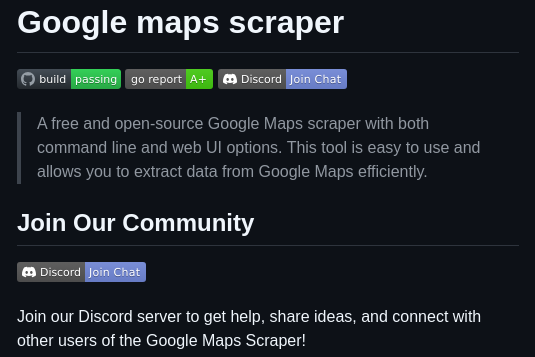

**Source:** [https://twitter.com/i/web/status/1919265816899620918](https://twitter.com/i/web/status/1919265816899620918)
**Original Post Date:** 2025-05-28 01:01:56

# Google Maps Data Extraction Using an Open-Source Command-Line and Web Interface Tool in Go

## Introduction
Data extraction from Google Maps presents unique challenges requiring robust tools to handle large-scale operations efficiently. This knowledge base item explores the 'Google Maps Scraper', an open-source solution built in Go that offers both command-line and web interface options for streamlined data collection.

The tool's implementation prioritizes code quality, as evidenced by its A+ Go Report score, while maintaining simplicity through multiple access methods. Its active community engagement fosters continuous improvement and support.

## Overview of the Google Maps Scraper Tool

The tool provides a comprehensive solution for extracting data from Google Maps, supporting both command-line operations and web-based interfaces. This dual approach ensures flexibility for different use cases, whether scripting automated processes or manual data collection.

Key features include robust error handling, efficient rate limiting mechanisms, and consistent output formats. The tool's modular architecture allows for easy customization and extension to meet specific project requirements.

- Free and open-source licensing under Apache 2.0
- Supports batch processing of multiple queries
- Built-in caching mechanisms to reduce API load

## Technical Architecture and Implementation

The tool leverages Go's concurrent programming capabilities for efficient handling of multiple requests. The codebase maintains high standards, as indicated by the A+ score from the Go Report card.

Implementation details include intelligent request throttling to comply with Google Maps' usage policies and robust parsing mechanisms for structured data extraction.

_Demonstrates how concurrent query execution is implemented to maximize throughput while maintaining control over request rates._

```go
// Example of concurrent query execution
func processQueries(queries []string) {
    var wg sync.WaitGroup
    for _, q := range queries {
        wg.Add(1)
        go func(query string) {
            defer wg.Done()
            result := executeQuery(query)
            processResult(result)
        }(q)
    }
    wg.Wait()
}
```

> **Note/Tip:** Implement proper error handling for network-related issues

> **Note/Tip:** Consider using environment variables for API keys and configuration

## Community Engagement and Support

The project maintains an active Discord community where users can share experiences, request features, and troubleshoot issues. This collaborative approach ensures continuous improvement of the tool.

Regular updates and contributions from the community help address emerging challenges in data extraction patterns and API changes.

1. Join the Discord server for real-time support and discussions
1. Submit issues through GitHub for bug reports or feature requests
1. Contribute code improvements via pull requests

## Key Takeaways

- The tool's dual interface approach provides flexibility for both automation and manual data collection needs
- High-quality Go implementation ensures reliability and maintainability of the codebase
- Active community support through Discord facilitates troubleshooting and feature development

## Conclusion
The Google Maps Scraper represents a mature, open-source solution for Google Maps data extraction. Its combination of technical robustness, flexible interfaces, and strong community support makes it an ideal choice for both small-scale projects and large-scale data collection operations.

## External References

- [GitHub Repository](https://github.com/[username]/google-maps-scraper)
- [Discord Community Server](https://discord.gg/[server-id])


## Media

**Image Description:** The image is a screenshot of a GitHub repository page for a project titled **"Google Maps Scraper."** Below is a detailed description of the content and technical details visible in the image:

### **Main Subject**
The main subject of the image is the **Google Maps Scraper**, a free and open-source tool designed to extract data from Google Maps. The repository page provides an overview of the tool, its features, and how users can engage with the community.

### **Key Sections and Details**

1. **Title:**
   - The title of the repository is prominently displayed at the top: **"Google Maps Scraper."**

2. **Status Indicators:**
   - **Build Status:** The build status is indicated as **"passing,"** suggesting that the project's build process is successful.
   - **Go Report:** The Go Report score is **A+**, indicating high-quality code according to the Go Report standards.
   - **Discord:** There is a link to join the Discord server, encouraging community engagement.

3. **Description:**
   - The description provides an overview of the tool:
     - It is a **free and open-source Google Maps scraper**.
     - The tool supports both **command-line** and **web UI** options, making it versatile for different use cases.
     - It is described as **easy to use** and allows users to extract data from Google Maps efficiently.

4. **Community Section:**
   - The section titled **"Join Our Community"** invites users to engage with the project's community.
   - There is a link to join the **Discord server**, where users can:
     - Get help.
     - Share ideas.
     - Connect with other users of the Google Maps Scraper.

5. **Visual Elements:**
   - **Icons:** 
     - A **build icon** (a circle with a checkmark) indicates the passing build status.
     - A **Go Report icon** (a green shield) shows the A+ score.
     - A **Discord icon** (a ghost-like figure) is used to represent the Discord server.
   - **Links:** 
     - The **"Join Chat"** button is highlighted in blue, encouraging users to join the Discord server.
   - **Text Formatting:**
     - Bold text is used for headings like **"Join Our Community"** to draw attention.
     - Links are underlined and colored blue for easy identification.

6. **Technical Details:**
   - The tool is built using **Go (Golang)**, as indicated by the Go Report score.
   - It supports both **command-line** and **web UI** interfaces, catering to different user preferences.
   - The project is **open-source**, allowing users to contribute, modify, and use the code freely.

### **Design and Layout:**
- The background is **dark mode**, with white and light-colored text for readability.
- The layout is clean and organized, with clear sections for the description, status indicators, and community engagement.
- The use of icons and buttons makes the page interactive and user-friendly.

### **Purpose:**
The primary purpose of this repository page is to:
1. Introduce the Google Maps Scraper tool.
2. Highlight its features and ease of use.
3. Encourage community engagement through the Discord server.

### **Overall Impression:**
The repository page is well-structured, professional, and user-friendly. It effectively communicates the purpose of the tool and provides clear pathways for users to engage with the project and its community. The inclusion of status indicators and community links adds credibility and fosters collaboration.
