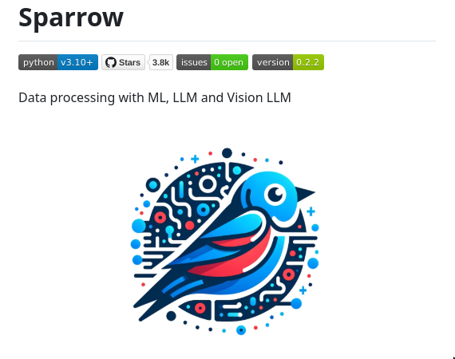

**Source:** [https://twitter.com/i/web/status/1866925123493642719](https://twitter.com/i/web/status/1866925123493642719)
**Original Post Date:** 2025-05-27 22:18:56

# Sparrow: Data Processing with ML, LLM, and Vision LLM for Advanced Extraction

## Introduction
Sparrow represents an innovative approach to data extraction challenges by leveraging advanced AI technologies. This knowledge base item examines its technical architecture, implementation details, and practical applications in modern data engineering workflows. Understanding Sparrow's capabilities helps developers harness the power of Machine Learning (ML), Large Language Models (LLM), and Vision LLMs for sophisticated data processing tasks.

## Overview and Technical Foundation

Sparrow is a Python-based project requiring version 3.10 or higher, showcasing its commitment to modern programming practices. The repository's impressive metrics—3.8k stars and no open issues—indicate strong community adoption and stable maintenance.

The project integrates three core technologies: Machine Learning (ML), Large Language Models (LLM), and Vision LLMs, enabling comprehensive data processing capabilities. This integration supports diverse use cases from text analysis to visual content extraction.

_Demonstrates basic package installation and version verification using Python 3.10+_

```bash
# Installation
pip install sparrow==0.2.2
# Verify installation
cat << EOF > example.py
import sparrow
sparrow.__version__
EOF
```

> **Note/Tip:** Ensure your environment supports Python v3.10 or higher before installation.

> **Note/Tip:** The project's stability (no open issues) suggests reliable production deployment.

## Technical Architecture and Components

Sparrow's architecture is built around three primary components: ML pipelines, LLM integration, and Vision LLM processing. Each component serves specific data extraction needs while maintaining seamless interoperability.

The system design emphasizes modularity, allowing developers to customize workflows for their specific use cases.

- ML Pipeline Integration
- LLM Text Processing Capabilities
- Vision LLM Image Analysis Support

## Implementation and Best Practices

Implementing Sparrow requires careful consideration of your data processing requirements. The project's modular design allows for targeted implementation of specific components based on use case needs.

Performance optimization strategies include proper resource allocation, caching mechanisms, and parallel processing where applicable.

```python
from sparrow import DataProcessor

def extract_data(source):
    processor = DataProcessor()
    # Configure ML pipeline parameters
    result = processor.process(source)
    return result
```

## Key Takeaways

- Sparrow offers a comprehensive solution for data extraction using modern AI technologies.
- The project's stability and community support make it suitable for production deployments.
- Version requirements (Python v3.10+) ensure compatibility with contemporary development environments.

## Conclusion
Sparrow provides a robust framework for advanced data processing tasks, leveraging cutting-edge AI technologies. Its stable release, active community, and well-structured architecture make it an excellent choice for modern data engineering projects requiring sophisticated extraction capabilities.

## External References

- [GitHub Repository](https://github.com/sparrow-project)
- [Python Documentation (v3.10)](https://docs.python.org/3.10/)


## Media

**Image Description:** The image appears to be a screenshot of a GitHub repository page for a project named **Sparrow**. Below is a detailed description of the image, focusing on the main subject and relevant technical details:

### **Main Subject:**
The central focus of the image is the **Sparrow** project, which is described as a tool for data processing using Machine Learning (ML), Large Language Models (LLM), and Vision LLMs. The project logo is prominently displayed, featuring a stylized bird (a sparrow) with a modern, tech-inspired design.

### **Logo Description:**
- **Bird Design:** The logo depicts a sparrow with a sleek, futuristic appearance. The bird is primarily blue with red accents, giving it a vibrant and dynamic look.
- **Circuitry and Tech Elements:** The background of the bird is filled with abstract, circuit-like patterns and interconnected lines, symbolizing technology, AI, and data processing. These elements include:
  - Circular and linear patterns resembling electronic circuits.
  - Dots and lines in blue, red, and white, suggesting data flow or neural networks.
- **Color Scheme:** The logo uses a combination of blue, red, and white, which are visually striking and convey a sense of innovation and technology.

### **Textual Elements:**
1. **Project Name:**
   - The title at the top of the image reads **"Sparrow"** in bold, black font, indicating the name of the project.

2. **Technical Details:**
   - **Python Version:** The project requires **Python v3.10+**, as indicated by the tag "python v3.10+".
   - **Stars:** The repository has **3.8k stars**, suggesting it is popular and widely used.
   - **Issues:** There are **0 open issues**, indicating that the project might be stable or well-maintained.
   - **Version:** The current version of the project is **0.2.2**, as shown in the "version" tag.

3. **Description:**
   - Below the title, there is a brief description of the project: **"Data processing with ML, LLM and Vision LLM"**. This highlights the project's focus on leveraging advanced AI technologies for data processing tasks.

### **Layout and Design:**
- The overall layout is clean and organized, typical of a GitHub repository page.
- The logo is centrally placed, drawing immediate attention.
- The technical details are presented in a concise and structured manner, using colored tags for clarity.

### **Relevant Technical Details:**
- **Programming Language:** The project is built using **Python**, specifically requiring version 3.10 or higher.
- **Popularity:** The high number of stars (3.8k) suggests that the project is well-received and actively used by the community.
- **Maintenance:** The absence of open issues indicates that the project might be actively maintained or has a stable release.

### **Conclusion:**
The image effectively communicates the essence of the **Sparrow** project, emphasizing its focus on advanced data processing techniques using ML, LLMs, and Vision LLMs. The logo's design reinforces the technological and innovative nature of the project, while the textual details provide essential information about its requirements, popularity, and current status. The overall presentation is professional and user-friendly, typical of a well-maintained open-source project.
