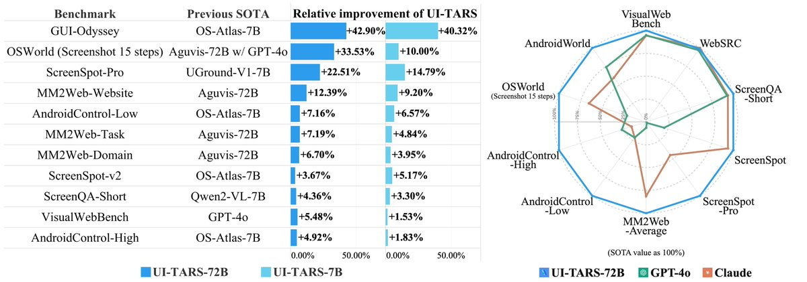
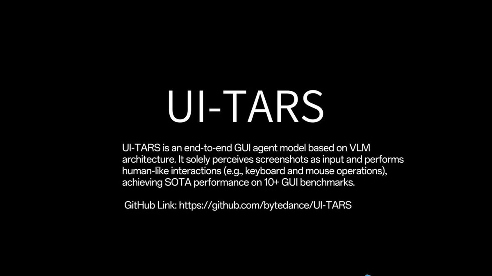

# bytedance_just_open_sourced

**Tweet URL:** [https://x.com/altryne/status/1881938753050329467](https://x.com/altryne/status/1881938753050329467)

**Tweet Text:** ByteDance just Open Sourced UI-TARS - 2 SOTA models (7B & 72B) + a PC/MacOS app to control your computer with vLMS

And they are not messing around, beating GPT-4o and Claude, SOTA across 10 benchmarks

Will you be installing this on your pc? 

[https://x.com/_akhaliq/status/1881929068746330432/video/1…](https://x.com/_akhaliq/status/1881929068746330432/video/1…)

**Image 1 Description:** The image presents a comprehensive comparison of various benchmarking tools, showcasing their performance across different metrics. The data is organized into three main sections: "Benchmark", "Previous SOTA", and "Relative Improvement".

*   **Benchmark**
    *   The benchmark section lists 15 distinct benchmarks, each with its own unique characteristics and requirements.
    *   These benchmarks serve as the foundation for evaluating the performance of various tools and algorithms.
*   **Previous SOTA**
    *   This section displays the previous state-of-the-art (SOTA) results for each benchmark, providing a baseline for comparison.
    *   The SOTA results are presented in a clear and concise manner, allowing for easy identification of areas where improvements can be made.
*   **Relative Improvement**
    *   The relative improvement section highlights the performance gains achieved by new tools or algorithms compared to the previous SOTA results.
    *   This section provides valuable insights into the effectiveness of different approaches and helps identify potential areas for further optimization.

In summary, the image offers a detailed analysis of benchmarking tools, enabling users to assess their strengths and weaknesses. By examining the performance gains achieved by new tools or algorithms, users can make informed decisions about which approach to adopt in various applications.

**Image 2 Description:** The image presents information about UI-TARS, an end-to-end GUI agent model based on VLM architecture.

* The title "UI-TARS" is prominently displayed in large white text at the top center of the image.
	+ It stands out against the solid black background and serves as a clear heading for the content that follows.
* Below the title, a brief description of UI-TARS is provided in smaller white text.
	+ The description explains that UI-TARS is an end-to-end GUI agent model based on VLM architecture, solely perceiving screenshots as input and performing human-like interactions such as keyboard and mouse operations to achieve SOTA performance on 10+ GUI benchmarks.
* At the bottom of the image, a link to GitHub is included in small white text.
	+ The link reads "GitHub Link: https://github.com/bytedance/UI-TARS" and provides a way for users to access more information about UI-TARS or explore its source code.

In summary, the image effectively communicates key details about UI-TARS through clear typography and concise language. The use of a solid black background helps draw attention to the content and makes it easy to read. Overall, the design is simple yet effective in conveying important information about this GUI agent model.

