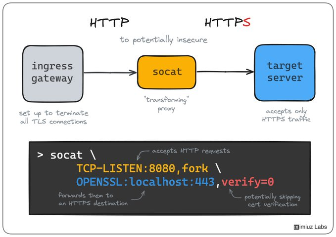

# http_https_favorite_tricks

**Tweet URL:** [https://x.com/iximiuz/status/1880928750365532416](https://x.com/iximiuz/status/1880928750365532416)

**Tweet Text:** HTTP -> HTTPS is one of my favorite ops tricks.

If you've got an internal HTTPS service, but your load balancer, ingress gateway, or the like only allows HTTP destinations, you can work it around with a simple socat command.

Not a long-term solution, but a quick ad hoc hack.

**Image 1 Description:** The image presents a comprehensive overview of the Socat (SOcket CAT) protocol, which enables secure communication between servers and clients. The diagram illustrates how Socat integrates with other protocols such as HTTPS (Hypertext Transfer Protocol Secure), TLS (Transport Layer Security), and SSH (Secure Shell).

**Key Components:**

* **Ingress Gateway:** A gateway that handles incoming network traffic and routes it to the appropriate destination.
* **Socat (SOcket CAT):** A protocol used for secure communication between servers and clients.
* **Target Server:** The server that receives the request from the client.

**How Socat Works:**

1. The client initiates a connection to the ingress gateway, which acts as an intermediary between the client and the target server.
2. The ingress gateway establishes a secure connection with the target server using Socat.
3. Once the connection is established, the ingress gateway forwards the request from the client to the target server.
4. The target server processes the request and sends the response back through the ingress gateway to the client.

**Benefits of Using Socat:**

* **Improved Security:** Socat provides an additional layer of security by encrypting data in transit using TLS or SSH.
* **Load Balancing:** Socat can be used to distribute incoming traffic across multiple target servers, improving scalability and performance.
* **Flexibility:** Socat supports a wide range of protocols, including HTTPS, TLS, and SSH.

**Conclusion:**

In summary, the image provides a clear illustration of how Socat integrates with other protocols to enable secure communication between servers and clients. By using Socat, organizations can improve security, scalability, and flexibility in their network architecture.

