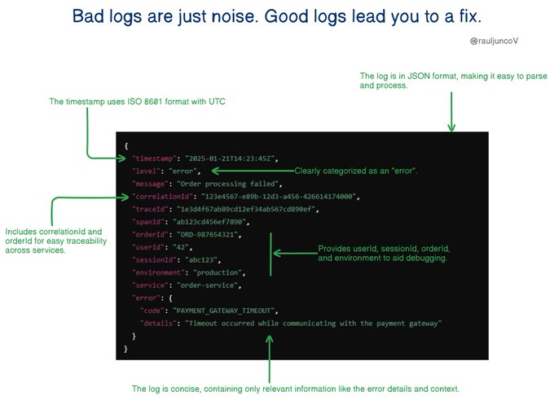

# logs_just_noise_good

**Tweet URL:** [https://x.com/RaulJuncoV/status/1881696953190264862](https://x.com/RaulJuncoV/status/1881696953190264862)

**Tweet Text:** Bad logs are just noise. Good logs lead you to a fix.

Here are 7 Rules of Thumb for Effective Logging.

1. Use Structured Logging

Format log entries structured to enable easy parsing and processing by tools and automation systems.

2. Include Unique Identifiers

Each log entry should have a unique identifier (correlation IDs, request IDs, or transaction IDs) to trace requests across distributed services.

3. Log entries should be small, easy to read, and useful

Don't overload your logs with unnecessary info. Focus on what's important and make sure your logs are easy to read.

4. Standardize Timestamps

Use consistent time zones (preferably UTC) and formats. Logs with mixed time zones or formats can turn debugging into a nightmare.

5. Categorize Log Levels

• Debug: Detailed technical information for troubleshooting during development.
• Info: High-level operational information.
• Error: Critical issues requiring attention.

6. Include Contextual Information

Contextual details make debugging easier:

• User ID
• Session ID 
• Environment-specific identifiers (e.g., instance ID)

Context helps you understand not just what happened, but why and where it happened.

7. Protect Sensitive Information

• Don’t log private data like passwords, API keys, or Personally Identifiable Information (PII).
• If unavoidable, mask, redact, or hash sensitive data to protect users and systems.

Many logging frameworks already support these features, so there's no need to reinvent the wheel. Use them, and life gets a whole lot easier.

P.S. What's your favorite logging framework? Mine's Serilog.

**Image 1 Description:** The image presents a detailed breakdown of log data, featuring a prominent screenshot of code in green text on a black background, accompanied by explanatory annotations. The title "Bad logs are just noise. Good logs lead you to a fix." is displayed at the top.

**Key Features:**

* **Code Screenshot:** A large section of code in green text on a black background, likely representing log data.
* **Annotations:** Green arrows and lines pointing to specific parts of the code, highlighting important details such as timestamp usage (ISO 8601), JSON format processing, and error categorization.
* **Statistics:**
	+ No statistics are presented in this image.

**Summary:**

The image provides a clear and concise explanation of log data, emphasizing its importance in troubleshooting issues. By highlighting key features like timestamp usage, JSON format processing, and error categorization, the image effectively communicates the value of well-structured log data.

