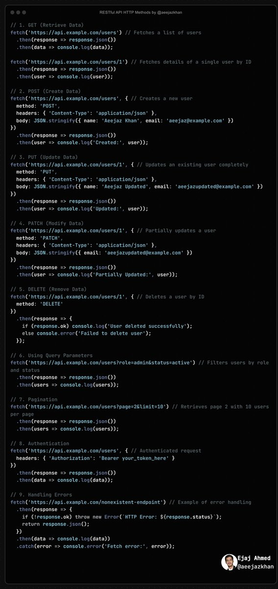
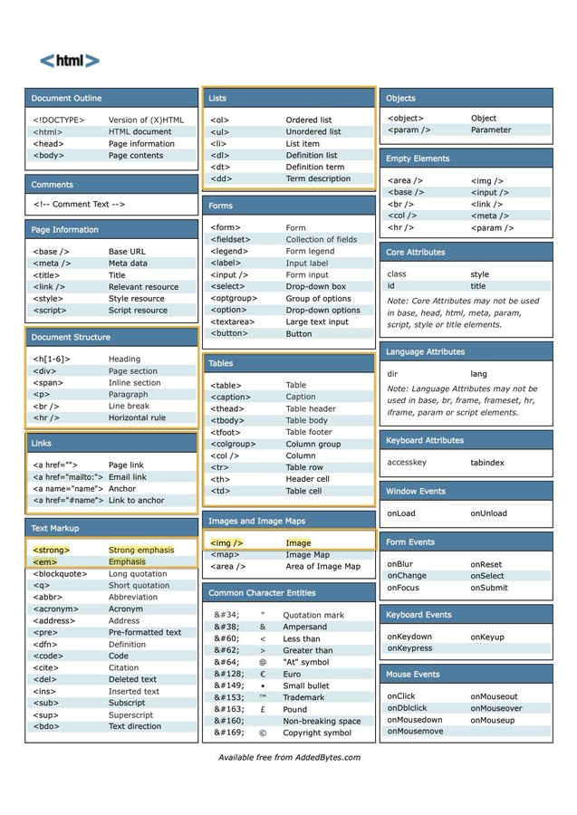

# restful_http_methods_html

**Tweet URL:** [https://x.com/aeejazkhan/status/1869733233279279427](https://x.com/aeejazkhan/status/1869733233279279427)

**Tweet Text:** RESTful API HTTP Methods Html Cheatsheet  x.com/aeejazkhan/sta…

**Image 1 Description:** The image presents a collection of code snippets in white text against a black background, showcasing various programming languages and frameworks. The code is organized into distinct sections, each with its own title and labeled accordingly.

**Code Snippets:**

*   **GET (Retrieve Data)**
    *   Fetches data from an API endpoint
    *   Uses the `fetch` function to send a GET request to the specified URL
    *   Handles errors and responses using try-catch blocks
    *   Returns the response data as JSON
*   **POST (Create Data)**
    *   Creates new data by sending a POST request to an API endpoint
    *   Uses the `fetch` function to send a POST request with the provided data
    *   Handles errors and responses using try-catch blocks
    *   Returns the response data as JSON
*   **PUT (Update Data)**
    *   Updates existing data by sending a PUT request to an API endpoint
    *   Uses the `fetch` function to send a PUT request with the provided data
    *   Handles errors and responses using try-catch blocks
    *   Returns the response data as JSON
*   **DELETE (Delete Data)**
    *   Deletes data by sending a DELETE request to an API endpoint
    *   Uses the `fetch` function to send a DELETE request with the provided ID
    *   Handles errors and responses using try-catch blocks
    *   Returns the response data as JSON

**Additional Information:**

*   The code snippets are written in JavaScript and use the Fetch API for making HTTP requests.
*   The code includes error handling and response processing to ensure robustness and reliability.
*   The image provides a clear and concise visual representation of the code, making it easy to understand and navigate.

Overall, the image effectively communicates the functionality and structure of the code snippets, providing valuable insights into the development process.

**Image 2 Description:** The image presents a comprehensive guide to HTML elements, organized into a table with 7 columns and 24 rows. The table is divided into sections, each focusing on a specific aspect of HTML elements.

**Table Structure:**

*   **Columns:** 
    *   Document Outline
    *   Lists
    *   Objects
    *   Comments
    *   Forms
    *   Page Information
    *   Links
*   **Rows:** Each row represents a unique HTML element, with its name and description provided.

**Key Features:**

*   The table is color-coded, with each section having a distinct background color.
*   The header row contains the column names in bold font.
*   The table includes a variety of HTML elements, such as `
`, ``, `<a>`, `<ul>`, `<li>`, and more.

**Purpose:**

The purpose of this image is to provide a quick reference guide for web developers and designers, allowing them to easily access information about various HTML elements. By organizing the elements into categories and using color-coding, the table makes it simple to navigate and find specific elements quickly.

