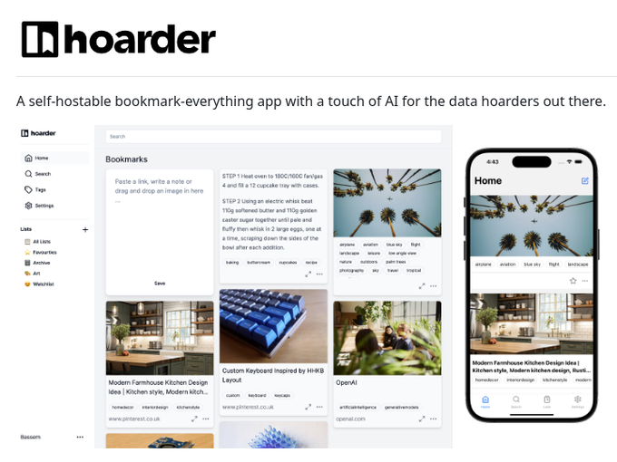

# self_hostable_bookmark_note

**Tweet URL:** [https://x.com/tom_doerr/status/1881314782474584560](https://x.com/tom_doerr/status/1881314782474584560)

**Tweet Text:** Self-hostable bookmark and note manager

**Image 1 Description:** The image presents a self-hosted bookmarking app, "hoarder," designed to store and organize bookmarks in a user-friendly manner.

* **Title and Tagline**
	+ Title: "A self-hostable bookmark-everything app with a touch of AI for the data hoarders out there."
	+ Font: Black sans-serif font
	+ Alignment: Centered at the top of the image
* **App Logo**
	+ Name: "hoarder"
	+ Design: A stylized square logo with rounded corners, featuring a white background and black text.
	+ Position: Top-left corner of the image
* **Bookmarking Interface**
	+ Background Color: Light gray
	+ Content:
		- Search bar at the top
		- Bookmarks displayed in a grid layout below the search bar
		- Each bookmark includes an image, title, and description
		- A "Save" button next to each bookmark
	+ Navigation Menu
		- Located on the left side of the screen
		- Includes options for managing bookmarks, such as saving, editing, and deleting
* **Mobile Devices**
	+ Two mobile devices are displayed in the image, showcasing the app's interface on a smaller scale.
	+ Device 1: A smartphone with a black border around the screen, displaying the home page of the app.
	+ Device 2: A tablet with a black border around the screen, also showing the home page of the app.

In summary, the image effectively communicates the features and functionality of the hoarder bookmarking app, highlighting its user-friendly interface and self-hosted capabilities. The inclusion of mobile devices demonstrates how the app can be accessed on various devices, making it convenient for users to manage their bookmarks anywhere, anytime.

