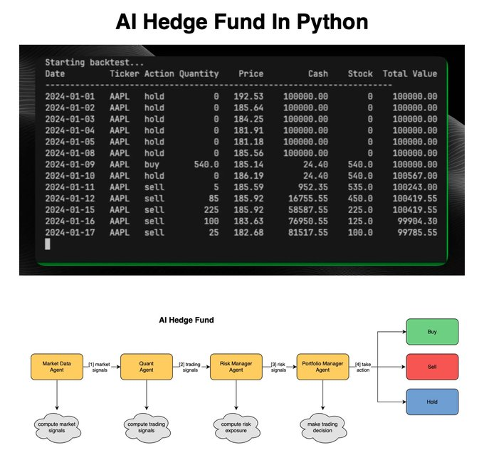

# this_made_real_world

**Tweet URL:** [https://x.com/quantscience_/status/1875893402329403874](https://x.com/quantscience_/status/1875893402329403874)

**Tweet Text:** This guy made a real-world AI Hedge Fund Team in Python.

Then he made it available for everyone for free.

Here's how he did it (and how you can too).

**Image 1 Description:** The image presents a comprehensive overview of an AI Hedge Fund in Python, showcasing its capabilities through two distinct sections: a table displaying market data and a flowchart illustrating the fund's operations.

**Market Data Table**

* **Header Row**: The first row contains column headers, including "Starting backtest...", "Date", "Ticker", "Action Quantity", "Price", "Cash", "Stock", and "Total Value".
* **Data Rows**: Each subsequent row represents a single data point, with columns filled in accordingly.
	+ Starting backtest...: 2024-01-01
	+ Date: 2024-01-02
	+ Ticker: AAPL
	+ Action Quantity: hold
	+ Price: $192.53
	+ Cash: $1000000.00
	+ Stock: 0
	+ Total Value: $1000000.00

**Flowchart**

* **Title**: "AI Hedge Fund"
* **Arrows**: The flowchart features arrows connecting different boxes, indicating the sequence of events.
* **Boxes**:
	+ Market Data Agent
	+ Quant Agent
	+ Risk Manager Agent
	+ Portfolio Manager Agent
	+ Hold Box

The image provides a clear and concise visual representation of an AI Hedge Fund in Python, allowing viewers to quickly understand its structure and functionality.

