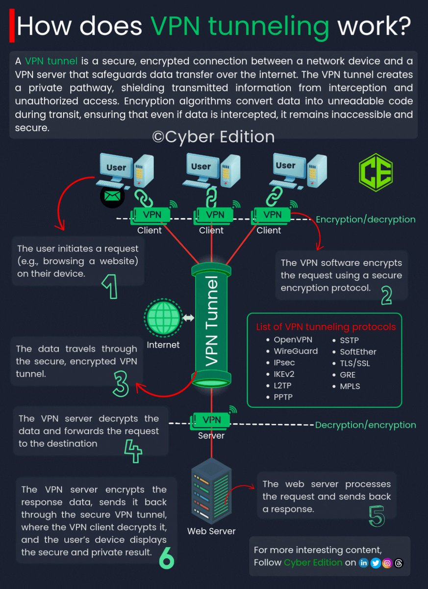

# tunneling_teams_tweet_text

**Tweet URL:** [https://x.com/LetsDefendIO/status/1880555755348144617](https://x.com/LetsDefendIO/status/1880555755348144617)

**Tweet Text:** VPN Tunneling for SOC Teams

**Image 1 Description:** The infographic, titled "How does VPN tunneling work?", provides a comprehensive overview of the process involved in creating a secure connection between two devices using Virtual Private Network (VPN) technology.

**Key Components:**

* **VPN Server:** A centralized server that manages all connections to and from the network.
* **Client Device:** The device connecting to the VPN, which can be a computer, smartphone, or other internet-enabled device.
* **Internet Connection:** The connection between the client device and the VPN server.

**The Process:**

1. **Initiation:** The user initiates a request on their device, such as browsing a website or accessing an online service.
2. **Encryption:** The data is encrypted using advanced algorithms to ensure secure transmission over the internet.
3. **Transmission:** The encrypted data is transmitted from the client device to the VPN server.
4. **Decryption:** At the VPN server, the encrypted data is decrypted and forwarded to its final destination on the internet.
5. **Reply Transmission:** The response from the requested website or service is received by the VPN server and transmitted back to the client device.

**Security Features:**

* **Encryption:** All data exchanged between the client device and the VPN server is encrypted, ensuring that even if intercepted, the data cannot be accessed without the decryption key.
* **Secure Connection:** The connection between the client device and the VPN server is secure, protecting against unauthorized access or eavesdropping.

**Benefits:**

* **Security:** Ensures secure transmission of sensitive information over public networks.
* **Anonymity:** Hides the user's IP address, making it difficult for third parties to track their online activities.
* **Accessibility:** Allows users to access geo-restricted content by masking their location.

In summary, the infographic effectively illustrates how VPN tunneling works, highlighting its key components, process, security features, and benefits. By providing a clear and concise explanation, it helps users understand the importance of using VPN technology in today's digital landscape.

