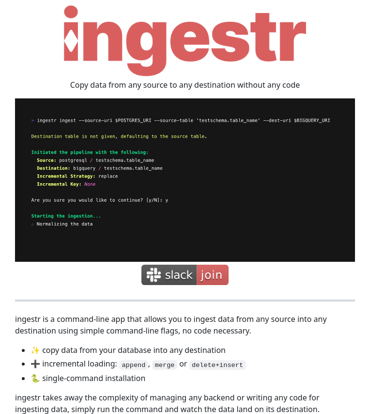

**Source:** [https://twitter.com/i/web/status/1875687158742237611](https://twitter.com/i/web/status/1875687158742237611)
**Original Post Date:** 2025-05-27 19:03:34

# ingestr: Zero-Code Data Integration CLI Tool for Seamless Cross-Platform Transfers

## Introduction
Data integration processes often require complex setup and coding efforts. The ingestr tool revolutionizes this workflow by providing a simple, CLI-based solution for transferring data across various platforms without writing code. This article explores its capabilities, usage patterns, and how it streamlines modern data pipelines.

## Core Functionality

ingestr is designed as a universal data ingestion tool that eliminates the need for custom coding or complex backend configurations. It supports direct transfers from any database source to any destination through simple command-line flags.

The tool's primary strength lies in its ability to handle multiple data sources and destinations seamlessly, making it ideal for both batch transfers and incremental loading scenarios.

_Example of basic usage showing how ingestr handles the transfer from PostgreSQL to BigQuery._

```bash
> ingestr ingest --source-uri $POSTGRES_URI --source-table 'testschema.table_name' --dest-uri $BIGQUERY_URI
Destination table is not given, defaulting to the source table.
Initiated the pipeline with the following:
Source: PostgreSQL
destination: BigQuery
Starting the ingestion...
Normalizing the data
```

## Incremental Loading Capabilities

ingestr supports three main incremental loading strategies: append, merge, and delete+insert. These options provide flexibility in handling data updates across different use cases.

The tool automatically handles schema differences during transfers, making it particularly useful for maintaining consistent datasets between systems.

- Append: Adds new records without modifying existing ones
- Merge: Updates existing records and adds new ones
- Delete+Insert: Removes old data before inserting updated records

## Implementation Best Practices

For optimal performance, it's recommended to use environment variables for connection URIs rather than hardcoding them. This approach enhances security and maintainability.

Regular monitoring of the transfer process is essential to ensure data consistency across source and destination systems.

> **Note/Tip:** Always verify schema compatibility before initiating large transfers

> **Note/Tip:** Use incremental loading for frequent updates to minimize processing time

## Key Takeaways

- ingestr eliminates the need for custom coding in data transfer workflows
- Supports multiple incremental loading strategies for flexible update handling
- Simplifies cross-platform data migration with simple command-line interface

## Conclusion
ingestr represents a significant advancement in data integration by making complex transfers accessible through a straightforward CLI interface. Its support for various databases and incremental loading strategies makes it an invaluable tool for modern data engineering pipelines.

## External References

- [Join the ingestr community on Slack](#)


## Media

**Image Description:** The image is a promotional or informational graphic for a command-line tool called **ingestr**. The main subject of the image is the **ingestr** tool, which is designed to facilitate data ingestion from any source to any destination without requiring any coding. Below is a detailed breakdown of the image:

### **Main Components:**

1. **Logo and Branding:**
   - The top of the image features a prominent logo for **ingestr**. The logo consists of the word "ingestr" in a bold, sans-serif font with a distinctive design. The "i" in "ingestr" is stylized with a small icon resembling a database or data pipeline, emphasizing the tool's purpose.

2. **Tagline:**
   - Below the logo, there is a tagline that reads:
     **"Copy data from any source to any destination without any code"**
   - This tagline highlights the primary purpose of the tool: to simplify data ingestion processes by eliminating the need for coding.

3. **Command-Line Example:**
   - A code block is displayed, showing a sample command-line usage of the **ingestr** tool:
     ```bash
     > ingestr ingest --source-uri $POSTGRES_URI --source-table 'testschema.table_name' --dest-uri $BIGQUERY_URI
     ```
     - **Explanation of the Command:**
       - `ingestr ingest`: The main command to initiate the data ingestion process.
       - `--source-uri $POSTGRES_URI`: Specifies the source URI (in this case, a PostgreSQL database).
       - `--source-table 'testschema.table_name'`: Specifies the source table from which data will be ingested.
       - `--dest-uri $BIGQUERY_URI`: Specifies the destination URI (in this case, BigQuery).
     - **Output Messages:**
       - The tool provides feedback during the process:
         - **"Destination table is not given, defaulting to the source table."**: Indicates that the destination table name is not explicitly provided, so it defaults to the source table name.
         - **"Initiated the pipeline with the following:"**: Lists the source and destination configurations.
         - **"Starting the ingestion..."**: Indicates the ingestion process has begun.
         - **"Normalizing the data"**: Shows that the tool is processing the data.

4. **Slack Join Button:**
   - Below the code block, there is a button with the Slack logo and the text **"join"**. This suggests that users can join a Slack community or channel for support, documentation, or discussions related to **ingestr**.

5. **Key Features:**
   - A list of key features of the **ingestr** tool is provided:
     - **⚡ Copy data from your database into any destination**: Emphasizes the tool's ability to transfer data from any source to any destination.
     - **✚ Incremental loading: append, merge, or delete+insert**: Highlights the tool's support for incremental data loading strategies, including append, merge, and delete+insert operations.
     - **✚ Single-command-command installation**: Indicates that the tool can be installed with a single command, simplifying setup.

6. **Description:**
   - Below the features, there is a brief description of the tool:
     - **"ingestr is a command-line app that allows you to ingest data from any source into any destination using simple command-line flags, no code necessary."**
     - This reinforces the tool's simplicity and ease of use, emphasizing that no coding is required.

7. **Conclusion:**
   - The final paragraph reiterates the tool's purpose:
     - **"ingestr takes away the complexity of managing any backend or writing any code for ingesting data, simply run the command and watch the data land on its destination."**
     - This highlights the tool's goal of simplifying data ingestion workflows.

### **Technical Details:**
- **Command-Line Interface (CLI):** The tool is designed to be used via a command-line interface, making it accessible for developers and data engineers who prefer CLI tools.
- **Data Sources and Destinations:** The example command shows support for PostgreSQL as a source and BigQuery as a destination, indicating compatibility with popular databases and data warehouses.
- **Incremental Loading Strategies:** The tool supports various incremental loading strategies, such as append, merge, and delete+insert, which are crucial for maintaining data consistency and efficiency in data pipelines.
- **Normalization:** The tool performs data normalization during the ingestion process, ensuring that the data is processed and formatted appropriately for the destination.

### **Design and Layout:**
- The image uses a clean and modern design with a dark background for the code block, making the text stand out.
- The use of icons (e.g., a lightning bolt for speed, a plus sign for features) adds visual interest and emphasizes key points.
- The color scheme is consistent, with red accents for the logo and button, creating a cohesive look.

### **Overall Purpose:**
The image is designed to promote the **ingestr** tool, highlighting its ease of use, flexibility, and powerful features for data ingestion. It targets users who want to simplify their data transfer processes without writing code. The inclusion of a Slack join button suggests community support and engagement. 

This image effectively communicates the tool's value proposition and encourages users to try it out.
