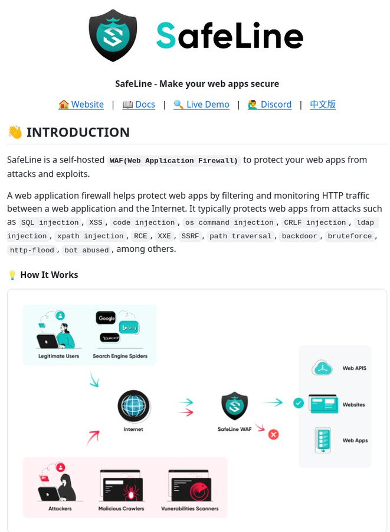

# open_source_application_firewall

**Tweet URL:** [https://x.com/tom_doerr/status/1880972150623850987](https://x.com/tom_doerr/status/1880972150623850987)

**Tweet Text:** Open-source web application firewall

**Image 1 Description:** The image presents a comprehensive overview of SafeLine, a web application firewall (WAF) designed to protect websites from various types of attacks. The image is divided into several sections, each providing valuable information about the features and benefits of using SafeLine.

* **Introduction**
	+ SafeLine is a self-hosted WAF that helps protect web applications by filtering and monitoring HTTP traffic between the application and the internet.
	+ It typically protects against attacks such as SQL injection, XSS, command injection, CRLF injection, LDAP injection, XPath injection, RCE, XXE, SSRF, path traversal, brute force, bot abuse, and others.
* **How it Works**
	+ SafeLine works by analyzing HTTP requests and responses to identify potential threats.
	+ It uses a combination of rules and machine learning algorithms to detect and block malicious traffic.
	+ The system also includes features such as IP blocking, rate limiting, and content filtering to further enhance security.
* **Features**
	+ SafeLine offers a range of features, including:
		- Automatic threat detection and mitigation
		- Customizable rules and policies
		- Real-time monitoring and reporting
		- Integration with other security tools and services
	+ The system is designed to be highly scalable and flexible, making it suitable for use in large-scale deployments.
* **Benefits**
	+ SafeLine provides a number of benefits, including:
		- Improved security and protection against cyber threats
		- Enhanced visibility and control over web application traffic
		- Simplified management and configuration
		- Cost-effective solution compared to traditional WAFs

In summary, the image provides a detailed overview of SafeLine, a powerful web application firewall designed to protect websites from various types of attacks. With its advanced features and customizable rules, SafeLine offers a robust solution for businesses looking to enhance their online security.

