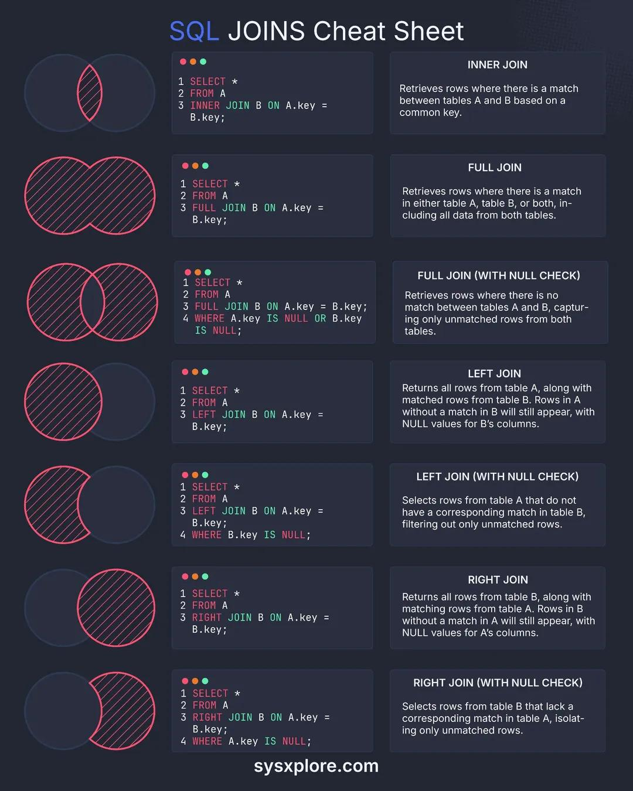

The SQL JOINS cheat sheet is a comprehensive guide to understanding the various types of joins available in SQL. It provides a clear and concise reference for database developers, engineers, and analysts to quickly look up the syntax and usage examples of different join operations.

#### Technical Content
SQL joins are used to combine data from two or more tables based on related columns between them. The cheat sheet covers the following types of joins:
##### 1. INNER JOIN
An inner join returns records that have matching values in both tables.
```sql
SELECT *
FROM table1
INNER JOIN table2
ON table1.column_name = table2.column_name;
```
Example: Suppose we have two tables, `orders` and `customers`, and we want to retrieve the orders with their corresponding customer names.
```sql
SELECT orders.order_id, customers.customer_name
FROM orders
INNER JOIN customers
ON orders.customer_id = customers.customer_id;
```
##### 2. LEFT JOIN (or LEFT OUTER JOIN)
A left join returns all records from the left table and the matched records from the right table. If there are no matches, the result will contain NULL values.
```sql
SELECT *
FROM table1
LEFT JOIN table2
ON table1.column_name = table2.column_name;
```
Example: Retrieve all customers with their corresponding orders, if any.
```sql
SELECT customers.customer_name, orders.order_id
FROM customers
LEFT JOIN orders
ON customers.customer_id = orders.customer_id;
```
##### 3. RIGHT JOIN (or RIGHT OUTER JOIN)
A right join is similar to a left join, but it returns all records from the right table and the matched records from the left table.
```sql
SELECT *
FROM table1
RIGHT JOIN table2
ON table1.column_name = table2.column_name;
```
Example: Retrieve all orders with their corresponding customer names, if any.
```sql
SELECT orders.order_id, customers.customer_name
FROM orders
RIGHT JOIN customers
ON orders.customer_id = customers.customer_id;
```
##### 4. FULL OUTER JOIN
A full outer join returns all records from both tables, with NULL values in the columns where there are no matches.
```sql
SELECT *
FROM table1
FULL OUTER JOIN table2
ON table1.column_name = table2.column_name;
```
Example: Retrieve all customers and orders, with NULL values where there are no matches.
```sql
SELECT customers.customer_name, orders.order_id
FROM customers
FULL OUTER JOIN orders
ON customers.customer_id = orders.customer_id;
```
#### Key Takeaways and Best Practices

* Use the correct type of join based on the requirements of your query.
* Ensure that the columns used in the join condition are of compatible data types.
* Use table aliases to simplify complex queries with multiple joins.
* Avoid using SELECT \* and instead specify only the columns that you need to reduce the amount of data being retrieved.

#### References
The SQL JOINS cheat sheet is a valuable resource for database developers, engineers, and analysts working with relational databases. The following tools and technologies are mentioned:
* SQL (Structured Query Language)
* Relational databases (e.g., MySQL, PostgreSQL, Microsoft SQL Server)
## Source

- Original Tweet: [https://twitter.com/i/web/status/1878513153492877751](https://twitter.com/i/web/status/1878513153492877751)
- Date: 2025-02-20 21:13:36


## Media

### Media 1

**Description:** The image presents a comprehensive cheat sheet for SQL JOINS, providing a clear and concise guide to understanding the various types of joins available in SQL.

*   **Title**: The title "SQL JOINS Cheat Sheet" is prominently displayed at the top of the image.
    *   The title effectively communicates the purpose of the image, which is to provide a quick reference for SQL JOINs.
*   **Visual Representation**: The image features a series of circular diagrams on the left side, each representing a different type of join. These diagrams are accompanied by corresponding code snippets that illustrate how to implement each type of join in SQL.
    *   The visual representation helps to make complex concepts more accessible and easy to understand.
*   **Code Snippets**: The image includes several code snippets that demonstrate how to use each type of join in SQL. These code snippets are concise and clearly labeled, making it easy for users to quickly reference the information they need.
    *   The code snippets provide a practical example of how to apply the concepts learned from the visual representation.
*   **Types of Joins**: The image covers several types of joins, including INNER JOIN, LEFT JOIN, RIGHT JOIN, and FULL OUTER JOIN. Each type of join is explained in detail, including its syntax and usage examples.
    *   The inclusion of multiple types of joins ensures that users have a comprehensive understanding of the different ways to combine data from two or more tables.
*   **Syntax**: The image provides clear and concise syntax for each type of join, making it easy for users to write their own SQL queries using these joins.
    *   The syntax is presented in a consistent format throughout the image, allowing users to quickly reference the information they need.

In summary, the image provides a valuable resource for anyone looking to learn about SQL JOINS. By combining visual representations with concise code snippets and clear explanations, the image effectively communicates complex concepts in an accessible way. Whether you're a beginner or an experienced developer, this cheat sheet is sure to be a useful tool in your database management toolkit.

*Last updated: 2025-02-20 21:13:36*