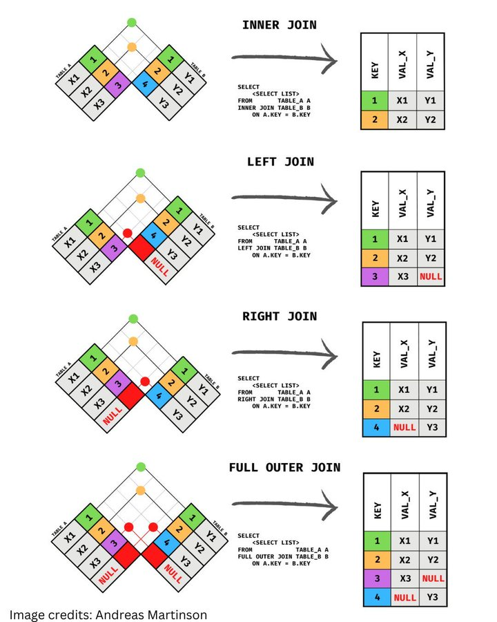

# sql_joins

**Tweet URL:** [https://x.com/Franc0Fernand0/status/1867871911637557685](https://x.com/Franc0Fernand0/status/1867871911637557685)

**Tweet Text:** What are SQL joins?

In a relational database, data are kept mostly normalized in different tables.

Such tables are defined to be as much independent as possible and are related only using keys.

However, to fetch meaningful data, you may need to combine multiple tables.

Join is used to fetch results from related database tables.

[1/4] ↓

**Image 1 Description:** The image presents a comprehensive guide to SQL join operations, illustrating various types of joins through diagrams and accompanying text. The visual representation effectively communicates complex concepts, making it an invaluable resource for understanding different join techniques.

*   **Inner Join**
    *   An inner join returns only records that have matching values in both tables.
    *   It is represented by a Venn diagram with overlapping circles, symbolizing the intersection of two sets.
    *   The text accompanying the diagram explains how to select data from one table based on a condition in another table using the INNER JOIN clause.
*   **Left Join**
    *   A left join returns all records from the left table and matching records from the right table.
    *   It is represented by a Venn diagram with an arrow pointing from the left circle to the right, indicating that all records from the left table are included in the result set.
    *   The text explains how to select data from one table based on a condition in another table using the LEFT JOIN clause.
*   **Right Join**
    *   A right join returns all records from the right table and matching records from the left table.
    *   It is represented by a Venn diagram with an arrow pointing from the right circle to the left, indicating that all records from the right table are included in the result set.
    *   The text explains how to select data from one table based on a condition in another table using the RIGHT JOIN clause.
*   **Full Outer Join**
    *   A full outer join returns all records when there is at least one match in either left or right tables.
    *   It is represented by a Venn diagram with overlapping circles and arrows pointing to both circles, indicating that all records from both tables are included in the result set.
    *   The text explains how to select data from one table based on a condition in another table using the FULL OUTER JOIN clause.

In summary, the image provides a clear and concise visual representation of various SQL join operations, making it easier for developers and database administrators to understand and implement these techniques. By utilizing this resource, individuals can improve their skills in working with databases and creating efficient queries.

