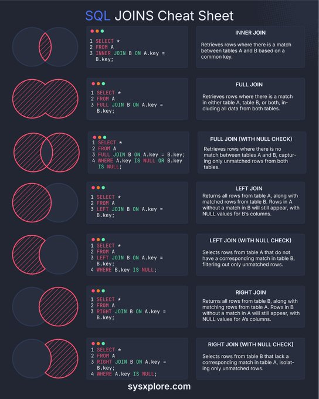

This entry provides a comprehensive guide to SQL joins, including a detailed explanation of eight distinct join types, their syntax, and examples. The information is based on an infographic titled "SQL JOINS Cheat Sheet" and is intended to serve as a valuable resource for individuals looking to improve their understanding of SQL and its applications.

#### Technical Content
SQL joins are used to combine rows from two or more tables based on a related column between them. The resulting table contains columns from both tables, allowing for more complex queries and analysis. There are several types of SQL joins, each with its own specific use case:

* **INNER JOIN**: Retrieves rows where there is a match between tables A and B based on a common key. The syntax for an INNER JOIN is:
```sql
SELECT *
FROM tableA
INNER JOIN tableB
ON tableA.common_key = tableB.common_key;
```
Example: Suppose we have two tables, `orders` and `customers`, with a common column `customer_id`. To retrieve all orders with their corresponding customer information, we can use an INNER JOIN:
```sql
SELECT *
FROM orders
INNER JOIN customers
ON orders.customer_id = customers.customer_id;
```

* **FULL JOIN (WITH NULL CHECK)**: Retrieves rows from both tables with no matching records in either table. The syntax for a FULL JOIN is:
```sql
SELECT *
FROM tableA
FULL OUTER JOIN tableB
ON tableA.common_key = tableB.common_key;
```
Example: To retrieve all customers and their corresponding orders, including customers with no orders and orders with no corresponding customer, we can use a FULL JOIN:
```sql
SELECT *
FROM customers
FULL OUTER JOIN orders
ON customers.customer_id = orders.customer_id;
```

* **LEFT JOIN**: Returns all rows from table A along with matched rows from table B, without any matches resulting in NULL values for column(s) specified in the ON clause. The syntax for a LEFT JOIN is:
```sql
SELECT *
FROM tableA
LEFT JOIN tableB
ON tableA.common_key = tableB.common_key;
```
Example: To retrieve all customers and their corresponding orders, including customers with no orders, we can use a LEFT JOIN:
```sql
SELECT *
FROM customers
LEFT JOIN orders
ON customers.customer_id = orders.customer_id;
```

* **RIGHT JOIN (WITH NULL CHECK)**: Selects rows from table B that lack a corresponding match in table A while isolating only unmatched rows. The syntax for a RIGHT JOIN is:
```sql
SELECT *
FROM tableA
RIGHT JOIN tableB
ON tableA.common_key = tableB.common_key;
```
Example: To retrieve all orders with no corresponding customer, we can use a RIGHT JOIN:
```sql
SELECT *
FROM customers
RIGHT JOIN orders
ON customers.customer_id = orders.customer_id
WHERE customers.customer_id IS NULL;
```

In addition to these join types, there are four more:

* **CROSS JOIN**: Returns the Cartesian product of both tables.
* **SELF JOIN**: Joins a table with itself.
* **SEMI JOIN**: Returns rows from one table where there is a match in another table.
* **ANTI JOIN**: Returns rows from one table where there is no match in another table.

#### Key Takeaways and Best Practices
When working with SQL joins, keep the following best practices in mind:

* Always specify the join type (e.g., INNER JOIN, LEFT JOIN) to avoid ambiguity.
* Use meaningful table aliases to improve query readability.
* Be cautious when using FULL JOINs, as they can result in large datasets.
* Test your queries thoroughly to ensure correct results.

#### References
The infographic "SQL JOINS Cheat Sheet" is available on the website [sysxplore.com](http://sysxplore.com). This resource provides a comprehensive guide to SQL joins and is intended for individuals looking to improve their understanding of SQL and its applications.
## Source

- Original Tweet: [https://twitter.com/i/web/status/1891946149730451954](https://twitter.com/i/web/status/1891946149730451954)
- Date: 2025-02-20 20:44:43


## Media

### Media 1

**Description:** The infographic, titled "SQL JOINS Cheat Sheet," presents a comprehensive guide to SQL joins. The title is displayed in white text at the top of the image, with the word "SQL" in blue.

**Key Features:**

* A black background
* White text throughout the cheat sheet
* Eight distinct SQL join types are illustrated using red and green lines within circles on the left side of the infographic

**SQL Join Types:**

The infographic provides a detailed explanation of each SQL join type, including:

* INNER JOIN: Retrieves rows where there is a match between tables A and B based on a common key
* FULL JOIN (WITH NULL CHECK): Retrieves rows from both tables with no matching records in either table
* LEFT JOIN: Returns all rows from table A along with matched rows from table B, without any matches resulting in NULL values for column(s) specified in the ON clause
* RIGHT JOIN (WITH NULL CHECK): Selects rows from table B that lack a corresponding match in table A while isolating only unmatched rows

**Additional Information:**

At the bottom of the infographic, the website "sysxplore.com" is listed in white text. This suggests that the infographic may be part of a larger resource or tutorial on SQL and database management.

Overall, the infographic provides a clear and concise overview of various SQL join types, making it a valuable resource for individuals looking to improve their understanding of SQL and its applications.

*Last updated: 2025-02-20 20:44:43*