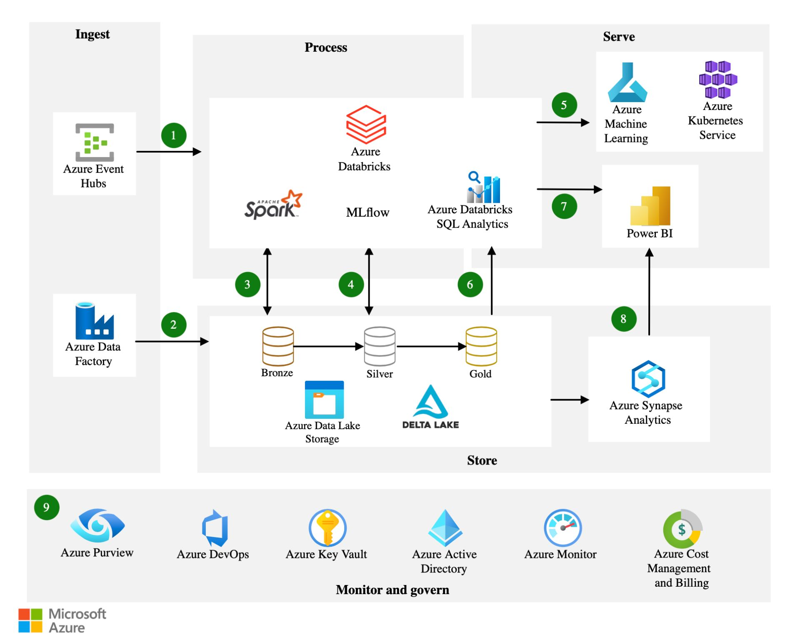

**Source:** [https://twitter.com/i/web/status/1879786511509647635](https://twitter.com/i/web/status/1879786511509647635)
**Original Post Date:** 2025-05-27 17:34:50

# Azure-Based Data Pipeline Architecture: Design Framework

## Introduction
This article presents a modern approach to designing enterprise-grade data pipelines using Microsoft Azure services. The architecture covers the complete data lifecycle from ingestion through serving, incorporating best practices for scalability, security, and compliance. This framework is essential for teams building real-time analytics platforms or data-driven applications requiring robust ETL capabilities.

## Data Ingestion Layer

The ingestion layer handles high-throughput event streaming and batch processing using Azure Event Hubs and Data Factory. Event Hubs supports real-time data streams from IoT devices and applications, while Data Factory orchestrates complex ETL workflows.

Key components include: 
- Event Hubs for scalable event ingestion
- Data Factory for workflow orchestration
- Storage connectors for various data sources

- Event Hubs can handle millions of events per second with guaranteed delivery
- Data Factory provides native integration with over 90 different data sources
- Supports both real-time streaming and batch processing paradigms

> **Note/Tip:** Always implement dead-letter queues for failed message handling in Event Hubs

## Processing Layer

The processing layer transforms raw data using Apache Spark and MLflow, running on Azure Databricks. This tier handles data cleansing, feature engineering, and model training.

Spark's distributed computing capabilities enable processing of petabyte-scale datasets efficiently.

_Example of reading from Delta Lake in Databricks_

```scala
val df = spark.read
  .format("delta")
  .load("/data/silver")
  .filter(col("processed_date") >= current_date())
```

1. Use Delta Lake for ACID-compliant storage within Databricks
1. Implement structured logging using Apache Log4j or similar frameworks
1. Utilize MLflow's experiment tracking for model versioning

## Storage Architecture

Data is stored across three maturity layers: Bronze, Silver, and Gold. Each layer represents increasing data quality and refinement.

Delta Lake provides ACID transactions and time travel capabilities for all storage tiers.

- Bronze: Raw data with minimal transformations
- Silver: Cleaned, validated data ready for analysis
- Gold: Business-ready datasets enriched with calculations and aggregations

## Monitoring & Governance

The governance layer ensures compliance and operational reliability through Azure Purview, Monitor, and Key Vault.

Real-time monitoring captures performance metrics, while Azure DevOps automates CI/CD pipelines for continuous delivery.

- Use Azure Purview for data lineage tracking
- Implement role-based access control via Azure AD
- Enable automated cost management and optimization

## Key Takeaways

- Design with scalability in mind by leveraging managed services like Event Hubs and Data Factory.
- Implement the Bronze-Silver-Gold data maturity model for consistent quality.
- Ensure end-to-end monitoring and governance using Azure's built-in tools.

## Conclusion
This architecture provides a robust foundation for building enterprise-scale data pipelines. By following these patterns, teams can create reliable, scalable solutions that meet modern business requirements while maintaining security and compliance standards.

## External References

- [Microsoft Azure Data Factory Documentation](https://docs.microsoft.com/en-us/azure/data-factory/)
- [Databricks Delta Lake Guide](https://docs.databricks.com/delta/index.html)


## Media

**Image Description:** The image depicts a comprehensive data pipeline architecture using Microsoft Azure services, illustrating the flow of data from ingestion to serving, along with monitoring and governance. The diagram is divided into several sections, each representing a stage in the data lifecycle. Below is a detailed description of the image:

---

### **1. Ingest**
This section represents the initial stage where data is ingested into the system. It includes two primary components:

- **Azure Event Hubs (1)**: 
  - Azure Event Hubs is a highly scalable, real-time event ingestion service. It is used to capture and process large volumes of event data from various sources, such as IoT devices, applications, or other systems.
  - This component is connected to the next stage via a numbered arrow labeled "1."

- **Azure Data Factory (2)**:
  - Azure Data Factory is a cloud-based data integration service used for orchestrating and automating data movement and transformation. It can ingest data from various sources, including databases, files, and APIs.
  - This component is connected to the next stage via a numbered arrow labeled "2."

---

### **2. Process**
This section focuses on the transformation and processing of data. It includes several key components:

- **Azure Databricks (3)**:
  - Azure Databricks is a unified analytics platform that simplifies data engineering, data science, and machine learning workflows. It is built on Apache Spark and provides a collaborative environment for data processing and analytics.
  - This component is connected to the next stage via a numbered arrow labeled "3."

- **Apache Spark (4)**:
  - Apache Spark is a fast and general-purpose cluster computing system for large-scale data processing. It is used for batch and real-time data processing, enabling transformations and computations on large datasets.
  - This component is connected to the next stage via a numbered arrow labeled "4."

- **MLflow (5)**:
  - MLflow is an open-source platform for managing the end-to-end machine learning lifecycle, including tracking experiments, packaging models, and deploying models to production.
  - This component is connected to the next stage via a numbered arrow labeled "5."

- **Azure Databricks SQL Analytics (6)**:
  - Azure Databricks SQL Analytics provides a SQL interface for querying data stored in Databricks. It allows users to run SQL queries on large datasets without needing to write complex Spark code.
  - This component is connected to the next stage via a numbered arrow labeled "6."

---

### **3. Store**
This section represents the storage of data in various stages of processing. It includes:

- **Azure Data Lake Storage (Bronze, Silver, Gold)**:
  - Azure Data Lake Storage is a highly scalable and secure data lake storage solution. The diagram shows three stages of data storage:
    - **Bronze**: Raw, unprocessed data.
    - **Silver**: Data that has been cleaned and transformed but not yet enriched.
    - **Gold**: Fully processed, enriched, and ready-to-use data.
  - These stages are connected sequentially, indicating the flow of data from raw to refined forms.

- **Delta Lake**:
  - Delta Lake is an open-source storage layer that brings reliability to data lakes. It provides ACID transactions, data versioning, and schema enforcement for data stored in Apache Spark and Databricks.
  - This component is integrated with the storage layers.

---

### **4. Serve**
This section focuses on serving the processed data to various applications and services. It includes:

- **Azure Machine Learning (5)**:
  - Azure Machine Learning is a cloud-based service for building, training, and deploying machine learning models. It allows users to operationalize machine learning models for real-time or batch predictions.
  - This component is connected to the "Serve" section via a numbered arrow labeled "5."

- **Azure Kubernetes Service (AKS)**:
  - Azure Kubernetes Service (AKS) is a managed Kubernetes service for deploying and managing containerized applications. It can be used to deploy machine learning models or other applications in a scalable and secure manner.
  - This component is connected to the "Serve" section via a numbered arrow labeled "5."

- **Power BI (7)**:
  - Power BI is a business analytics service that provides interactive visualizations and business intelligence capabilities. It is used to create dashboards and reports for data analysis.
  - This component is connected to the "Serve" section via a numbered arrow labeled "7."

- **Azure Synapse Analytics (8)**:
  - Azure Synapse Analytics is a unified analytics service that brings together data integration, enterprise data warehousing, and big data analytics. It is used for querying and analyzing data across various storage systems.
  - This component is connected to the "Serve" section via a numbered arrow labeled "8."

---

### **5. Monitor and Govern**
This section focuses on monitoring, security, and governance of the data pipeline. It includes several key components:

- **Azure Purview (9)**:
  - Azure Purview is a data governance service that provides a comprehensive view of an organization's data assets. It helps in managing data catalogs, lineage, and compliance.
  - This component is connected to the monitoring section via a numbered arrow labeled "9."

- **Azure DevOps**:
  - Azure DevOps is a set of tools for software development and project management. It is used for version control, continuous integration, and continuous deployment (CI/CD) of data pipelines and applications.

- **Azure Key Vault**:
  - Azure Key Vault is a secure cloud service for storing and managing cryptographic keys, secrets, and certificates. It ensures the security of sensitive data and credentials used in the pipeline.

- **Azure Active Directory (Azure AD)**:
  - Azure Active Directory is Microsoft's cloud-based identity and access management service. It provides single sign-on (SSO) and access control for users and applications.

- **Azure Monitor**:
  - Azure Monitor is a cloud-based service for monitoring the performance and health of applications and infrastructure. It provides insights into the performance of the data pipeline and helps in troubleshooting issues.

- **Azure Cost Management and Billing**:
  - Azure Cost Management and Billing provides tools for managing and monitoring costs associated with Azure resources. It helps in optimizing resource usage and controlling expenses.

---

### **Overall Flow**
The diagram illustrates a complete data lifecycle:
1. **Ingestion**: Data is ingested using Azure Event Hubs and Azure Data Factory.
2. **Processing**: Data is processed using Azure Databricks, Apache Spark, MLflow, and Azure Databricks SQL Analytics.
3. **Storage**: Data is stored in Azure Data Lake Storage in Bronze, Silver, and Gold stages, with Delta Lake providing reliability.
4. **Serving**: Processed data is served to applications using Azure Machine Learning, AKS, Power BI, and Azure Synapse Analytics.
5. **Monitoring and Governance**: The pipeline is monitored and governed using Azure Purview, Azure DevOps, Azure Key Vault, Azure AD, Azure Monitor, and Azure Cost Management.

---

### **Key Technical Details**
- **Scalability**: The use of Azure services like Event Hubs, Data Factory, and Databricks ensures scalability for handling large volumes of data.
- **Data Quality**: The Bronze, Silver, and Gold storage layers ensure data is processed and refined at each stage.
- **Security**: Azure Key Vault and Azure AD ensure secure access and management of sensitive data.
- **Automation**: Azure DevOps enables CI/CD for automating the deployment and management of the pipeline.
- **Compliance and Governance**: Azure Purview helps in managing data governance and compliance.

---

This diagram provides a comprehensive view of a modern data pipeline architecture, leveraging Azure services for data ingestion, processing, storage, serving, and governance. It highlights the integration of various Azure tools to build a robust and scalable data solution.
