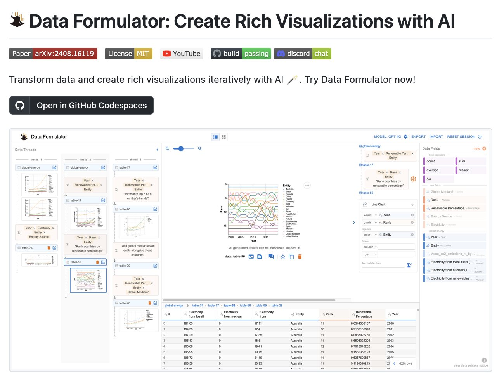

**Source:** [https://twitter.com/i/web/status/1926637371946045548](https://twitter.com/i/web/status/1926637371946045548)
**Original Post Date:** 2025-05-28 09:20:26

# Data Formulator Pipeline: AI-Driven Data Transformation and Visualization

## Introduction
The Data Formulator pipeline represents a modern approach to data engineering that combines traditional ETL processes with artificial intelligence capabilities. This knowledge base item explores its architecture, key components, and implementation considerations. The pipeline's unique feature set enables iterative development of data transformations while leveraging AI for enhanced visualization and analysis.

## Architectural Components

The Data Formulator pipeline consists of five main architectural layers: Data Threads, Visualizations, Operations, Data Table, and Model Management. Each layer serves a specific purpose in the data transformation and visualization workflow.

Data Threads provide hierarchical organization of datasets and workflows, while the Visualization layer handles interactive rendering. The Operations layer enables statistical transformations and filtering, and the Data Table presents raw or transformed data with AI-generated result warnings.

- Data Threads for dataset management
- Interactive visualization components
- Statistical operation engine
- Real-time data table rendering
- AI model integration layer

## Technical Implementation Details

The pipeline leverages GPT-40 for AI-driven transformations, with warnings displayed for AI-generated results to ensure data integrity. Interactive visualizations support dynamic filtering through UI elements like sliders and dropdown menus.

Data manipulation operations include aggregations (count, average), rankings, and field modifications, all accessible through the Operations layer.

> **Note/Tip:** Always verify AI-generated results before production use

> **Note/Tip:** Implement version control for data transformations

> **Note/Tip:** Monitor model performance across different datasets

## Deployment and Community Support

The pipeline is open-source under MIT license, with cloud deployment options via GitHub Codespaces. Community support is available through Discord chat and YouTube tutorials.

Build status monitoring ensures codebase reliability, while academic foundations are documented in the associated arXiv paper.

## Key Takeaways

- Data Formulator combines traditional ETL with AI capabilities for modern data transformation
- Interactive visualization components enable dynamic exploration of data relationships
- Hierarchical data thread organization supports complex workflow management
- Open-source nature and community support enhance adoption and development

## Conclusion
The Data Formulator pipeline exemplifies the evolution of data engineering toward AI-augmented workflows. Its architecture balances automation with user control, making it suitable for both rapid prototyping and production environments. Engineers should consider its iterative approach to data transformation while maintaining vigilance over AI-generated outputs.

## External References

- [Data Formulator Research Paper](https://arxiv.org/abs/2408.16119)
- [GitHub Codespaces Documentation](https://github.com/features/codespaces)
- [Data Formulator YouTube Channel](https://youtube.com/DataFormulatorChannel)

## Media

**Image Description:** The image showcases a tool called **Data Formulator**, which is designed to transform data and create rich visualizations iteratively using AI. Below is a detailed description of the image, focusing on its main components and technical details:

### **Header Section**
1. **Title**:
   - The title reads: **"Data Formulator: Create Rich Visualizations with AI"**.
   - This indicates the primary purpose of the tool: to facilitate the creation of data visualizations using AI-driven techniques.

2. **Badges and Links**:
   - **Paper**: A link to an arXiv paper (arXiv:2408.16119), suggesting that the tool is based on research published in an academic paper.
   - **License**: The tool is licensed under the MIT license, indicating it is open-source and freely available for use.
   - **YouTube**: A link to a YouTube channel, likely for tutorials or demonstrations related to the tool.
   - **Build Status**: The build status is marked as "passing," indicating that the codebase is functioning correctly.
   - **Discord Chat**: A link to a Discord server, suggesting a community or support channel for users.

3. **Call to Action**:
   - The text encourages users to try the tool and mentions the iterative nature of data transformation and visualization using AI.

4. **GitHub Codespaces Button**:
   - A button labeled **"Open in GitHub Codespaces"** allows users to access and run the tool directly in a cloud-based development environment provided by GitHub.

---

### **Main Interface**
The main section of the image displays the **Data Formulator interface**, which is divided into several key components:

#### **1. Data Threads**
- **Location**: On the left side of the interface.
- **Description**: This section shows a list of data threads, which appear to be different datasets or data processing workflows.
  - Examples of data threads include:
    - **Bread-1**, **global-energy**, **table-17**, **table-56**, etc.
  - Each thread is represented as a box with a title and a small preview of the data or visualization.
  - The threads seem to be organized in a hierarchical or sequential manner, indicating different stages or types of data processing.

#### **2. Visualizations**
- **Location**: The central and right sections of the interface.
- **Description**: This area displays various visualizations generated from the data threads.
  - **Types of Visualizations**:
    - Line charts, bar charts, and scatter plots are visible.
    - These visualizations appear to represent trends over time (e.g., "Year" as a common axis).
  - **Examples**:
    - A line chart showing trends in renewable energy percentages across different countries.
    - A bar chart comparing electricity generation from fossil fuels and nuclear sources.
    - A scatter plot showing relationships between variables like "Renewable Percentage" and "Rank."
  - **Interactive Elements**:
    - The visualizations are interactive, as indicated by the presence of sliders, dropdown menus, and other UI elements for filtering and exploring data.

#### **3. Data Fields and Operations**
- **Location**: On the right side of the interface.
- **Description**: This section provides a detailed breakdown of the data fields and operations available for manipulation.
  - **Data Fields**:
    - Lists fields such as "Year," "Entity," "Rank," "Renewable Percentage," etc.
  - **Operations**:
    - Includes statistical operations like "count," "average," "sum," "median," etc.
    - Users can apply these operations to transform and analyze the data.
  - **Filters and Parameters**:
    - Users can filter data based on specific criteria (e.g., selecting specific countries or years).
    - Parameters like "x-axis" and "y-axis" allow customization of visualizations.

#### **4. Data Table**
- **Location**: At the bottom of the interface.
- **Description**: This section shows a tabular representation of the data, which appears to be the raw or transformed dataset.
  - **Columns**:
    - Includes fields such as "Year," "Entity," "Rank," "Renewable Percentage," etc.
  - **Rows**:
    - Displays data entries for different countries (e.g., Australia) over various years.
  - **AI-Generated Warning**:
    - A note at the bottom of the table warns users that AI-generated results may be inaccurate and should be inspected.

#### **5. Model and Export Options**
- **Location**: At the top-right corner of the interface.
- **Description**:
  - **Model**: Indicates the AI model being used (e.g., "GPT-40").
  - **Export/Import**: Options to export or import data, allowing users to save or load datasets.
  - **Reset Session**: A button to reset the current session, likely for starting fresh with new data or configurations.

---

### **Technical Details**
1. **AI Integration**:
   - The tool leverages AI (e.g., GPT-40) to assist in data transformation and visualization.
   - The AI-generated results are flagged with a warning, emphasizing the need for user verification.

2. **Interactive Visualization**:
   - The interface supports interactive visualizations, allowing users to explore data dynamically.
   - Features like sliders, dropdowns, and filters enable fine-tuning of visualizations.

3. **Data Manipulation**:
   - Users can perform various operations on data fields, such as counting, averaging, summing, and ranking.
   - The ability to add or modify fields suggests a flexible data manipulation workflow.

4. **Community and Support**:
   - Links to a YouTube channel and Discord chat indicate community support and resources for learning and troubleshooting.

5. **Open-Source Nature**:
   - The MIT license and GitHub Codespaces integration suggest that the tool is open-source and can be accessed and modified by developers.

---

### **Overall Impression**
The **Data Formulator** is a comprehensive tool designed for data scientists, analysts, and researchers to transform and visualize data efficiently using AI. The interface is user-friendly, with clear sections for data threads, visualizations, data fields, and operations. The integration of AI, interactive visualizations, and community support makes it a powerful tool for data exploration and analysis. The warning about AI-generated results highlights the importance of critical evaluation in data science workflows.
