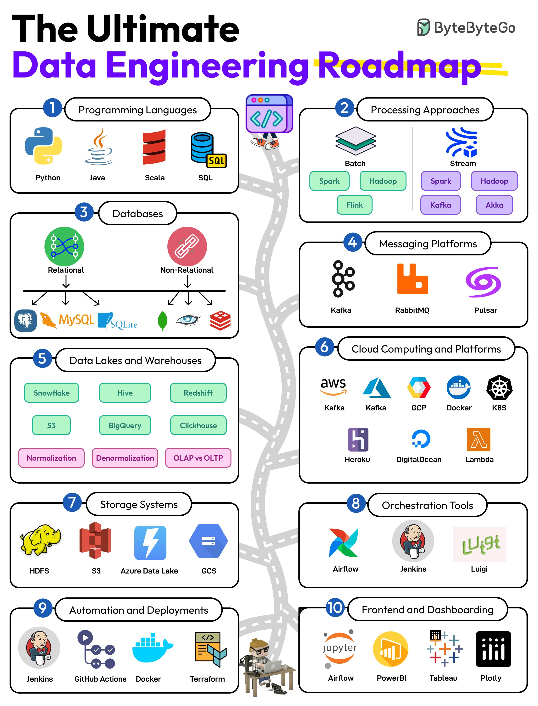

**Source:** [https://twitter.com/i/web/status/1911804150356254867](https://twitter.com/i/web/status/1911804150356254867)
**Original Post Date:** 2025-05-27 20:23:47

# Data Pipeline Architecture: Comprehensive Guide to Modern Data Engineering

## Introduction
Data pipeline architecture forms the backbone of modern data systems. This comprehensive guide explores essential components including programming languages, processing approaches, storage solutions, orchestration tools, and visualization platforms. Understanding these elements is crucial for building robust, scalable data infrastructure that handles both batch and real-time data processing effectively.

Key areas include programming fundamentals, distributed computing paradigms, cloud technologies, and automation strategies.

## Programming Languages Foundation

Mastering core languages is essential for data engineering. Python provides versatile capabilities for ETL operations and analytics, while Java excels in building scalable systems. Scala's functional programming features integrate well with big data tools like Apache Spark. SQL remains fundamental for database interactions.

- Python: ETL pipelines and machine learning integration
- Java: Building distributed systems and applications
- Scala: Big data processing with functional programming

## Data Processing Paradigms

Batch vs stream processing forms the core of modern data architectures. Batch processing excels for periodic large-scale computations, while streaming handles real-time analytics and immediate insights.

_Demonstrates basic batch processing using PySpark_

```python
# Example Spark batch job
from pyspark.sql import SparkSession
spark = SparkSession.builder.appName('BatchJob').getOrCreate()
df = spark.read.csv('data/input.csv')
processed_df.write.parquet('output/path')
```

1. Hadoop: MapReduce for large-scale data processing
1. Apache Spark: Unified analytics engine supporting both batch and stream processing

> **Note/Tip:** Choose appropriate paradigm based on latency requirements and data volume

## Storage and Messaging Architecture

Distributed storage systems like HDFS provide reliable big data storage. Modern cloud solutions offer scalable alternatives while messaging platforms enable real-time data flow.

```java
// Kafka producer example
Properties props = new Properties();
props.put("bootstrap.servers", "localhost:9092");
KafkaProducer<String, String> producer = 
    new KafkaProducer<>(props);
```

## Orchestration and Automation

Modern data pipelines require robust orchestration tools. Airflow provides DAG-based workflow management while Jenkins handles CI/CD automation.

```python
# Airflow DAG example
dag = DAG('data_pipeline', schedule_interval='@daily')
task1 = PythonOperator(
    task_id='process_data',
    python_callable=process_function,
    dag=dag)
```

## Cloud Infrastructure and Best Practices

Cloud platforms (AWS, GCP, Azure) offer comprehensive services for data engineering. Strategic cloud adoption enables scalable, cost-effective solutions.

- Leverage serverless computing for event-driven workloads
- Implement multi-cloud strategies for resilience

## Key Takeaways

- Master core programming languages (Python, Scala, SQL) for data engineering tasks
- Understand batch vs stream processing paradigms and choose appropriately
- Design scalable storage architecture using distributed systems and cloud services
- Implement robust orchestration using modern workflow management tools

## Conclusion
Effective data pipeline architecture combines technical expertise across multiple domains. By mastering programming languages, understanding processing approaches, implementing proper storage solutions, and leveraging automation tools, engineers can build efficient, scalable data infrastructure that meets modern business needs.

## External References

- [Apache Airflow Documentation](https://airflow.apache.org/docs/apache-airflow/stable/)
- [AWS Data Pipeline Guide](https://aws.amazon.com/datapipeline/)


## Media

**Image Description:** This image is a comprehensive roadmap titled **"The Ultimate Data Engineering Roadmap"**, designed to guide individuals through the key concepts, tools, and technologies in the field of data engineering. The roadmap is visually structured as a journey along a road, with each segment representing a different stage or area of focus in data engineering. Below is a detailed breakdown of the image:

---

### **1. Programming Languages**
- **Icon**: Python, Java, Scala, SQL
- **Description**: This section highlights the essential programming languages used in data engineering:
  - **Python**: A versatile language widely used for data manipulation, analysis, and machine learning.
  - **Java**: A robust language often used for building scalable systems and applications.
  - **Scala**: A functional programming language popular in big data processing, especially with Apache Spark.
  - **SQL**: The standard language for querying and managing relational databases.

---

### **2. Processing Approaches**
- **Icon**: Batch, Stream
- **Description**: This section covers the two primary data processing paradigms:
  - **Batch Processing**: Processing large datasets in fixed intervals.
    - **Tools**: Hadoop, Spark, Flink.
  - **Stream Processing**: Real-time processing of continuous data streams.
    - **Tools**: Spark Streaming, Kafka, Flink, Akka.

---

### **3. Databases**
- **Icon**: Relational, Non-Relational
- **Description**: This section distinguishes between two types of databases:
  - **Relational Databases**: Structured databases with tables and relationships.
    - **Tools**: MySQL, PostgreSQL, SQLite.
  - **Non-Relational (NoSQL) Databases**: Flexible databases for handling unstructured or semi-structured data.
    - **Tools**: MongoDB, Cassandra, Redis.

---

### **4. Messaging Platforms**
- **Icon**: Kafka, RabbitMQ, Pulsar
- **Description**: These are tools used for building scalable, distributed messaging systems:
  - **Kafka**: A distributed streaming platform for handling real-time data.
  - **RabbitMQ**: A message broker for reliable messaging.
  - **Pulsar**: A distributed messaging and streaming platform.

---

### **5. Data Lakes and Warehouses**
- **Icon**: Snowflake, Hive, Redshift, BigQuery, Clickhouse
- **Description**: This section covers platforms for storing and analyzing large volumes of data:
  - **Data Warehouses**: Centralized repositories for structured data.
    - **Tools**: Snowflake, Redshift, BigQuery.
  - **Data Lakes**: Storage for raw, unstructured data.
    - **Tools**: Hive, Clickhouse.

---

### **6. Cloud Computing and Platforms**
- **Icon**: AWS, GCP, Azure
- **Description**: This section highlights major cloud service providers and their offerings:
  - **AWS**: Amazon Web Services, offering a wide range of services like S3, Lambda, and EMR.
  - **GCP**: Google Cloud Platform, with tools like BigQuery and Dataflow.
  - **Azure**: Microsoft Azure, providing services like Azure Data Lake and Databricks.

---

### **7. Storage Systems**
- **Icon**: HDFS, S3, Azure, GCS
- **Description**: This section covers distributed storage systems:
  - **HDFS**: Hadoop Distributed File System for storing large datasets.
  - **S3**: Amazon S3 for cloud-based object storage.
  - **Azure**: Azure Blob Storage for scalable storage.
  - **GCS**: Google Cloud Storage for cloud-based storage.

---

### **8. Orchestration Tools**
- **Icon**: Airflow, Jenkins, Luigi
- **Description**: These tools are used for automating and orchestrating data pipelines:
  - **Airflow**: A workflow management platform for scheduling and monitoring data pipelines.
  - **Jenkins**: A CI/CD tool for automating software development processes.
  - **Luigi**: A Python-based workflow management system.

---

### **9. Automation and Deployments**
- **Icon**: Jenkins, GitHub Actions, Docker, Terraform
- **Description**: This section covers tools for automating and deploying data engineering solutions:
  - **Jenkins**: For continuous integration and continuous deployment (CI/CD).
  - **GitHub Actions**: For automating workflows in GitHub repositories.
  - **Docker**: For containerizing applications.
  - **Terraform**: For infrastructure as code (IaC) to manage cloud resources.

---

### **10. Frontend and Dashboarding**
- **Icon**: Jupyter, PowerBI, Tableau, Plotly
- **Description**: This section covers tools for data visualization and dashboarding:
  - **Jupyter**: An interactive notebook environment for data exploration.
  - **PowerBI**: A business analytics tool for creating interactive dashboards.
  - **Tableau**: A powerful data visualization tool for creating interactive dashboards.
  - **Plotly**: A library for creating interactive visualizations in Python.

---

### **Visual Design and Layout**
- The roadmap is visually organized as a journey along a road, with each segment representing a different stage in the data engineering learning path.
- Icons and logos of popular tools and technologies are used to represent each category, making the roadmap visually engaging and easy to understand.
- The color scheme is bright and consistent, with each section having its own color to differentiate topics.

---

### **Overall Purpose**
This roadmap serves as a comprehensive guide for individuals looking to navigate the field of data engineering. It covers the foundational skills, tools, and technologies required to build robust data pipelines, manage data storage, and create meaningful insights through visualization and dashboarding. The roadmap is particularly useful for beginners and intermediate learners who want to structure their learning journey in a systematic manner. 

---

### **Key Takeaways**
1. **Programming Languages**: Python, Java, Scala, SQL.
2. **Processing Approaches**: Batch (Hadoop, Spark) and Stream (Kafka, Flink).
3. **Databases**: Relational (MySQL, PostgreSQL) and NoSQL (MongoDB, Cassandra).
4. **Messaging Platforms**: Kafka, RabbitMQ, Pulsar.
5. **Data Lakes and Warehouses**: Snowflake, BigQuery, Redshift.
6. **Cloud Platforms**: AWS, GCP, Azure.
7. **Storage Systems**: HDFS, S3, Azure Blob Storage.
8. **Orchestration Tools**: Airflow, Jenkins, Luigi.
9. **Automation and Deployments**: Jenkins, GitHub Actions, Docker, Terraform.
10. **Frontend and Dashboarding**: Jupyter, PowerBI, Tableau, Plotly.

This roadmap provides a clear and structured path for anyone interested in mastering data engineering.
