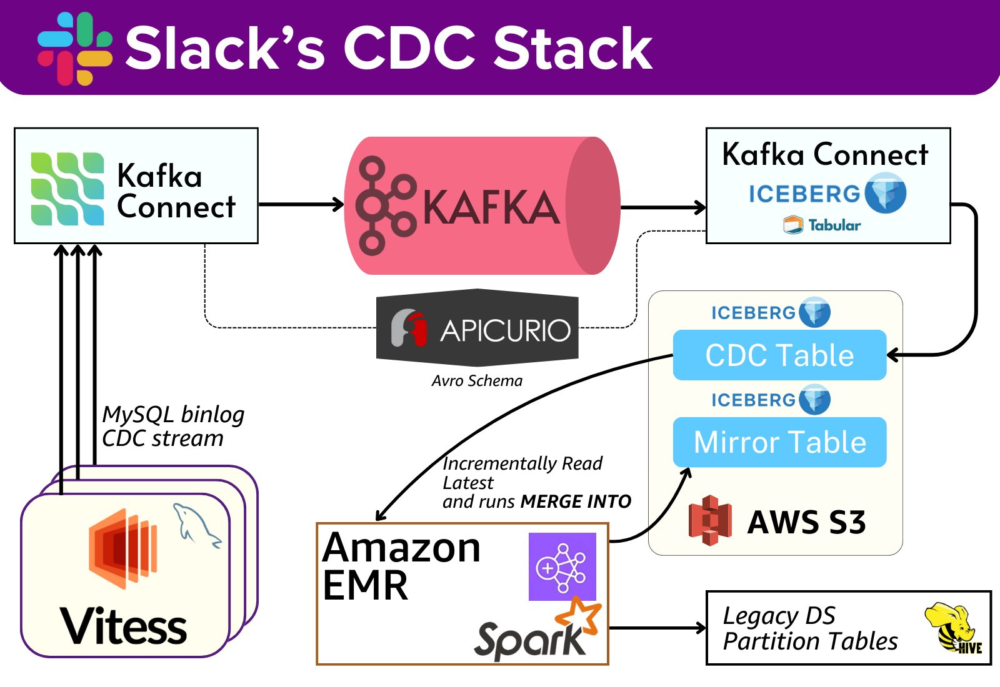

**Source:** [https://twitter.com/i/web/status/1908523999467892865](https://twitter.com/i/web/status/1908523999467892865)
**Original Post Date:** 2025-05-27 21:25:30

# Slack's Data Pipeline Architecture: Change Data Capture (CDC) Implementation

## Introduction
This article explores Slack's sophisticated Change Data Capture (CDC) implementation, designed to efficiently process and store real-time database changes. The architecture leverages modern technologies including Apache Kafka, Delta Lake-compatible Iceberg tables, and Amazon Web Services, creating a robust system for handling high-volume data streams from MySQL databases. This knowledge base item provides comprehensive insights into the pipeline's design principles, component interactions, and best practices.

## Data Pipeline Architecture Overview

The architecture begins with MySQL Binlog as the source of CDC data, capturing all database changes in real-time. This stream is ingested into Kafka via Kafka Connect, ensuring reliable and scalable data ingestion.

Kafka serves as the central messaging system, storing data in Avro-encoded format across multiple topics. The pipeline then routes this data to downstream systems including Iceberg tables for storage, Apicurio for schema management, and Tabular for integrated data access.

- Real-time MySQL change capture via Binlog
- Kafka-based streaming with Avro serialization
- Iceberg storage with AWS S3 backing
- Apicurio-managed schema evolution

> **Note/Tip:** Ensure proper MySQL replication configuration for reliable CDC streams

> **Note/Tip:** Implement Kafka retention policies based on data volume and business needs

## Data Storage and Processing Components

Iceberg tables are the primary storage mechanism, supported by AWS S3 for scalability. The system maintains both raw CDC data and mirrored source database tables in Iceberg format.

Amazon EMR and Apache Spark work together to process large datasets from Kafka streams and legacy systems, enabling complex analytics and data transformation operations.

1. Set up partitioning strategies for optimal query performance in Iceberg tables
1. Configure EMR clusters with appropriate Spark versions for compatibility

## Schema Management and Legacy Integration

Apicurio plays a critical role in managing Avro schemas used across the pipeline, ensuring schema evolution without breaking existing consumers.

Legacy partitioned tables are integrated using Spark, providing a migration path for older data systems into the modern architecture.

> **Note/Tip:** Maintain backward compatibility during schema updates

> **Note/Tip:** Monitor legacy integration processes for performance bottlenecks

## Key Takeaways

- CDC implementation requires careful orchestration of real-time streaming and storage components
- Schema management is crucial for maintaining system stability during data evolution
- Integration with legacy systems demands robust migration strategies and monitoring

## Conclusion
Slack's CDC architecture demonstrates a mature approach to handling real-time data changes at scale. The combination of reliable ingestion, flexible storage, and robust processing capabilities provides a foundation for building scalable data pipelines. Understanding these components and their interactions is essential for designing similar systems in large-scale applications.

## External References

- [Apache Kafka Documentation](https://kafka.apache.org/documentation/)
- [Delta Lake (Iceberg) Documentation](https://delta.io/)

## Media

**Image Description:** The image depicts a complex data pipeline architecture, specifically designed for Change Data Capture (CDC) and data processing. The diagram is titled **"Slack's CDC Stack"**, and it illustrates the flow of data from a source database through various components to a destination storage system. Below is a detailed breakdown of the image:

---

### **Main Components and Flow**

1. **MySQL Binlog (CDC Stream)**:
   - **Location**: Bottom-left corner.
   - **Description**: The MySQL Binlog is the source of the data. It represents the binary log of MySQL, which captures all the changes (inserts, updates, deletes) made to the database. This is the starting point of the CDC stream.
   - **Key Details**:
     - The binlog is labeled as a "CDC stream," indicating that it is used for capturing continuous changes in real-time.
     - It is connected to Kafka Connect, which acts as the bridge to ingest these changes into the Kafka cluster.

2. **Kafka Connect**:
   - **Location**: Top-left corner.
   - **Description**: Kafka Connect is a tool for scalably and reliably streaming data between Apache Kafka and other systems. In this context, it is used to ingest the MySQL Binlog data into Kafka.
   - **Key Details**:
     - Kafka Connect reads the MySQL Binlog and transforms the data into a format suitable for Kafka.
     - It acts as the data ingestion layer, ensuring that the data is reliably streamed into Kafka.

3. **Kafka**:
   - **Location**: Center of the diagram.
   - **Description**: Kafka is a distributed streaming platform used for building real-time data pipelines and streaming applications. It serves as the central hub for processing and distributing the CDC data.
   - **Key Details**:
     - Kafka stores the ingested data from Kafka Connect in topics.
     - The data is stored in an Avro Schema format, which is a flexible and efficient serialization format for structured data.
     - Kafka is connected to multiple downstream systems, including Iceberg, Tabular, and Apicurio.

4. **Apicurio**:
   - **Location**: Center-right, below Kafka.
   - **Description**: Apicurio is a tool for managing and versioning APIs and schemas. In this context, it is used to manage the Avro schemas used in the Kafka topics.
   - **Key Details**:
     - Apicurio ensures that the schemas used for serialization and deserialization of data in Kafka are versioned and consistent.
     - It plays a critical role in maintaining schema compatibility and evolution.

5. **Iceberg**:
   - **Location**: Top-right and middle-right sections.
   - **Description**: Iceberg is an open-source table format for large analytic datasets. It provides features like schema evolution, time travel, and efficient compaction.
   - **Key Details**:
     - Iceberg is used to store the data in a structured format, enabling efficient querying and analysis.
     - The diagram shows two Iceberg tables:
       - **CDC Table**: This table is used to store the raw CDC data from Kafka.
       - **Mirror Table**: This table is used to maintain a mirrored version of the source database, ensuring consistency and providing a reliable view of the data.

6. **Tabular**:
   - **Location**: Top-right, adjacent to Kafka Connect.
   - **Description**: Tabular is a data management platform that provides a unified view of data across multiple sources. In this context, it is used to integrate and manage data from Kafka and other sources.
   - **Key Details**:
     - Tabular helps in managing and querying the data stored in Kafka and Iceberg.

7. **AWS S3**:
   - **Location**: Middle-right, below Iceberg.
   - **Description**: AWS S3 (Simple Storage Service) is an object storage service used for storing large amounts of data. In this context, it is used as a storage backend for the Iceberg tables.
   - **Key Details**:
     - Iceberg tables are stored in S3, leveraging its scalability and durability.
     - The diagram shows that the Iceberg tables are incrementally read and merged into S3.

8. **Amazon EMR (Elastic MapReduce)**:
   - **Location**: Bottom-center.
   - **Description**: Amazon EMR is a managed Hadoop framework that simplifies running big data processing frameworks on AWS. It is used for processing and analyzing large datasets.
   - **Key Details**:
     - EMR is connected to Kafka and Iceberg, indicating that it processes the data stored in these systems.
     - It is likely used for batch processing or analytics on the CDC data.

9. **Spark**:
   - **Location**: Bottom-center, adjacent to EMR.
   - **Description**: Apache Spark is a fast and general-purpose cluster computing system. It is used for processing and analyzing large datasets in real-time or batch mode.
   - **Key Details**:
     - Spark is connected to EMR, indicating that it is used for distributed data processing.
     - It is also connected to the legacy partitioned tables, suggesting that it is involved in integrating or migrating data from legacy systems.

10. **Legacy Partitioned Tables**:
    - **Location**: Bottom-right.
    - **Description**: These represent older, partitioned database tables that need to be migrated or integrated into the new data pipeline.
    - **Key Details**:
      - The legacy tables are connected to Spark, indicating that Spark is used to process and migrate the data from these tables into the new system.
      - The presence of Hive (indicated by the beehive icon) suggests that these tables might be Hive tables, which are commonly used in big data environments.

---

### **Data Flow Summary**
1. **MySQL Binlog** → **Kafka Connect** → **Kafka**:
   - MySQL Binlog data is ingested into Kafka via Kafka Connect.
2. **Kafka** → **Iceberg**:
   - Data in Kafka is stored in Iceberg tables, which are managed in AWS S3.
3. **Iceberg** → **AWS S3**:
   - Iceberg tables are stored and managed in S3, ensuring scalability and durability.
4. **Kafka** → **Apicurio**:
   - Avro schemas used in Kafka are managed and versioned by Apicurio.
5. **Kafka** → **Tabular**:
   - Tabular integrates and manages data from Kafka and other sources.
6. **EMR and Spark**:
   - EMR and Spark are used for processing and analyzing data from Kafka, Iceberg, and legacy tables.
7. **Legacy Partitioned Tables** → **Spark**:
   - Spark is used to migrate or integrate data from legacy tables into the new system.

---

### **Key Technical Details**
- **Avro Schema**: Used for serialization and deserialization of data in Kafka topics.
- **CDC (Change Data Capture)**: The process of capturing real-time changes in the MySQL database.
- **Iceberg**: Used for storing and managing large datasets with features like schema evolution and time travel.
- **Kafka**: Serves as the central messaging system for streaming data.
- **Apicurio**: Manages and version schemas used in Kafka.
- **AWS S3**: Used as the storage backend for Iceberg tables.
- **EMR and Spark**: Used for distributed data processing and analytics.

---

### **Overall Architecture**
The diagram illustrates a robust and scalable data pipeline that leverages Kafka for real-time data ingestion, Iceberg for efficient data storage and querying, and EMR/Spark for processing and analytics. The integration with legacy systems ensures a smooth transition and migration of data into the new architecture. The use of Apicurio for schema management and Tabular for data integration further enhances the reliability and maintainability of the system.
