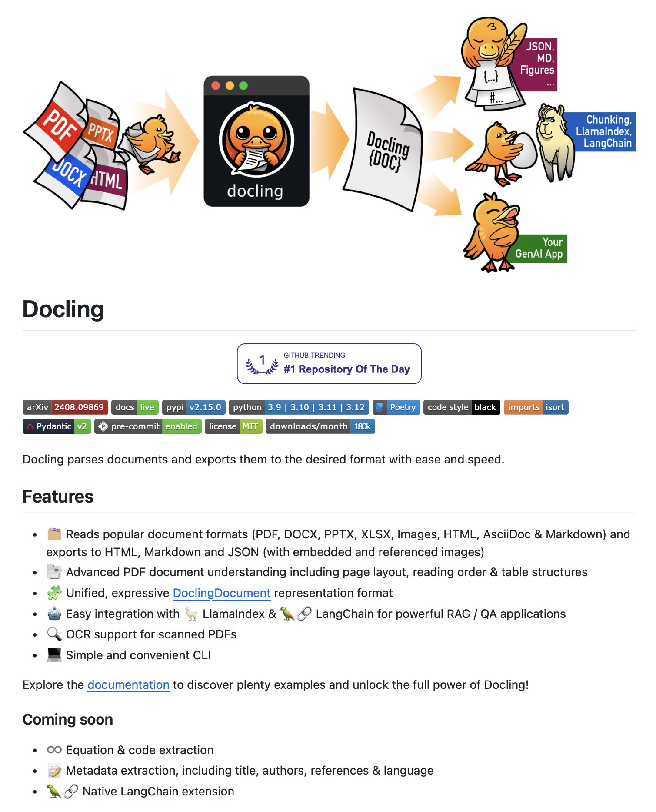

**Source:** [https://twitter.com/i/web/status/1876988824825258145](https://twitter.com/i/web/status/1876988824825258145)
**Original Post Date:** 2025-05-28 01:23:35

# Docling: A Python Tool for Document Parsing and LLM Integration

## Introduction
Document processing is a critical component of modern machine learning workflows, especially when preparing data for Large Language Models (LLMs). Docling emerges as a comprehensive solution that bridges the gap between raw document formats and structured data suitable for AI consumption. This article explores its architecture, integration capabilities with leading frameworks like LangChain and LlamaIndex, and its role in accelerating RAG-based applications.

## Core Capabilities and Document Processing

Docling provides robust support for a wide range of document formats including PDF, DOCX, PPTX, HTML, AsciiDoc, and Markdown. Its unified DoclingDocument format ensures consistent representation across different input types.

Advanced PDF processing capabilities include automatic layout detection, table structure preservation, and reading order optimization. This makes it particularly valuable for complex documents containing structured information.

- Supports 10+ document input formats
- Generates HTML, Markdown, or JSON outputs with embedded images
- Maintains metadata and structure during conversion

## Integration with LLM Ecosystems

Docling's architecture is designed to seamlessly integrate with popular RAG frameworks. It offers pre-built connectors for both LangChain and LlamaIndex, simplifying the process of creating QA systems.

The tool automatically handles document chunking and metadata extraction, reducing the complexity of preparing data for retrieval-based models.

_Demonstrates basic document loading and chunking using Docling's Python API_

```python
from docling import Document

doc = Document.from_file('input.pdf')
chunks = doc.chunk()
for chunk in chunks:
    print(chunk.text)
```

## Technical Implementation Details

Developed with Python 3.9-3.12, Docling utilizes Poetry for dependency management and implements strict code quality standards through Black formatting and pre-commit hooks.

The tool leverages Pydantic v2 for data validation, ensuring robust type checking and serialization capabilities.

## Key Takeaways

- Docling simplifies document preparation by handling multiple formats and maintaining structure during conversion
- Built-in OCR support enables processing of scanned documents without manual intervention
- Integration with LangChain/LlamaIndex accelerates RAG application development
- Active community (2.4M stars) ensures continuous improvement and reliable usage

## Conclusion
Docling stands as a powerful tool for document preparation in LLM workflows, offering both breadth of format support and depth of processing capabilities. Its integration with leading frameworks makes it an essential component for building modern AI applications that rely on structured data from diverse sources.

## External References

- [Official Docling Repository](https://github.com/docling-docs)
- [Docling Documentation](https://docling.readthedocs.io/)


## Media

**Image Description:** The image is a screenshot of a GitHub repository page for a project called **Docling**. The page is designed to showcase the project's features, technical details, and upcoming developments. Below is a detailed description:

### **Main Subject: Docling**
Docling is a Python-based tool designed to parse, understand, and manipulate documents in various formats. It is highlighted as a trending repository on GitHub, emphasizing its popularity and utility in the developer community.

### **Visual Elements**
1. **Header Section:**
   - The header features a cartoonish duck character holding a piece of paper, symbolizing the parsing and handling of documents.
   - The duck is part of a flowchart-like diagram that illustrates the process:
     - **Input:** Various document formats (PDF, DOCX, PPTX, HTML, etc.) are shown as icons.
     - **Processing:** The central icon is the Docling logo, indicating the tool's role in processing these documents.
     - **Output:** The processed documents are exported in formats like HTML, Markdown, and JSON, as indicated by the icons.
   - Additional elements in the diagram include:
     - **Chunking:** Suggesting the tool's ability to break down documents into manageable sections.
     - **LlamaIndex and LangChain:** Highlighting integration with popular libraries for RAG (Retrieval-Augmented Generation) and QA (Question Answering) applications.
     - **Your GenAI App:** Indicating the tool's compatibility with generative AI applications.

2. **Textual Content:**
   - **Title:** The project is titled **"Docling"** in bold, large font.
   - **Subtitle:** Below the title, a brief description states: *"Docling parses documents and exports them to the desired format with ease and speed."*
   - **GitHub Trending Badge:** The project is marked as the **#1 Repository of the Day** on GitHub, indicating its popularity and recent activity.
   - **Metrics and Badges:**
     - **Stars:** The repository has 2,408,096 stars, indicating significant community interest.
     - **Docs:** Links to documentation are provided.
     - **Live:** Indicates a live demo or interactive environment.
     - **Python Version:** Supports Python versions 3.9, 3.10, 3.11, and 3.12.
     - **Poetry:** Uses Poetry for dependency management.
     - **Code Style:** Follows the Black style guide.
     - **Imports and Sort:** Indicates organized imports and sorting practices.
     - **Pydantic v2:** Uses Pydantic for data validation.
     - **Pre-commit:** Pre-commit hooks are enabled for code quality.
     - **License:** The project is licensed under MIT.
     - **Downloads:** Shows 180k downloads per month, indicating high usage.

3. **Features Section:**
   - **Document Format Support:** Docling can read and export popular document formats, including PDF, DOCX, PPTX, XLSX, images, HTML, AsciiDoc, and Markdown.
   - **Export Formats:** Supports exporting to HTML, Markdown, and JSON, with embedded and referenced images.
   - **Advanced PDF Understanding:** Handles complex PDF structures, including page layout, reading order, and table structures.
   - **Unified Representation:** Provides a unified and expressive representation format called `DoclingDocument`.
   - **Integration with LlamaIndex and LangChain:** Facilitates integration with these libraries for RAG and QA applications.
   - **OCR Support:** Includes OCR capabilities for scanned PDFs.
   - **CLI:** Offers a simple and convenient command-line interface.

4. **Coming Soon Section:**
   - **Equation and Code Extraction:** Future support for extracting equations and code from documents.
   - **Metadata Extraction:** Enhanced metadata extraction, including title, authors, references, and language.
   - **Native LangChain Extension:** Integration with LangChain for more advanced functionalities.

### **Technical Details**
- **Programming Language:** Python.
- **Dependency Management:** Uses Poetry.
- **Code Style:** Adheres to the Black style guide.
- **Validation:** Utilizes Pydantic for data validation.
- **Pre-commit Hooks:** Ensures code quality with pre-commit hooks.
- **License:** MIT, indicating permissive licensing for open-source use.
- **Integration:** Supports integration with LlamaIndex and LangChain for advanced applications.

### **Overall Impression**
The image effectively communicates the purpose, features, and technical details of the Docling project. The use of visual elements like the flowchart and badges enhances the readability and appeal of the repository page, making it clear and engaging for potential users and contributors. The emphasis on GitHub trending status and high download metrics underscores the project's popularity and reliability.
