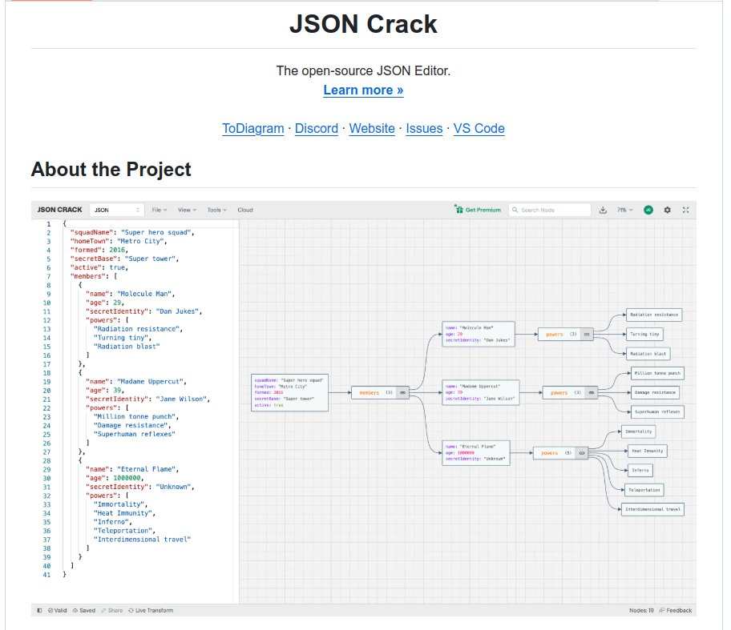

**Source:** [https://twitter.com/i/web/status/1867035191052828950](https://twitter.com/i/web/status/1867035191052828950)
**Original Post Date:** 2025-05-28 02:55:54

# JSON Data Visualization and Transformation: Superhero Squad Example

## Introduction
JSON serves as a cornerstone of modern data serialization, but understanding complex nested structures can be challenging. This article examines how JSON visualization tools like JSON Crack transform raw JSON into intuitive diagrams, using a superhero squad dataset to illustrate key concepts. We'll explore the interplay between textual structure and visual representation, highlighting validation mechanisms and real-time transformations.

## JSON Structure Analysis

The JSON document represents a hierarchical data model for a superhero squad with five top-level properties: squadName, homeTown, formed, secretBase, and active. This structure demonstrates proper JSON syntax using curly braces for objects and square brackets for arrays.

Each member of the squad is represented as an object within the 'members' array, containing name, age, secretIdentity, and a powers array. The Eternal Flame's entry (age: 1000000) illustrates how JSON handles varied data types.

```json
{
  "squadName": "Super hero squad",
  "homeTown": "Metro City",
  "formed": 2016,
  "secretBase": "Super tower",
  "active": true
}
```

## Visual Diagram Representation

The JSON Crack interface transforms the raw data into a hierarchical diagram, with 'squadName' as the root node. This visual representation clearly shows relationships between squad properties and member details.

Each superhero member appears as a child node under 'members', with their individual properties (name, age, secretIdentity) nested below them.

- Root level: Squad information visualization
- Members array representation as central nodes
- Individual member details shown in sub-nodes
- Power arrays expanded into connected elements

## Editor Interface and Features

The JSON Crack editor provides a comprehensive toolkit for working with JSON data. The interface includes navigation links, validation indicators (Valid/Saved/Share), and real-time transformation options.

Key features like 'Live Transform' enable immediate visual feedback when modifying the JSON structure.

> **Note/Tip:** Always validate JSON syntax before visualizing

> **Note/Tip:** Use proper indentation for readability in complex structures

## Key Takeaways

- JSON visualization tools enhance understanding of nested data relationships
- Real-time transformations provide immediate feedback on structural changes
- Properly structured JSON enables effective serialization and deserialization
- Visual representation bridges the gap between raw data and intuitive comprehension

## Conclusion
Understanding how to leverage JSON visualization tools like JSON Crack is crucial for modern developers. The superhero squad example demonstrates how complex nested structures can be transformed into understandable diagrams, making it easier to validate, modify, and share structured data.

## External References

- [JSON Schema Specification](https://json-schema.org/)
- [JSON Crack Documentation](https://github.com/epoberezkin/json-crack)


## Media

**Image Description:** ### Description of the Image

The image depicts a JSON editor interface, showcasing a JSON document alongside a visual diagram representation of the same data. The JSON document is structured to represent a fictional superhero squad, and the diagram provides a visual breakdown of the relationships and data hierarchy within the JSON structure. Below is a detailed breakdown:

---

#### **Main Subject: JSON Document**
The JSON document is displayed on the left side of the image. It is structured to represent a superhero squad with the following key elements:

1. **Squad Information**:
   - **squadName**: "Super hero squad"
   - **homeTown**: "Metro City"
   - **formed**: 2016
   - **secretBase**: "Super tower"
   - **active**: true

2. **Members Array**:
   - The JSON includes an array of members, each with the following properties:
     - **name**: The superhero's name.
     - **age**: The age of the superhero.
     - **secretIdentity**: The real name or alias of the superhero.
     - **powers**: An array of powers possessed by the superhero.

3. **Superhero Members**:
   - **Molecule Man**:
     - **name**: "Molecule Man"
     - **age**: 29
     - **secretIdentity**: "Dan Jukes"
     - **powers**: ["Radiation resistance", "Turning tiny", "Radiation blast"]
   - **Madame Uppercut**:
     - **name**: "Madame Uppercut"
     - **age**: 39
     - **secretIdentity**: "Jane Wilson"
     - **powers**: ["Million tonne punch", "Damage resistance", "Superhuman reflexes"]
   - **Eternal Flame**:
     - **name**: "Eternal Flame"
     - **age**: 1000000
     - **secretIdentity**: "Unknown"
     - **powers**: ["Immortality", "Heat Immunity", "Inferno", "Teleportation", "Interdimensional travel"]

---

#### **Visual Diagram**
On the right side of the image, there is a visual diagram that represents the JSON structure in a hierarchical and relational manner. Key features of the diagram include:

1. **Root Node**:
   - The root node is labeled as "squadName: Super hero squad," indicating the top-level object in the JSON structure.

2. **Members Array**:
   - The "members" array is represented as a central node with three child nodes, each corresponding to a member of the squad:
     - **Molecule Man**
     - **Madame Uppercut**
     - **Eternal Flame**

3. **Member Details**:
   - Each member node contains sub-nodes for their properties:
     - **name**
     - **age**
     - **secretIdentity**
     - **powers**: This is further expanded into a list of powers for each superhero.

4. **Connections**:
   - The diagram uses lines to connect parent nodes to their child nodes, visually illustrating the hierarchical structure of the JSON data.

---

#### **Technical Details**
1. **JSON Syntax**:
   - The JSON is valid and follows standard JSON syntax, with proper use of curly braces `{}` for objects, square brackets `[]` for arrays, and double quotes `""` for strings.
   - The JSON is well-indented, making it easy to read and understand the structure.

2. **Visual Representation**:
   - The diagram on the right provides a clear, graphical representation of the JSON structure, making it easier to visualize the relationships between different elements.
   - Each node in the diagram corresponds to a key or value in the JSON, and the connections between nodes represent the hierarchical relationships.

3. **Editor Interface**:
   - The top of the image shows the title "JSON Crack Crack," indicating the name of the JSON editor tool.
   - There are navigation links at the top for additional resources such as "ToDiagram," "Discord," "Website," "Issues," and "VS Code."
   - The JSON editor interface includes standard features like file management, view options, tools, and cloud integration.

4. **Validation and Feedback**:
   - The bottom left corner of the JSON editor indicates that the JSON is valid (`Valid`), saved (`Saved`), and shared (`Share`).
   - There is also a "Live Transform" option, suggesting real-time updates or transformations of the JSON data.

---

#### **Overall Structure**
The image effectively combines textual JSON data with a visual diagram to provide a comprehensive view of the superhero squad's structure. The JSON document is well-organized, and the diagram enhances understanding by visually mapping the relationships between different elements.

---

### Summary
The image showcases a JSON editor interface with a JSON document describing a superhero squad and its members. The JSON is valid and well-structured, and the accompanying visual diagram provides a clear, hierarchical representation of the data. The interface includes navigation links and tools for further interaction with the JSON data. This combination of textual and visual elements makes the data easy to understand and analyze.
