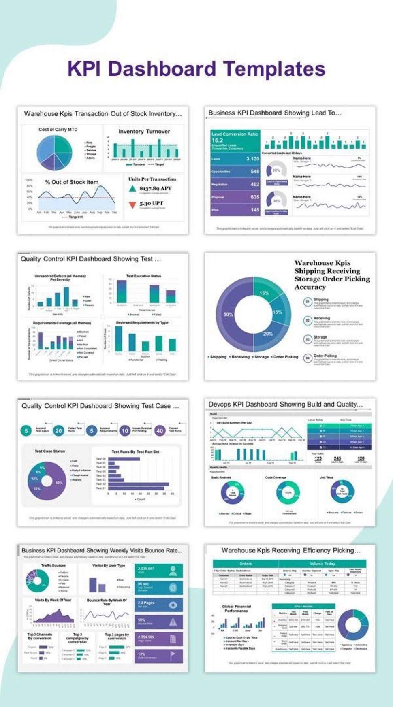

**Source:** [https://twitter.com/i/web/status/1918645768606335054](https://twitter.com/i/web/status/1918645768606335054)
**Original Post Date:** 2025-05-28 01:37:36

# KPI Dashboard Templates for Multi-Department Performance Monitoring

## Introduction
This knowledge base item presents a structured analysis of KPI (Key Performance Indicator) dashboard templates designed for monitoring cross-departmental business metrics. The grid-based layout of ten specialized dashboards provides insights into warehouse efficiency, sales conversion rates, quality control processes, DevOps pipeline performance, and website analytics. Each template incorporates strategic visualization techniques to enable data-driven decision making.

## Warehouse Operations KPI Dashboards

The Warehouse KPI dashboards (1 & 4 & 8) focus on inventory management, transaction efficiency, and operational accuracy. Template 1 uses a combination of pie charts for cost analysis, bar charts for inventory turnover tracking, and line charts with target lines to monitor out-of-stock percentages.

Template 4 provides detailed storage activity distribution through pie charts segmented by shipping, receiving, storage, order processing, and picking operations. Template 8 focuses on receiving efficiency metrics including orders processed, volume received, and financial cycle time.

- Cost of Carry analysis using pie charts with fixed, propane, service, other segments
- Inventory turnover tracking with comparative target lines
- Out-of-stock percentage monitoring

## Sales and Marketing KPI Dashboards

The Business KPI dashboards (2 & 7 & 9) track sales pipeline progression from leads to conversions. Template 2 presents lead-to-conversion ratios with multiple stages, while Templates 7 & 9 focus on website traffic metrics including source distribution, user type analysis, and weekly bounce rate trends.

1. Lead conversion funnel visualization
1. Traffic source analysis via pie charts
1. Weekly visit tracking with comparative baseline

## Quality Control and DevOps Dashboards

The Quality Control dashboards (3 & 5) utilize pie charts for test status distribution and bar charts for defect severity analysis. The DevOps KPI dashboard tracks build success rates, code coverage metrics, and unit test results.

Each template incorporates target lines for performance benchmarking against established goals.

## Key Takeaways

- Dynamic visualization techniques (pie, bar, line charts) enable real-time monitoring of department-specific KPIs
- Target line integration facilitates performance benchmarking and goal achievement tracking
- Consistent color coding schemes improve data interpretation across different dashboard types
- Customizable templates support organization-specific requirements while maintaining standard metrics

## Conclusion
These KPI dashboard templates provide a structured approach to cross-departmental performance monitoring. The combination of visual elements, dynamic updates, and customizable components enables organizations to track key metrics effectively. Implementation should focus on department-specific needs while maintaining consistent visualization patterns for coherent data interpretation.

## Media

**Image Description:** The image showcases a collection of **KPI (Key Performance Indicator) Dashboard Templates**. These templates are designed to help organizations monitor and analyze various performance metrics across different departments or business functions. The layout is organized into a grid of 10 individual dashboard templates, each focusing on a specific area of business operations. Below is a detailed description of the image, focusing on the main subjects and technical details:

---

### **Overall Layout**
- The image is divided into a **2x5 grid**, presenting 10 distinct KPI dashboard templates.
- Each template is labeled with a title at the top, indicating the specific area of focus (e.g., Warehouse KPIs, Business KPIs, Quality Control KPIs, etc.).
- The templates are visually designed with a mix of charts, graphs, and tables to present data in an organized and digestible manner.

---

### **Individual Templates Descriptions**

#### **1. Warehouse KPIs: Transaction Out of Stock Stock Inventory**
- **Title**: "Warehouse KPIs Transaction Out of Stock Stock Inventory..."
- **Key Elements**:
  - **Pie Chart**: Displays the "Cost of Carry MTD" (Month-to-Date) with segments labeled as "Fixed," "Propane," "Service," and "Other."
  - **Bar Chart**: Shows "Inventory Turnover" over time, with a target line for comparison.
  - **Line Chart**: Tracks the percentage of stock items out of stock over time, with a target line.
  - **Metrics**: Includes "Units Per Transaction," "APV (Average Purchase Value)," and "UPT (Units Per Transaction)."
  - **Purpose**: Monitors warehouse efficiency, inventory management, and transaction performance.

#### **2. Business KPI Dashboard: Lead to Conversion**
- **Title**: "Business KPI Dashboard Showing Lead To..."
- **Key Elements**:
  - **Lead Conversion Ratio**: Displays the ratio of leads converted into opportunities, opportunities into negotiations, negotiations into proposals, and proposals into wins.
  - **Bar Charts**: Show the number of leads, opportunities, negotiations, proposals, and wins.
  - **Line Charts**: Track the trend of leads turned into opportunities over time.
  - **Metrics**: Includes "Leads," "Opportunities," "Negotiation," "Proposal," and "Win."
  - **Purpose**: Tracks the sales pipeline and conversion rates.

#### **3. Quality Control KPI Dashboard: Test Execution**
- **Title**: "Quality Control KPI Dashboard Showing Test..."
- **Key Elements**:
  - **Bar Charts**: Displays unresolved defects by severity and requirements coverage by severity.
  - **Pie Chart**: Shows the distribution of test case statuses (e.g., Passed, Failed, Blocked).
  - **Metrics**: Includes "Test Case Status," "Test Execution Status," and "Requirements Coverage."
  - **Purpose**: Monitors the quality of software or products through testing metrics.

#### **4. Warehouse KPIs: Shipping, Receiving, Storage, Order, Picking**
- **Title**: "Warehouse KPIs Shipping Receiving Storage Order Receiving Picking..."
- **Key Elements**:
  - **Pie Chart**: Shows the distribution of storage accuracy across different activities (Shipping, Receiving, Storage, Order, Picking).
  - **Metrics**: Includes percentages for each activity.
  - **Purpose**: Tracks the efficiency and accuracy of warehouse operations.

#### **5. Quality Control KPI Dashboard: Test Case Execution**
- **Title**: "Quality Control KPI Dashboard Showing Test Case..."
- **Key Elements**:
  - **Pie Chart**: Displays the distribution of test case statuses (e.g., Passed, Failed, Blocked).
  - **Bar Charts**: Shows the number of test cases by status and test runs by test set.
  - **Metrics**: Includes "Test Case Status," "Test Runs," and "Requirements Coverage."
  - **Purpose**: Monitors the execution and coverage of test cases in quality control.

#### **6. DevOps KPI Dashboard: Build and Quality**
- **Title**: "DevOps KPI Dashboard Showing Build and Quality..."
- **Key Elements**:
  - **Build Summary**: Displays the number of builds per day, with a breakdown of successful and failed builds.
  - **Pie Charts**: Show the distribution of build statuses (e.g., Success, Failure).
  - **Metrics**: Includes "Build Success Rate," "Code Coverage," and "Unit Test Results."
  - **Purpose**: Tracks the performance of the DevOps pipeline, focusing on build and quality metrics.

#### **7. Business KPI Dashboard: Weekly Visits and Bounce Rate**
- **Title**: "Business KPI Dashboard Showing Weekly Visits Bounce Rate..."
- **Key Elements**:
  - **Pie Chart**: Displays the distribution of traffic sources.
  - **Bar Charts**: Shows visits by user type and visits by channel.
  - **Line Charts**: Tracks visits by week and bounce rate by week.
  - **Metrics**: Includes "Traffic Sources," "Visits," and "Bounce Rate."
  - **Purpose**: Monitors website performance and user engagement.

#### **8. Warehouse KPIs: Receiving Efficiency**
- **Title**: "Warehouse KPIs Receiving Efficiency..."
- **Key Elements**:
  - **Pie Chart**: Shows the distribution of receiving efficiency across different activities.
  - **Bar Charts**: Displays the number of orders received and the volume of goods received.
  - **Metrics**: Includes "Orders Received," "Volume Today," and "Global Financial Cycle Time."
  - **Purpose**: Tracks the efficiency of the receiving process in the warehouse.

#### **9. Business KPI Dashboard: Weekly Visits and Bounce Rate (Alternative View)**
- **Title**: "Business KPI Dashboard Showing Weekly Visits Bounce Rate..."
- **Key Elements**:
  - **Pie Chart**: Displays the distribution of traffic sources.
  - **Bar Charts**: Shows visits by user type and visits by channel.
  - **Line Charts**: Tracks visits by week and bounce rate by week.
  - **Metrics**: Includes "Traffic Sources," "Visits," and "Bounce Rate."
  - **Purpose**: Monitors website performance and user engagement.

#### **10. Warehouse KPIs: Receiving Efficiency (Alternative View)**
- **Title**: "Warehouse KPIs Receiving Efficiency..."
- **Key Elements**:
  - **Pie Chart**: Shows the distribution of receiving efficiency across different activities.
  - **Bar Charts**: Displays the number of orders received and the volume of goods received.
  - **Metrics**: Includes "Orders Received," "Volume Today," and "Global Financial Cycle Time."
  - **Purpose**: Tracks the efficiency of the receiving process in the warehouse.

---

### **Common Features Across Templates**
1. **Charts and Graphs**:
   - **Pie Charts**: Used to show proportions and distributions.
   - **Bar Charts**: Used to compare metrics over time or across categories.
   - **Line Charts**: Used to track trends over time.
   - **Metrics**: Specific numerical values are displayed for key indicators.

2. **Color Coding**:
   - Each template uses a consistent color scheme to differentiate between categories or statuses (e.g., green for success, red for failure).

3. **Target Lines**:
   - Many templates include target lines on charts to compare actual performance against goals.

4. **Dynamic Data**:
   - The text at the bottom of each template indicates that the data is dynamic and updates automatically based on the underlying data source.

5. **Focus on KPIs**:
   - Each template is designed to highlight specific KPIs relevant to the business function it represents.

---

### **Technical Details**
- **Data Visualization**: The templates use a combination of charts and graphs to present data in a visually appealing and easy-to-understand format.
- **Dynamic Updates**: The dashboards are designed to be dynamic, meaning they update automatically as new data is fed into the system.
- **Interactivity**: The text suggests that the dashboards are interactive, allowing users to click and select specific data points for deeper analysis.
- **Customization**: The templates are likely customizable to fit the specific needs of different organizations or departments.

---

### **Conclusion**
The image provides a comprehensive set of KPI dashboard templates that cover a wide range of business functions, including warehouse operations, sales, quality control, DevOps, and website performance. Each template is designed to be visually intuitive, with a focus on key performance indicators and dynamic data presentation. These templates can be used to monitor and improve operational efficiency across various departments.
