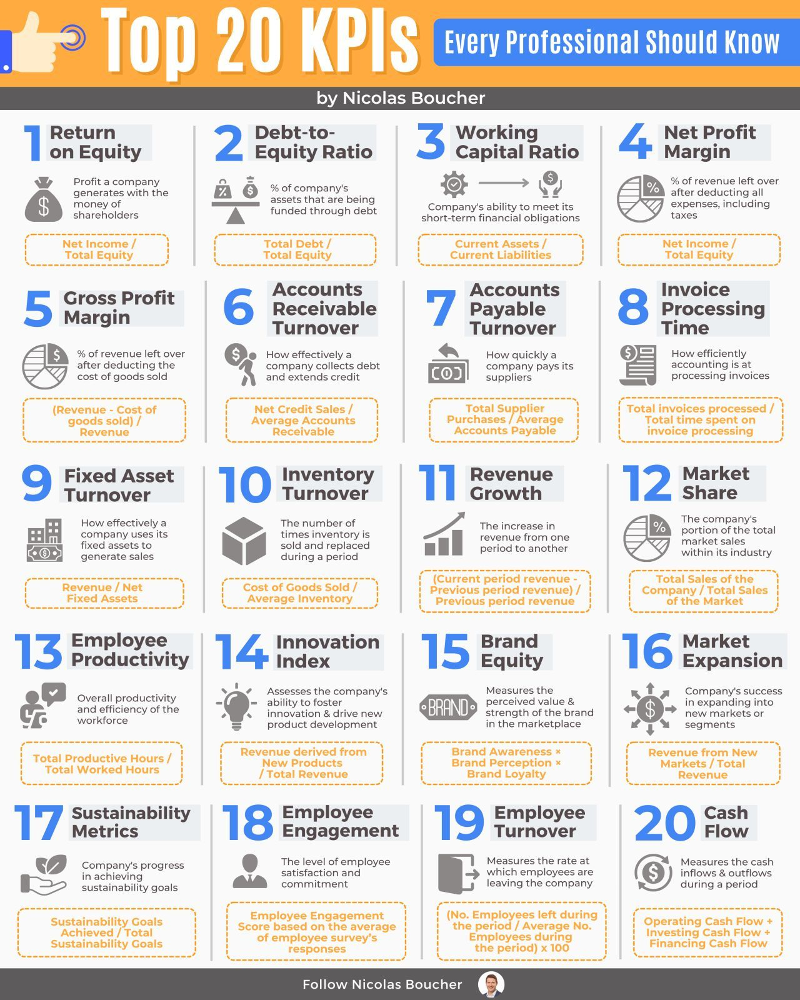

**Source:** [https://twitter.com/i/web/status/1869553886937407686](https://twitter.com/i/web/status/1869553886937407686)
**Original Post Date:** 2025-05-28 07:48:19

# Top 20 Essential KPIs for Business Performance Monitoring

## Introduction
Key performance indicators (KPIs) serve as fundamental metrics for measuring business success and operational efficiency. This knowledge base article presents the top 20 KPIs identified by Nicolas Boucher's infographic, providing detailed explanations, formulas, and practical applications.

Understanding these KPIs enables professionals to make data-driven decisions across financial health, operational efficiency, market performance, employee management, and sustainability metrics.

## Financial Health Indicators

These KPIs focus on measuring profitability and leverage. ROE (Net Income / Total Equity) evaluates shareholder returns while Debt-to-Equity Ratio (Total Debt / Total Equity) assesses financial risk.

The Working Capital Ratio (Current Assets / Current Liabilities) ensures short-term solvency, critical for day-to-day operations.

_SQL query to calculate ROE and Debt-to-Equity Ratio from financial tables_

```sql
SELECT
  net_income / total_equity AS roe,
  debt_to_equity_ratio
FROM financial_metrics;
```

1. Calculate ROE using quarterly net income data
1. Monitor debt levels relative to equity for risk assessment
1. Track working capital trends monthly

## Operational Efficiency Metrics

Operations-focused KPIs like Inventory Turnover and Fixed Asset Turnover measure resource utilization efficiency. The Accounts Receivable Turnover ratio (Net Credit Sales / Average AR) indicates collection effectiveness.

Invoice Processing Time evaluates administrative efficiency through the metric: Total Invoices / Total Time Processed.

_Python function to compute inventory turnover ratio_

```python
def calculate_inventory_turnover(cogs, avg_inventory):
    return cogs / avg_inventory
# Example usage:
inv_turnover = calculate_inventory_turnover(500000, 125000)
```

## Human Resources and Sustainability

Employee productivity metrics include Productive Hours/Worked Hours ratios. The Employee Engagement score, derived from surveys, measures staff satisfaction.

Sustainability Metrics track goal achievement against targets using the formula: Goals Achieved / Total Goals.

> **Note/Tip:** Regular employee engagement surveys are crucial for accurate measurement

> **Note/Tip:** Track sustainability metrics quarterly to identify trends

## Key Takeaways

- KPI selection should align with organizational goals and industry standards
- Implement automated KPI tracking systems using SQL or Python for accuracy
- Regular monitoring of multiple interconnected KPIs provides comprehensive insights
- Visual representation through dashboards enhances understanding and communication

## Conclusion
These 20 KPIs form a robust framework for business performance analysis. By implementing automated calculation methods and maintaining consistent tracking, organizations can make informed decisions across financial, operational, human resource, and sustainability dimensions.

## External References

- [Financial Modeling Prep](https://financialmodelingprep.com/education/kpis/)
- [Harvard Business Review KPI Guide](https://hbr.org/guide-to-business-key-performance-indicators)


## Media

**Image Description:** ### Description of the Image

The image is an infographic titled **"Top 20 KPIs Every Professional Should Know"** by **Nicolas Boucher**. It is designed to provide a comprehensive overview of key performance indicators (KPIs) that are essential for professionals across various industries. The infographic is structured in a grid format, with each KPI clearly numbered and accompanied by a brief explanation, formula, and relevant icons. Below is a detailed breakdown of the content:

---

### **Main Title and Layout**
- **Title**: "Top 20 KPIs Every Professional Should Know" is prominently displayed at the top in bold white and blue text.
- **Author**: The infographic is credited to **Nicolas Boucher**, whose name is mentioned below the title.
- **Design**: The layout is clean and organized, with a grid format that divides the content into 20 sections, each representing a different KPI.

---

### **KPIs Listed**
The infographic lists 20 KPIs, each with a number, name, description, formula, and an icon. Below is a detailed breakdown of each section:

#### **1. Return on Equity (ROE)**
- **Description**: Measures the profitability of a company relative to shareholders' equity.
- **Formula**: Net Income / Total Equity
- **Icon**: A dollar sign and a pie chart.

#### **2. Debt-to-Equity Ratio**
- **Description**: Indicates the proportion of debt to equity in a company's capital structure.
- **Formula**: Total Debt / Total Equity
- **Icon**: A balance scale and a dollar sign.

#### **3. Working Capital Ratio**
- **Description**: Measures a company's ability to meet its short-term financial obligations.
- **Formula**: Current Assets / Current Liabilities
- **Icon**: A clock and a dollar sign.

#### **4. Net Profit Margin**
- **Description**: Shows the percentage of revenue left as profit after all expenses.
- **Formula**: Net Income / Total Revenue
- **Icon**: A globe and a percentage symbol.

#### **5. Gross Profit Margin**
- **Description**: Indicates the percentage of revenue left after deducting the cost of goods sold.
- **Formula**: (Revenue - Cost of Goods Sold) / Revenue
- **Icon**: A pie chart and a dollar sign.

#### **6. Accounts Receivable Turnover**
- **Description**: Measures how effectively a company collects its debt.
- **Formula**: Net Credit Sales / Average Accounts Receivable
- **Icon**: A dollar sign and a clock.

#### **7. Accounts Payable Turnover**
- **Description**: Measures how quickly a company pays its suppliers.
- **Formula**: Total Purchases / Average Accounts Payable
- **Icon**: A dollar sign and a clock.

#### **8. Invoice Processing Time**
- **Description**: Measures the efficiency of invoice processing.
- **Formula**: Total Invoices / Total Time Processed
- **Icon**: A document and a clock.

#### **9. Fixed Asset Turnover**
- **Description**: Measures how effectively a company uses its fixed assets to generate sales.
- **Formula**: Revenue / Net Fixed Assets
- **Icon**: A building and a dollar sign.

#### **10. Inventory Turnover**
- **Description**: Indicates how many times inventory is sold and replaced during a period.
- **Formula**: Cost of Goods Sold / Average Inventory
- **Icon**: A box and a dollar sign.

#### **11. Revenue Growth**
- **Description**: Measures the increase in revenue from one period to another.
- **Formula**: (Current Period Revenue - Previous Period Revenue) / Previous Period Revenue
- **Icon**: A bar graph and a percentage symbol.

#### **12. Market Share**
- **Description**: Represents the company's portion of total market sales within its industry.
- **Formula**: Total Company Sales / Total Market Sales
- **Icon**: A pie chart and a percentage symbol.

#### **13. Employee Productivity**
- **Description**: Measures the overall productivity and efficiency of the workforce.
- **Formula**: Total Productive Hours / Total Worked Hours
- **Icon**: A person and a clock.

#### **14. Innovation Index**
- **Description**: Assesses a company's ability to foster innovation and drive new product development.
- **Formula**: Revenue from New Products / Total Revenue
- **Icon**: A light bulb and a dollar sign.

#### **15. Brand Equity**
- **Description**: Measures the perceived value and strength of a brand in the marketplace.
- **Formula**: Brand Awareness × Brand Perception × Brand Loyalty
- **Icon**: A brand logo and a percentage symbol.

#### **16. Market Expansion**
- **Description**: Measures a company's success in expanding into new markets.
- **Formula**: Revenue from New Markets / Total Revenue
- **Icon**: A globe and a dollar sign.

#### **17. Sustainability Metrics**
- **Description**: Tracks a company's progress in achieving sustainability goals.
- **Formula**: Sustainability Goals Achieved / Total Sustainability Goals
- **Icon**: A leaf and a percentage symbol.

#### **18. Employee Engagement**
- **Description**: Measures the level of employee satisfaction and commitment.
- **Formula**: Employee Engagement Score (based on surveys)
- **Icon**: A person and a thumbs-up.

#### **19. Employee Turnover**
- **Description**: Measures the rate at which employees leave the company.
- **Formula**: (No. of Employees Left / Average No. of Employees) × 100
- **Icon**: A person and an arrow.

#### **20. Cash Flow**
- **Description**: Measures the inflows and outflows of cash during a period.
- **Formula**: Operating Cash Flow + Investing Cash Flow + Financing Cash Flow
- **Icon**: A dollar sign and a flowchart.

---

### **Design Elements**
- **Color Scheme**: The infographic uses a clean color palette with blue, orange, and white as primary colors. Each KPI is highlighted with a blue number and a corresponding icon.
- **Icons**: Simple, relevant icons are used to visually represent each KPI, making the content more engaging and easier to understand.
- **Formulas**: Each KPI includes a clear formula, making it easy for readers to calculate the metrics.
- **Footer**: At the bottom, there is a call-to-action to "Follow Nicolas Boucher," accompanied by a small profile picture.

---

### **Purpose**
The infographic serves as an educational tool for professionals, providing a concise and visual summary of the top 20 KPIs that are crucial for measuring and improving business performance across various aspects, including financial health, operational efficiency, market presence, employee satisfaction, and sustainability.

---

This structured and visually appealing design ensures that the information is accessible and easy to digest for a wide audience.
