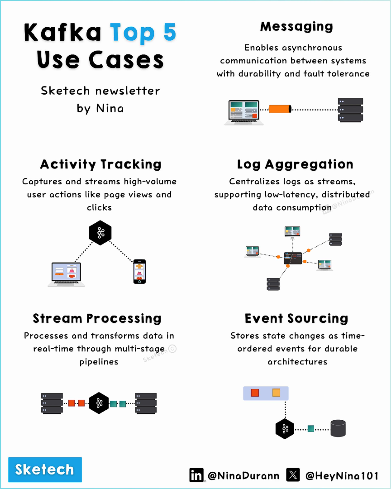

**Source:** [https://twitter.com/i/web/status/1870221387761136108](https://twitter.com/i/web/status/1870221387761136108)
**Original Post Date:** 2025-05-28 03:29:55

# Apache Kafka: Top 5 Use Cases for Stream Processing

## Introduction
Apache Kafka is a distributed streaming platform that has become essential for handling high-throughput data streams in modern systems. This knowledge base item explores the top five use cases where Kafka excels: asynchronous messaging, user activity tracking, centralized log aggregation, real-time stream processing, and event-driven architectures. Each case demonstrates how Kafka's unique capabilities address specific technical challenges in scalable data infrastructure.

## Messaging Use Case

Kafka serves as a robust messaging backbone for asynchronous system communication. It ensures message durability through persistent storage and fault tolerance via distributed architecture. Kafka's scalability allows it to handle millions of messages per second without compromising performance.

The platform's pub/sub model enables decoupled, event-driven architectures where producers send messages to topics and consumers process them independently.

- Asynchronous communication between services
- Guaranteed message delivery with persistence
- Distributed fault tolerance

## Activity Tracking Use Case

Kafka efficiently captures high-volume user actions for real-time analytics. User interactions like clicks and page views are streamed into Kafka topics, enabling immediate processing by analytics engines.

This use case is particularly valuable for businesses needing to monitor user behavior in real time and react to trends instantly.

1. Real-time user action tracking
1. Immediate analytics pipeline integration
1. Scalable event ingestion

## Log Aggregation Use Case

Kafka centralizes logs from multiple sources into a single, unified stream. This centralized approach simplifies log management and enables efficient distributed consumption.

The platform's low-latency capabilities make it ideal for real-time monitoring and debugging across distributed systems.

## Stream Processing Use Case

Kafka processes data in real time through multi-stage pipelines. It supports complex transformations, aggregations, and enrichments as data flows through the system.

This use case is crucial for applications requiring immediate insights from streaming data.

## Event Sourcing Use Case

Kafka stores state changes as time-ordered events, creating a durable event store. This pattern enables building systems based on immutable event streams.

It's particularly useful for scenarios requiring audit trails or rebuilding system states from historical events.

## Key Takeaways

- Kafka excels in handling high-throughput data streams across diverse use cases
- Its distributed architecture ensures scalability and fault tolerance
- The platform supports real-time processing while maintaining event order

## Conclusion
Apache Kafka's versatility makes it a cornerstone for modern stream processing systems. Whether you're building messaging backbones, tracking user activity, aggregating logs, processing streams in real time, or implementing event sourcing patterns, Kafka provides the necessary foundation for scalable and reliable data infrastructure.

## External References

- [Official Apache Kafka Documentation](https://kafka.apache.org/documentation/)
- [Kafka Design Patterns Book](https://www.confluent.io/resources/ebook/designing-event-driven-systems-apache-kafka)

## Media

**Image Description:** The image is an infographic titled **"Kafka Top 5 Use Cases"** by Nina, presented in a structured format with clear sections and accompanying diagrams. The infographic highlights the top five use cases for Apache Kafka, a popular distributed streaming platform. Below is a detailed description of the content and technical details:

---

### **Main Title and Header**
- **Title**: "Kafka Top 5 Use Cases"
- **Subtitle**: "Sketech newsletter by Nina"
- **Visual Design**: The title is prominently displayed at the top in bold, with "Top 5" in blue for emphasis. The subtitle is in a smaller font size below the main title.

---

### **Section 1: Messaging**
- **Description**: 
  - Kafka is used for **asynchronous communication** between systems.
  - It ensures **durability**, **fault tolerance**, and **scalability**.
- **Diagram**:
  - A laptop is shown sending a message (represented by an orange bar) to a Kafka cluster (represented by a series of black rectangular blocks).
  - The diagram illustrates the flow of messages from a producer to a Kafka cluster, emphasizing the asynchronous nature of Kafka.

---

### **Section 2: Activity Tracking**
- **Description**:
  - Kafka captures and streams **high-volume user actions**, such as page views and clicks.
  - It is ideal for real-time analytics and monitoring user behavior.
- **Diagram**:
  - A laptop and a mobile phone are shown sending data to a Kafka cluster (represented by a black hexagon).
  - The data flow is depicted using dotted lines, indicating the streaming of user activity data into Kafka.

---

### **Section 3: Log Aggregation**
- **Description**:
  - Kafka centralizes logs from multiple sources into a single stream.
  - It supports **low-latency, distributed log consumption**.
- **Diagram**:
  - Multiple servers (represented by rectangular blocks) send logs to a Kafka cluster (black hexagon).
  - The logs are then consumed by various systems (represented by laptops and servers), illustrating the distributed nature of log aggregation.

---

### **Section 4: Stream Processing**
- **Description**:
  - Kafka processes and transforms data in real-time through **multi-stage pipelines**.
  - It is used for real-time data processing and analytics.
- **Diagram**:
  - A series of Kafka clusters (black hexagons) are connected in a pipeline, with data flowing through multiple stages (represented by orange and green blocks).
  - The diagram shows data being processed and transformed as it moves through the pipeline.

---

### **Section 5: Event Sourcing**
- **Description**:
  - Kafka stores state changes as time-ordered events, enabling durable architectures.
  - It is used for building systems that rely on event-driven architectures.
- **Diagram**:
  - A Kafka cluster (black hexagon) is shown storing events (represented by colored blocks: red, blue, and yellow).
  - The events are consumed by a system (represented by a database or storage icon), illustrating the event sourcing pattern.

---

### **Footer**
- **Branding**:
  - The word "Sketechtech" is prominently displayed in a blue box at the bottom left.
- **Social Media Handles**:
  - Links to social media profiles are provided:
    - **LinkedIn**: @NinaDurann
    - **X (Twitter)**: @HeyNina101

---

### **Overall Design**
- The infographic uses a clean, minimalist design with a white background and black text for readability.
- Icons and diagrams are used effectively to illustrate each use case, making the content visually engaging and easy to understand.
- The color scheme is simple, with blue, black, and orange used to highlight key elements.

---

### **Key Technical Details**
1. **Kafka as a Messaging System**:
   - Kafka is used for asynchronous communication, ensuring durability and fault tolerance.
2. **Activity Tracking**:
   - Kafka captures high-volume user actions in real-time.
3. **Log Aggregation**:
   - Kafka centralizes logs from multiple sources, supporting distributed log consumption.
4. **Stream Processing**:
   - Kafka processes and transforms data in real-time through multi-stage pipelines.
5. **Event Sourcing**:
   - Kafka stores state changes as time-ordered events, enabling durable event-driven architectures.

---

This infographic effectively communicates the versatility of Kafka across various use cases, making it a valuable resource for understanding Kafka's applications in modern data processing and streaming systems.
