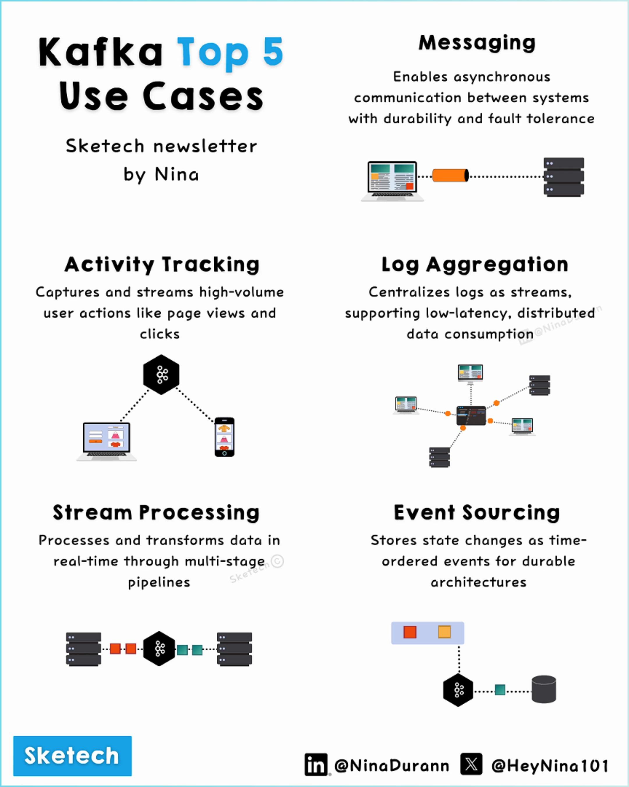

# Kafka Use Cases

## Description
5 Top Apache Kafka Use Cases 

♚ Messaging: Asynchronous communication, scalable.
♛ Activity Tracking: User actions, real-time analytics.
♜ Log Aggregation: Centralized logs, debugging aid.
♝ Stream P...

## Content
5 Top Apache Kafka Use Cases 

♚ Messaging: Asynchronous communication, scalable.
♛ Activity Tracking: User actions, real-time analytics.
♜ Log Aggregation: Centralized logs, debugging aid.
♝ Stream Processing: Real-time pipelines, IoT-ready.
♞ Event Sourcing: State logging, traceability.

Explore 
@HeyNina101
 & @SketechNews

## Category Information

- Main Category: data_engineering
- Sub Category: stream_processing
- Item Name: kafka_use_cases

## Source

- Original Tweet: [https://twitter.com/i/web/status/1870221387761136108](https://twitter.com/i/web/status/1870221387761136108)
- Date: 2025-02-20 15:36:34

## Media

### Media 1

**Description:** This infographic showcases the top 5 use cases for Kafka, a highly scalable data processing platform developed by Apache.

The five use cases are organized into two columns of three each, with accompanying images illustrating how they work. The first column presents:

* "Activity Tracking" - capturing and streaming high-volume user actions like page views and clicks
* "Stream Processing" - transforming real-time data through multi-stage pipelines
* "Messaging" - enabling asynchronous communication between systems with durability and fault tolerance

The second column highlights:

* "Log Aggregation" - centralizing logs as streams for low-latency, distributed data consumption
* "Event Sourcing" - storing state changes as time-ordered events for durable architectures
* "Sketech Newsletter by Nina" - a Sketech newsletter that provides information about Kafka use cases

The infographic was created using LinkedIn and X (formerly Twitter) handles @NinaDurann and @HeyNina101, with the Sketech logo displayed in the bottom left corner.

*Last updated: 2025-02-20 15:36:34*