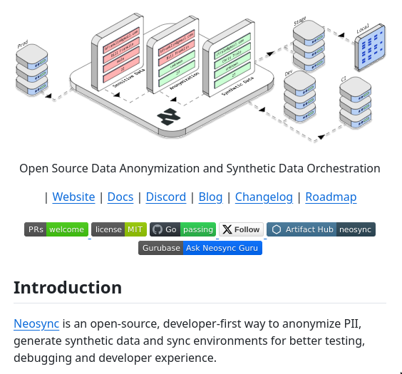

**Source:** [https://twitter.com/i/web/status/1866615462844383425](https://twitter.com/i/web/status/1866615462844383425)
**Original Post Date:** 2025-05-27 19:48:46

# Neosync: Open-Source Data Anonymization and Synthetic Data Generation for Secure Development

## Introduction
Neosync is a developer-centric, open-source platform designed to address critical challenges in handling sensitive data during software development. It provides robust solutions for Personally Identifiable Information (PII) anonymization, synthetic data generation, and environment synchronization. This comprehensive tool ensures developers can work with realistic but secure datasets while maintaining compliance with privacy regulations.

The architecture of Neosync is built on a three-tiered model that seamlessly integrates production data processing, transformation layers, and development/testing environments.

## System Architecture Overview

Neosync's architecture consists of three primary tiers: Production Environment, Processing/Transformation Layer, and Development/Test Environments. Each tier is designed to handle specific aspects of data processing and transformation while maintaining security.

The Production Environment serves as the source for real-world datasets containing sensitive information. This layer includes databases, services, and APIs that generate or process production data.

```yaml
production:
  database: postgresql
  services:
    - service1
    - service2
  apis:
    - api1
    - api2
```

## Core Features and Implementation

The Processing/Transformation Layer implements two critical functions: PII anonymization and synthetic data generation. Anonymization ensures sensitive information is protected while maintaining data utility.

Synthetic data generation creates realistic datasets that preserve statistical properties without exposing real user information.

```bash
# Initialize Neosync
neosync init --config config.yaml

# Execute anonymization pipeline
neosync anonymize --source prod-db --target dev-db
```

- PII Anonymization Pipeline Configuration
- Synthetic Data Generation Parameters
- Environment Synchronization Rules

## Developer Workflow and Best Practices

Developers can quickly set up environments using Neosync's CLI tools. The synchronization process ensures consistent data states across different environments.

Regular validation of anonymization rules is crucial to maintain data utility while ensuring privacy compliance.

```yaml
sync:
  intervals: 1h
  retention_period: 7d
```

## Key Takeaways

- Neosync provides a comprehensive solution for secure development with sensitive data
- The three-tier architecture ensures separation of concerns and secure data handling
- Implementation is straightforward with CLI tools and configuration files

## Conclusion
Neosync revolutionizes the way developers handle sensitive data in their workflows. By providing robust anonymization, synthetic data generation, and environment synchronization capabilities, it enables teams to work with realistic datasets while maintaining compliance and security.

## External References

- [Official Neosync Documentation](https://neosync.dev/docs)
- [GitHub Repository](https://github.com/neosync-org/neosync)


## Media

**Image Description:** ### Description of the Image

The image is a screenshot of a webpage for an open-source project called **Neosync**. The page provides an overview of the project, its purpose, and links to various resources. Below is a detailed breakdown of the image:

---

#### **1. Main Visual Element: Architecture Diagram**
- **Diagram Title**: The diagram is titled **"Open Source Data Data Anonymization and Synthetic Data Data Orchestration"**.
- **Diagram Layout**: The diagram illustrates a multi-tiered architecture for data anonymization and synthetic data generation. It is visually represented as a 3D model of a server or system, with various components connected through arrows, indicating data flow and interactions.

##### **Key Components of the Diagram**:
1. **Left Side (Production Environment)**:
   - **Label**: "Prod"
   - **Description**: Represents the production environment where the anonymization and synthetic data generation processes are applied.
   - **Details**:
     - Contains multiple layers, including:
       - **Database (DB)**
       - **Services (e.g., Service1, Service2)**
       - **APIs (e.g., API1, API2)**
     - These layers are depicted as stacked blocks, indicating a typical microservices or layered architecture.

2. **Middle Section (Processing and Transformation)**:
   - **Label**: "Processing and Transformation"
   - **Description**: This section represents the core functionality of the Neosync project, where data anonymization and synthetic data generation occur.
   - **Details**:
     - Contains multiple components:
       - **Anonymization Layer**: Indicates the anonymization of Personally Identifiable Information (PII).
       - **Synthetic Data Generation Layer**: Indicates the generation of synthetic data.
       - **Data Sync Layer**: Represents the synchronization of environments (e.g., production, development, testing).
     - These components are interconnected with arrows, showing the flow of data and processes.

3. **Right Side (Development and Testing Environments)**:
   - **Label**: "Dev" and "Test"
   - **Description**: Represents the development and testing environments where the anonymized and synthetic data are used for better testing, debugging, and developer experience.
   - **Details**:
     - Contains multiple layers similar to the production environment, including:
       - **Database (DB)**
       - **Services (e.g., Service1, Service2)**
       - **APIs (e.g., API1, API2)**
     - These layers are depicted as stacked blocks, similar to the production environment.

4. **Connections**:
   - Arrows connect the production environment to the processing and transformation layer, and then to the development and testing environments.
   - This indicates the flow of data and processes from the production environment through anonymization and synthetic data generation, and finally to the development and testing environments.

---

#### **2. Textual Content Below the Diagram**
- **Title**: "Introduction"
- **Description of Neosync**:
  - **Neosync** is described as an **open-source, developer-first tool** designed to:
    - **Anonymize PII (Personally Identifiable Information)**.
    - **Generate synthetic data**.
    - **Sync environments** for better testing, debugging, and developer experience.
  - The text emphasizes that Neosync is designed to improve the developer experience by providing tools for anonymization and synthetic data generation, which are critical for testing and debugging in development environments.

---

#### **3. Navigation and Resource Links**
- Below the introduction, there are several links to various resources related to the Neosync project:
  - **Website**: Link to the main website of the project.
  - **Docs**: Link to the documentation.
  - **Discord**: Link to the Discord server for community support and discussions.
  - **Blog**: Link to the project blog.
  - **Changelog**: Link to the changelog for updates and version history.
  - **Roadmap**: Link to the project roadmap.

---

#### **4. Badges and Status Indicators**
- At the bottom of the page, there are several badges providing additional information about the project:
  - **PRs (Pull Requests)**: Indicates the status of pull requests, with a "welcome" badge suggesting that contributions are welcome.
  - **License**: Indicates the project is licensed under the MIT license.
  - **Go**: Indicates that the project's tests are passing.
  - **Follow**: Suggests a way to follow the project.
  - **Artifact Hub**: Indicates the project is available on Artifact Hub, a platform for container images and Helm charts.
  - **Gurubase**: Indicates a link to Gurubase, a platform for developer communities.
  - **Ask Neosync Guru**: Indicates a way to ask questions or seek help related to the project.

---

### **Summary**
The image is a detailed representation of the **Neosync** project, which focuses on open-source data anonymization, synthetic data generation, and environment synchronization. The architecture diagram visually explains the flow of data and processes, from the production environment through anonymization and synthetic data generation, to development and testing environments. The textual content provides an introduction to the project's purpose and developer-centric approach, while the navigation links and badges offer additional resources and community engagement opportunities. The overall design is clean and informative, aimed at developers and users interested in data anonymization and synthetic data solutions.
