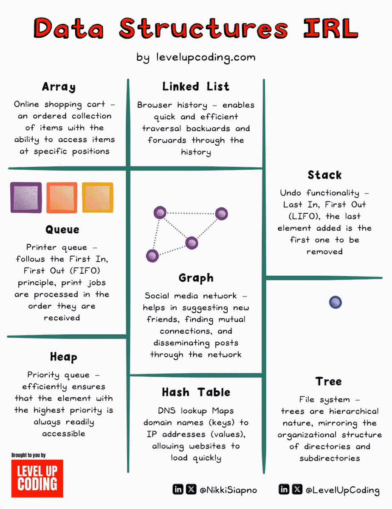

**Source:** [https://twitter.com/i/web/status/1883730238712246422](https://twitter.com/i/web/status/1883730238712246422)
**Original Post Date:** 2025-05-27 18:45:09

# Data Structures in Real-World Applications: A Comprehensive Guide

## Introduction
Understanding how theoretical data structures map to real-world scenarios is crucial for software engineers. This guide explores eight fundamental data structures through practical applications, demonstrating their relevance in modern programming challenges.

Each structure's implementation details are examined alongside concrete use cases, providing insights into performance considerations and best practices for specific domains.

## Fundamental Data Structures

Arrays represent ordered collections where elements can be accessed by index. In practical applications like online shopping carts, arrays efficiently manage items with O(1) access time. However, insertions and deletions in the middle can be costly.

Linked lists are optimized for sequential data management. Browser history implementations leverage linked list structures to maintain navigational state efficiently, especially when frequently adding or removing entries.

## Linear Structures: Stack and Queue

Stack implementations follow LIFO (Last-In, First-Out) principles. Undo functionality in applications like text editors uses stack structures to maintain operation history.

Queues operate on FIFO (First-In, First-Out) basis. Print spoolers utilize queue data structures to manage document processing order efficiently.

_Basic stack implementation demonstrating LIFO behavior_

```python
class Stack:
    def __init__(self):
        self.items = []

    def push(self, item):
        self.items.append(item)

    def pop(self):
        return self.items.pop()
```

## Hierarchical and Network Structures

Tree structures represent hierarchical relationships. File systems use tree structures to organize directories and files, enabling efficient traversal and search operations.

Graph data structures model complex relationships between entities. Social media networks utilize graph structures to manage connections between users efficiently.

> **Note/Tip:** Consider memory usage when implementing large-scale trees

> **Note/Tip:** Implement appropriate algorithms for specific graph traversals

## Advanced Structures: Heap and Hash Table

Heaps maintain priority order, essential for applications requiring efficient extraction of maximum or minimum elements. Task scheduling systems often use heap structures.

Hash tables provide constant-time access to data using key-value pairs. DNS lookup implementations rely on hash tables for rapid domain-to-IP resolution.

## Key Takeaways

- Array structures provide efficient random access but poor insertion/deletion performance
- Linked lists optimize for sequential data management with trade-offs in direct element access
- Stack and queue implementations are crucial for specific use cases like undo operations and print spoolers
- Tree and graph structures are fundamental for hierarchical and networked data representation
- Heap and hash table optimizations are critical for performance-sensitive applications

## Conclusion
Understanding the real-world implications of different data structure choices is essential for software engineering. This guide provides a foundation for selecting appropriate data structures based on specific application requirements, considering factors like access patterns, memory usage, and performance characteristics.

## External References

- [LevelUpCoding Data Structures IRL Infographic](https://levelupcoding.com)
- [Nikki Siapno on LinkedIn](https://linkedin.com/in/NikkiSiapno)


## Media

**Image Description:** ### Description of the Image

The image is a colorful and visually engaging infographic titled **"Data Structures IRL"** by **levelupcoding.com**. It aims to explain various data structures using real-world examples to make the concepts more relatable. The infographic is divided into a grid format with six main sections, each representing a different data structure. Below is a detailed breakdown of the content:

---

### **Title and Header**
- **Title**: "Data Structures IRL" is written in bold red text at the top of the image.
- **Subtitle**: "by levelupcoding.com" is written in smaller black text below the title.
- **Footer**: The bottom of the image includes social media handles:
  - **LinkedIn**: @NikkiSiapno
  - **Twitter**: @LevelUpCoding

---

### **Grid Layout**
The infographic is organized into a 3x2 grid, with each cell representing a different data structure. Each cell contains:
1. **The name of the data structure** in bold black text.
2. **A brief explanation** of the data structure.
3. **A real-world example** to illustrate its use.
4. **Visual elements** (e.g., icons, diagrams) to enhance understanding.

---

### **Sections in the Grid**

#### **1. Array**
- **Explanation**: An ordered collection of items where each item can be accessed by its specific position.
- **Real-World Example**: Online shopping cart.
- **Visual**: Three colored squares (purple, orange, yellow) representing items in the cart.

#### **2. Linked List**
- **Explanation**: A collection of nodes where each node points to the next, enabling efficient traversal.
- **Real-World Example**: Browser history.
- **Visual**: A dotted-line diagram showing nodes connected in a sequence.

#### **3. Stack**
- **Explanation**: A Last-In, First-Out (LIFO) structure where the last element added is the first one to be removed.
- **Real-World Example**: Undo functionality in applications.
- **Visual**: A single blue circle representing the top of the stack.

#### **4. Queue**
- **Explanation**: A First-In, First-Out (FIFO) structure where elements are processed in the order they are received.
- **Real-World Example**: Printer queue.
- **Visual**: Three colored squares (purple, orange, yellow) arranged horizontally to represent jobs in the queue.

#### **5. Graph**
- **Explanation**: A network of nodes connected by edges, used for modeling relationships.
- **Real-World Example**: Social media network.
- **Visual**: A diagram of interconnected nodes (circles) with lines representing connections.

#### **6. Heap**
- **Explanation**: A priority queue where the element with the highest priority is always accessible.
- **Real-World Example**: Not explicitly mentioned but implied as a priority-based system.
- **Visual**: A single blue circle representing the top of the heap.

#### **7. Hash Table**
- **Explanation**: A data structure that maps keys to values for efficient lookup.
- **Real-World Example**: DNS lookup table.
- **Visual**: A diagram showing key-value pairs (e.g., domain names to IP addresses).

#### **8. Tree**
- **Explanation**: A hierarchical structure used for organizing data.
- **Real-World Example**: File system.
- **Visual**: A single blue circle representing the root of the tree.

---

### **Design Elements**
- **Color Scheme**: The infographic uses a mix of bright colors (e.g., purple, orange, yellow) to make the content visually appealing.
- **Icons and Diagrams**: Simple icons and diagrams are used to illustrate each data structure.
- **Typography**: Bold and clear fonts are used for headings and key terms, while smaller fonts are used for detailed explanations.

---

### **Purpose**
The infographic serves as an educational tool to help learners understand abstract data structures by connecting them to familiar real-world scenarios. It is designed to be accessible and engaging, making complex concepts easier to grasp.

---

### **Overall Impression**
The image is well-organized, visually appealing, and effectively communicates the purpose of each data structure using relatable examples. It is a valuable resource for anyone learning about data structures and their applications.
