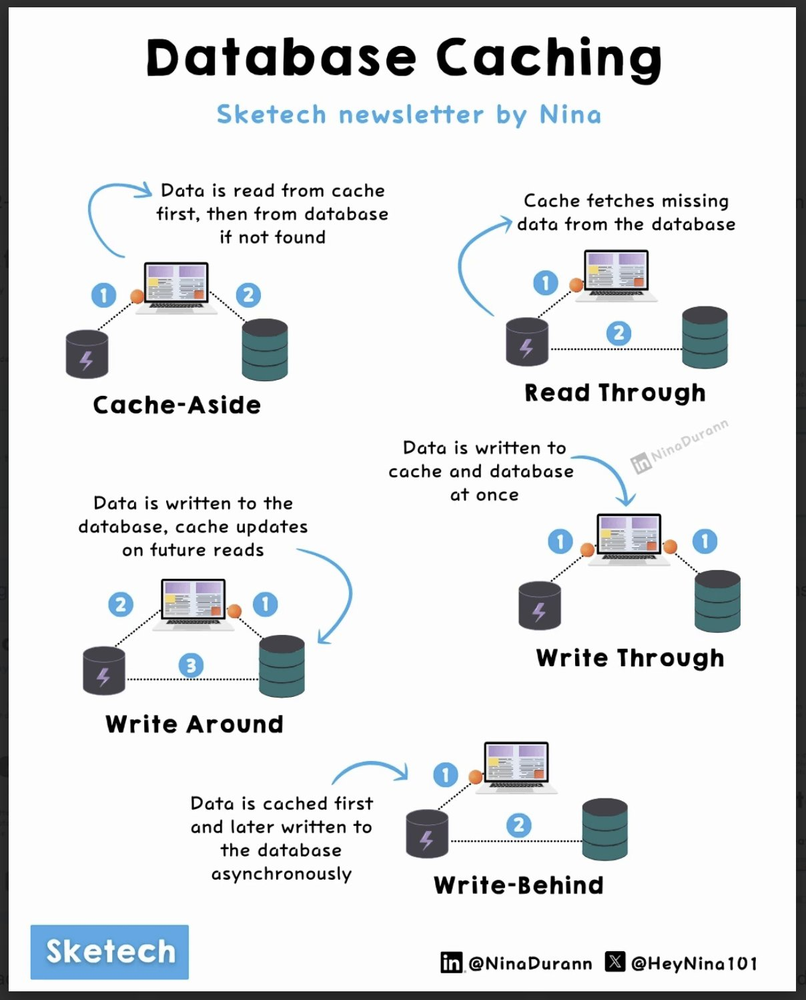

**Source:** [https://twitter.com/i/web/status/1867918614302458014](https://twitter.com/i/web/status/1867918614302458014)
**Original Post Date:** 2025-05-28 04:44:26

# Database Caching Strategies: Implementation Patterns and Trade-offs

## Introduction
Database caching is a critical optimization technique that significantly improves application response times by reducing direct database access. This knowledge base item examines five fundamental caching strategies - Cache-Aside, Read Through, Write Through, Write Around, and Write Behind - with detailed analysis of their implementation patterns, trade-offs, and optimal use cases.

## Cache-Aside Pattern

The Cache-Aside pattern implements a two-phase lookup: first checking the cache, then falling back to the database for cache misses. This approach is particularly effective in read-heavy workloads where stale data can be tolerated.

Implementation typically involves conditional logic that checks cache existence before database access.

- Best suited for infrequently updated data
- Requires careful invalidation strategy
- Provides good read performance

> **Note/Tip:** Consider using consistent hashing to distribute cache entries across multiple servers

## Write Through Pattern

Write Through ensures data consistency by writing simultaneously to both cache and database. This pattern guarantees immediate visibility of changes but introduces write latency overhead.

Ideal for scenarios requiring strong consistency at the cost of potentially slower write operations.

1. Use when real-time data consistency is critical
1. Implement proper error handling for database failures
1. Consider using transaction mechanisms

## Write Behind Pattern

Write Behind optimizes write performance by buffering changes in the cache and asynchronously propagating them to the database. This pattern significantly reduces latency but introduces complexity around eventual consistency.

Implementation requires careful consideration of data durability requirements.

> **Note/Tip:** Implement proper retry mechanisms for failed writes

## Key Takeaways

- Choose Cache-Aside when read performance is critical and slight staleness is acceptable
- Use Write Through in systems requiring immediate consistency across all layers
- Consider Write Behind only in scenarios where eventual consistency is acceptable
- Match the caching strategy to specific workload patterns and consistency requirements

## Conclusion
Database caching strategies must align with application requirements. Cache-Aside offers flexibility for read-heavy workloads, while Write Through ensures immediate consistency at higher latency costs. Write Behind provides performance benefits but requires careful handling of eventual consistency.

## External References

- [Nina's Database Caching Infographic](#)

## Media

**Image Description:** The image is an infographic titled **"Database Caching"** by Nina, presented in a sketched style. It illustrates four common caching strategies used in database systems: **Cache-Aside**, **Read Through**, **Write Through**, **Write Around**, and **Write Behind**. Each strategy is explained with a combination of text, arrows, and simple diagrams. Below is a detailed breakdown of each section:

---

### **1. Cache-Aside**
- **Description**: 
  - Data is first read from the cache.
  - If the data is not found in the cache, it is fetched from the database and then stored in the cache for future use.
- **Diagram**:
  - A laptop (representing the client) sends a request to the cache (represented by a cloud icon).
  - If the data is not in the cache, the request is forwarded to the database (represented by a database icon).
  - The fetched data is then stored in the cache for future access.
- **Key Steps**:
  1. Client requests data.
  2. Cache is checked first.
  3. If not found, the database is queried.
  4. Data is stored in the cache for future use.

---

### **2. Read Through**
- **Description**:
  - The cache is used as the primary data source. If the data is not found in the cache, the database is queried, and the data is fetched and stored in the cache.
- **Diagram**:
  - Similar to Cache-Aside, but the emphasis is on the cache being the primary source.
  - If the data is not in the cache, the database is queried, and the data is stored in the cache.
- **Key Steps**:
  1. Client requests data.
  2. Cache is checked first.
  3. If not found, the database is queried.
  4. Data is stored in the cache for future use.

---

### **3. Write Through**
- **Description**:
  - Data is written to both the cache and the database simultaneously.
  - This ensures consistency between the cache and the database.
- **Diagram**:
  - A laptop sends a write request to both the cache and the database.
  - The data is written to both systems at the same time.
- **Key Steps**:
  1. Client writes data.
  2. Data is written to the cache.
  3. Data is written to the database.
  4. Both systems are updated simultaneously.

---

### **4. Write Around**
- **Description**:
  - Data is written directly to the database, bypassing the cache.
  - The cache is updated later, either through a cache invalidation mechanism or by re-fetching the data from the database.
- **Diagram**:
  - A laptop sends a write request directly to the database.
  - The cache is updated later, either manually or automatically.
- **Key Steps**:
  1. Client writes data.
  2. Data is written directly to the database.
  3. The cache is updated later (either manually or automatically).

---

### **5. Write Behind**
- **Description**:
  - Data is written to the cache first, and then asynchronously written to the database.
  - This approach is used to improve write performance by reducing the latency associated with writing to the database.
- **Diagram**:
  - A laptop sends a write request to the cache.
  - The cache acknowledges the write and then asynchronously writes the data to the database.
- **Key Steps**:
  1. Client writes data.
  2. Data is written to the cache.
  3. The cache asynchronously writes the data to the database.

---

### **General Layout and Design**
- The infographic uses a clean, sketched style with simple icons for the cache (cloud), database (database icon), and client (laptop).
- Arrows indicate the flow of data between the client, cache, and database.
- Each strategy is labeled clearly with its name and a brief explanation of the process.
- The overall design is visually appealing and easy to follow, making it suitable for educational or explanatory purposes.

---

### **Footer**
- The infographic includes social media handles for the creator:
  - **LinkedIn**: @NinaDurann
  - **X (Twitter)**: @HeyNina101
- The creator's name, **Nina**, is mentioned multiple times, along with the branding "Sketech" and "Sketech newsletter."

---

### **Summary**
The image provides a clear and concise explanation of five database caching strategies: Cache-Aside, Read Through, Write Through, Write Around, and Write Behind. Each strategy is illustrated with a simple diagram and a brief description, making it easy for readers to understand the flow of data between the client, cache, and database in each scenario. The sketched style adds a friendly and approachable tone to the technical content.
