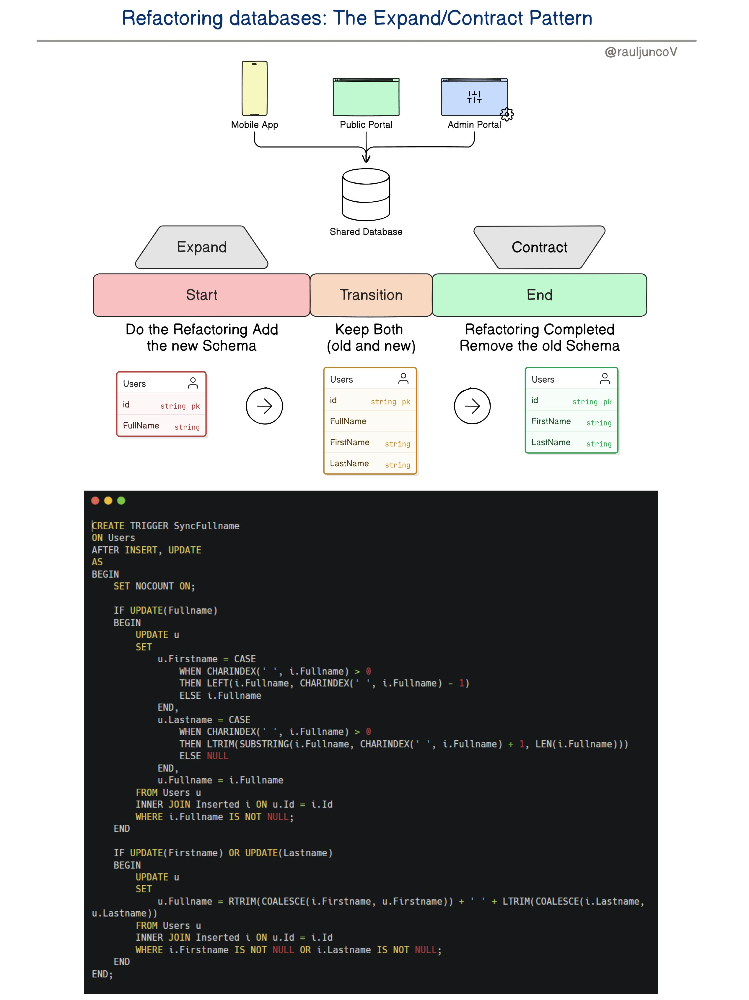

**Source:** [https://twitter.com/i/web/status/1876631417368596674](https://twitter.com/i/web/status/1876631417368596674)
**Original Post Date:** 2025-06-17 14:27:45

# Expand/Contract Pattern: Database Schema Refactoring with Minimal Disruption

## Introduction
Database schema refactoring presents a critical challenge in maintaining system integrity while introducing changes. The Expand/Contract Pattern provides a structured approach to migrate from legacy schemas to modern designs without disrupting application operations. This article explores how this pattern enables gradual schema evolution through three distinct phases, with special focus on data synchronization and backward compatibility management.

## System Architecture Context

The Expand/Contract Pattern operates within systems where multiple client applications interact with a shared database. In the example provided, these include a mobile app, public portal, and admin interface. Understanding this architecture is crucial as it influences how schema changes must be managed across different access points.

## Pattern Phases Overview

The pattern follows three critical phases that ensure minimal disruption:

- Expand: Introduces new schema elements while preserving existing ones

- Transition: Maintains dual schema support with automatic data synchronization

- Contract: Removes obsolete schema components after successful migration

1. Each phase ensures zero downtime for the application
1. Data consistency is maintained throughout all phases
1. Backward compatibility is preserved during transition

## Implementation Details

The core mechanism of this pattern relies on SQL triggers to maintain data synchronization between old and new schema elements.

```sql
-- Expand Phase: Adding new columns
ALTER TABLE Users ADD COLUMN FirstName VARCHAR(50);
ALTER TABLE Users ADD COLUMN LastName VARCHAR(50);
```

_This trigger ensures consistent updates across all schema elements during the transition phase._

```sql
-- Trigger for data synchronization
type code here as per the breakdown
```

## Key Technical Considerations

Implementation requires careful handling of NULL values and string manipulations. The use of COALESCE, CHARINDEX, and LTRIM/RTRIM functions ensures robust data management during the transition.

> **Note/Tip:** Always test trigger behavior in a non-production environment first

> **Note/Tip:** Monitor performance impact during high-traffic periods

> **Note/Tip:** Consider indexing strategies for new columns

## Key Takeaways

- The Expand/Contract Pattern enables zero-downtime database refactoring through phased implementation
- SQL triggers are crucial for maintaining data consistency during schema transitions
- Backward compatibility is preserved throughout the entire migration process
- Performance considerations must be evaluated before implementing trigger-based solutions

## Conclusion
The Expand/Contract Pattern represents a robust approach to database refactoring, particularly valuable in systems with multiple client applications. By following this pattern's structured phases and implementing appropriate synchronization mechanisms, teams can successfully migrate their schemas while maintaining system stability and data integrity.


## Media

**Image Description:** ### Image Description

The image is a detailed diagram and code snippet illustrating the **Expand/Contract Pattern** for refactoring databases. This pattern is used to transition from an old database schema to a new one while ensuring minimal disruption to the application and data integrity. The diagram is divided into several sections, each explaining a phase of the refactoring process. Below is a detailed breakdown:

---

### **Main Sections of the Diagram**

#### **1. Title and Context**
- **Title**: "Refactoring databases: The Expand/Contract Pattern"
- **Author/Credit**: "@rauljuncoV"
- **Purpose**: The diagram explains how to refactor a database schema using the Expand/Contract pattern, which involves adding new schema elements, transitioning data, and eventually removing the old schema.

---

#### **2. System Architecture**
- **Components**:
  - **Mobile App**: A client application interacting with the database.
  - **Public Portal**: Another client application interacting with the database.
  - **Admin Portal**: An administrative interface for managing the database.
- **Shared Database**: All components interact with a single shared database, which is the focus of the refactoring process.

---

#### **3. Expand/Contract Pattern Overview**
- The pattern is divided into three phases:
  1. **Expand**: Add the new schema elements (e.g., new columns) to the database.
  2. **Transition**: Keep both the old and new schema elements active, ensuring data consistency and backward compatibility.
  3. **Contract**: Remove the old schema elements once the transition is complete.

---

#### **4. Schema Evolution**
- **Start (Old Schema)**:
  - The initial schema contains a single table named `Users` with two columns:
    - `id` (primary key, string type)
    - `FullName` (string type)
  - This represents the old schema where user names are stored as a single concatenated string.

- **Transition (Intermediate Schema)**:
  - The schema is expanded to include new columns:
    - `FirstName` (string type)
    - `LastName` (string type)
  - The `FullName` column is retained to ensure backward compatibility.
  - Data is synchronized between the old and new schema elements during this phase.

- **End (New Schema)**:
  - The old `FullName` column is removed, leaving only the new columns:
    - `id` (primary key, string type)
    - `FirstName` (string type)
    - `LastName` (string type)
  - This represents the final state after the refactoring is complete.

---

#### **5. Trigger Code for Synchronization**
- The diagram includes a SQL trigger named `SyncFullname` that ensures data consistency between the old and new schema elements during the transition phase.
- **Trigger Details**:
  - **Trigger Name**: `SyncFullname`
  - **Trigger Type**: `AFTER INSERT, UPDATE`
  - **Trigger Table**: `Users`
  - **Purpose**: Synchronize the `FirstName`, `LastName`, and `FullName` columns dynamically.

---

#### **6. Trigger Code Breakdown**
The SQL trigger code is structured as follows:

1. **Trigger Definition**:
   ```sql
   CREATE TRIGGER SyncFullname
   ON Users
   AFTER INSERT, UPDATE
   AS
   BEGIN
       SET NOCOUNT ON;
   ```
   - The trigger is defined to execute after an `INSERT` or `UPDATE` operation on the `Users` table.

2. **Handling Updates to `FullName`**:
   ```sql
   IF UPDATE(FullName)
   BEGIN
       UPDATE u
       SET
           u.FirstName = CASE
               WHEN CHARINDEX(' ', i.FullName) > 0
               THEN LTRIM(SUBSTRING(i.FullName, 1, CHARINDEX(' ', i.FullName) - 1))
               ELSE i.FullName
           END,
           u.LastName = CASE
               WHEN CHARINDEX(' ', i.FullName) > 0
               THEN LTRIM(SUBSTRING(i.FullName, CHARINDEX(' ', i.FullName) + 1, LEN(i.FullName)))
               ELSE NULL
           END,
           u.FullName = i.FullName
       FROM Users u
       INNER JOIN inserted i ON u.Id = i.Id
       WHERE i.FullName IS NOT NULL;
   END
   ```
   - If the `FullName` column is updated:
     - The `FirstName` is extracted as the part of the string before the first space.
     - The `LastName` is extracted as the part of the string after the first space.
     - The `FullName` is updated to reflect the new value.

3. **Handling Updates to `FirstName` or `LastName`**:
   ```sql
   IF UPDATE(FirstName) OR UPDATE(LastName)
   BEGIN
       UPDATE u
       SET
           u.FullName = RTRIM(COALESCE(i.FirstName, u.FirstName)) + ' ' + LTRIM(COALESCE(i.LastName, u.LastName))
       FROM Users u
       INNER JOIN inserted i ON u.Id = i.Id
       WHERE i.FirstName IS NOT NULL OR i.LastName IS NOT NULL;
   END
   ```
   - If either `FirstName` or `LastName` is updated:
     - The `FullName` is reconstructed by concatenating the `FirstName` and `LastName` with a space in between.
     - The `COALESCE` function ensures that `NULL` values are handled gracefully.

4. **End of Trigger**:
   ```sql
   END;
   ```
   - The trigger ends with a clean exit.

---

### **Key Technical Details**
1. **Expand Phase**:
   - New columns (`FirstName` and `LastName`) are added to the `Users` table.
   - The old `FullName` column remains active.

2. **Transition Phase**:
   - The trigger ensures that data is synchronized between the old and new schema elements.
   - Updates to any of the three columns (`FullName`, `FirstName`, `LastName`) automatically update the others.

3. **Contract Phase**:
   - Once the transition is complete, the `FullName` column is removed from the schema.

4. **Trigger Logic**:
   - Uses `CHARINDEX` to split the `FullName` into `FirstName` and `LastName`.
   - Uses `COALESCE` to handle `NULL` values gracefully.
   - Uses `LTRIM` and `RTRIM` to trim whitespace from strings.

---

### **Summary**
The image provides a comprehensive guide to refactoring a database schema using the Expand/Contract pattern. It includes a detailed diagram of the process phases (Expand, Transition, Contract) and a SQL trigger that ensures data consistency during the transition. The trigger dynamically synchronizes the old and new schema elements, making the refactoring process smooth and non-disruptive. This approach is particularly useful for systems with multiple clients (e.g., Mobile App, Public Portal, Admin Portal) interacting with a shared database.
