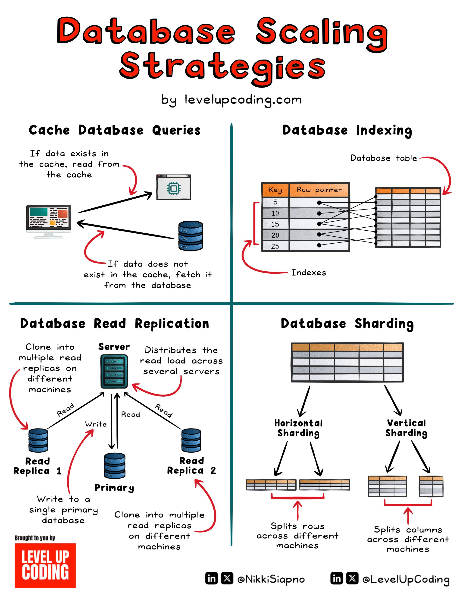

**Source:** [https://twitter.com/i/web/status/1919362218749042844](https://twitter.com/i/web/status/1919362218749042844)
**Original Post Date:** 2025-05-27 17:12:27

# Database Scaling Strategies: Caching, Indexing, Replication, and Sharding

## Introduction
As modern applications handle increasing data volumes and user traffic, databases face significant performance challenges. This knowledge base item explores four proven strategies to address these challenges: Caching, Indexing, Read Replication, and Sharding. Each strategy offers unique benefits depending on the specific use case and system requirements.

## Caching Strategy

Database caching improves performance by storing frequently accessed data in a faster memory layer. When a query is received, it first checks the cache before querying the database directly.

Cache operations follow two patterns: Cache Hit (data retrieved from cache) and Cache Miss (database queried and result stored in cache). This approach significantly reduces response times for repeated queries.

- Ideal for frequently accessed reference data
- Requires careful cache invalidation strategy
- Significant performance improvement for read-heavy workloads

> **Note/Tip:** Implement proper cache expiration policies to maintain data consistency

> **Note/Tip:** Monitor cache hit ratio to optimize caching strategy

## Database Indexing

Indexing creates specialized data structures that improve query performance by enabling faster lookups on specific columns. Each index maps keys to row pointers, facilitating quick access to relevant data.

Indices are particularly valuable for WHERE clause operations and JOIN queries, though they come with trade-offs in terms of storage space and write performance.

- Creates efficient lookup mechanisms
- Optimizes query execution plans
- Requires careful design to avoid excessive index bloat

## Database Read Replication

Read replication distributes database read operations across multiple servers while maintaining a single primary server for write operations. This architecture scales read capacity without compromising data consistency.

The primary server handles all writes and replicates changes to secondary nodes, which serve read requests from different client connections.

1. Distributes read load across multiple servers
1. Improves overall system throughput
1. Provides redundancy for high availability

## Database Sharding

Sharding distributes data across multiple database instances based on specific keys, enabling horizontal scaling of large datasets. Two main approaches exist: horizontal sharding (dividing by rows) and vertical sharding (dividing by columns).

Horizontal sharding is more common for partitioning based on attributes like user IDs or regions.

- Enables scaling of very large datasets
- Improves parallel query processing
- Requires careful shard key selection

## Key Takeaways

- Caching significantly improves response times for frequently accessed data
- Proper indexing design is crucial for optimizing query performance
- Read replication effectively scales read operations while maintaining data consistency
- Sharding enables horizontal scaling of large datasets but requires careful shard key selection

## Conclusion
Selecting the appropriate database scaling strategy depends on specific workload characteristics. Caching and indexing address immediate performance concerns, while replication and sharding provide long-term scalability solutions. Combining these strategies often yields optimal results for complex systems.

## External References

- [LevelUpCoding Database Scaling Infographic](https://levelupcoding.com/database-scaling-infographic)

## Media

**Image Description:** This image is a detailed infographic titled **"Database Scaling Strategies"** by **levelupcoding.com**. It provides an overview of four key strategies for scaling databases: **Caching**, **Indexing**, **Replication**, and **Sharding**. Each strategy is explained with diagrams and text to illustrate how they work. Below is a detailed breakdown of each section:

---

### **1. Cache Database Queries**
- **Objective**: Reduce the load on the database by storing frequently accessed data in a cache.
- **Diagram**:
  - A client sends a query to the cache.
  - If the data exists in the cache, it is served directly from the cache.
  - If the data does not exist in the cache, the query is forwarded to the database.
  - After fetching the data from the database, it is stored in the cache for future use.
- **Key Points**:
  - **Cache Hit**: Data is retrieved from the cache.
  - **Cache Miss**: Data is fetched from the database and stored in the cache.
  - This strategy improves response times for frequently accessed data.

---

### **2. Database Indexing**
- **Objective**: Speed up data retrieval by creating indexes on database tables.
- **Diagram**:
  - A database table is shown with a column labeled "Key" and a corresponding "Row pointer."
  - An index is created, which maps keys to row pointers, allowing faster lookups.
  - When a query is executed, the index is used to quickly locate the relevant rows.
- **Key Points**:
  - **Index**: A data structure that improves the speed of data retrieval operations.
  - **Row Pointer**: Points to the actual data row in the database.
  - Indexing is particularly useful for queries involving WHERE clauses or JOIN operations.

---

### **3. Database Read Replication**
- **Objective**: Distribute read operations across multiple servers to reduce load on the primary database.
- **Diagram**:
  - A primary database server is shown with a write operation.
  - The primary database replicates its data to multiple read replicas.
  - Read operations are distributed across these replicas, while write operations are handled by the primary server.
- **Key Points**:
  - **Primary Server**: Handles all write operations and replicates data to read replicas.
  - **Read Replicas**: Handle read operations, reducing load on the primary server.
  - This strategy improves read performance and scalability.

---

### **4. Database Sharding**
- **Objective**: Distribute data across multiple servers to handle large datasets and high loads.
- **Diagram**:
  - Two types of sharding are shown:
    1. **Horizontal Sharding**: Splits data rows across different servers based on a shard key (e.g., user ID).
    2. **Vertical Sharding**: Splits data columns across different servers.
  - Each shard is stored on a separate server, allowing for parallel processing and scalability.
- **Key Points**:
  - **Horizontal Sharding**: Divides data by rows, distributing them across servers.
  - **Vertical Sharding**: Divides data by columns, distributing them across servers.
  - Sharding is useful for very large datasets and high-concurrency workloads.

---

### **Overall Layout and Design**
- The infographic is divided into four quadrants, each dedicated to one scaling strategy.
- Each quadrant uses a combination of text and diagrams to explain the concept.
- Arrows and labels are used to illustrate data flow and relationships between components.
- The design is clean and visually appealing, with a focus on clarity and simplicity.

---

### **Footer Information**
- The infographic is credited to **levelupcoding.com**.
- Social media handles are provided: **@NikkiSiapno** and **@LevelUpCoding** on LinkedIn and X (formerly Twitter).

---

This infographic serves as an educational resource for developers and database administrators, providing a concise overview of common database scaling techniques. Each strategy addresses different aspects of performance and scalability challenges in database systems.
