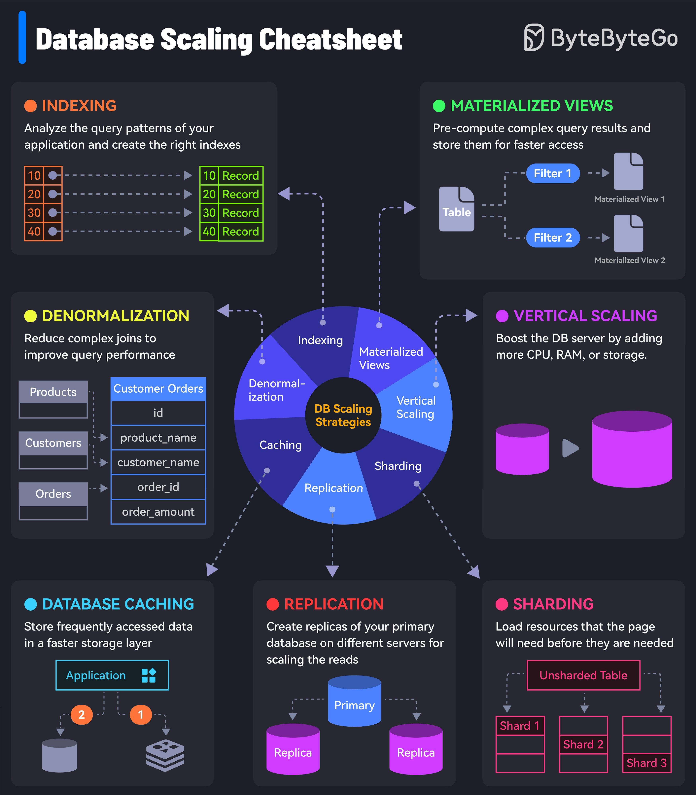

**Source:** [https://twitter.com/i/web/status/1914533883804324320](https://twitter.com/i/web/status/1914533883804324320)
**Original Post Date:** 2025-06-17 13:57:59

# Database Scaling Strategies: Comprehensive Techniques for Optimization

## Introduction
Optimizing database performance is crucial as applications grow in scale and complexity. This guide explores proven strategies for effective database scaling, addressing both read-intensive and write-heavy workloads. Each technique serves a specific purpose in the overall architecture, from improving query speed through indexing to distributing data across multiple servers using sharding.

## Indexing: Optimizing Query Performance

Indexes significantly reduce search time by creating quick access paths to database records. They're particularly effective for frequently accessed columns in WHERE clauses and JOIN operations.

- Create indexes on frequently queried columns
- Avoid over-indexing which can slow down write operations
- Monitor query execution plans to identify missing indexes

## Materialized Views: Accelerating Complex Queries

Materialized views store precomputed results of complex queries, reducing runtime computational overhead. They're ideal for reports and dashboards where data doesn't change frequently.

- Best suited for static or slowly changing data
- Require periodic refresh to maintain accuracy
- Significantly reduce query response times

## Sharding: Distributing Data Load

Sharding splits large datasets across multiple servers based on predefined rules, enabling horizontal scaling. Each shard operates independently while maintaining consistency.

- Requires careful partition key selection
- Distributes read/write load evenly
- Scales linearly with additional resources

## Replication: Scaling Read Operations

Database replication creates copies of the primary database across multiple servers, distributing read loads while maintaining data consistency. It's essential for read-heavy applications.

- Supports high availability and disaster recovery
- Requires conflict resolution strategy
- Primary server handles all writes

## Caching: Reducing Database Load

Implementing caching strategies stores frequently accessed data in memory or fast storage layers, minimizing database queries and improving response times.

- Use Redis or Memcached for distributed caching
- Cache frequently read but infrequently updated data
- Implement cache invalidation strategies

## Denormalization: Optimizing Query Structure

Strategic denormalization reduces complex joins by duplicating data across tables, improving query performance at the cost of increased storage and maintenance complexity.

- Use sparingly to balance performance and maintainability
- Consider application-specific access patterns
- Maintain consistency through triggers or background jobs

## Vertical Scaling: Upgrading Hardware Resources

Vertical scaling enhances database capacity by upgrading hardware components like CPU, RAM, and storage. While straightforward, it faces physical limitations.

- Simplest but least scalable approach
- Requires downtime for upgrades
- Cost-effective for moderate growth

## Key Takeaways

- Choose scaling strategies based on specific application bottlenecks and requirements
- Combine multiple techniques for optimal performance (e.g., caching + sharding)
- Monitor and adjust strategies as data patterns evolve
- Consider trade-offs between scalability, consistency, and complexity

## Conclusion
Database scaling requires a strategic approach combining appropriate techniques based on workload characteristics. Success depends on understanding the strengths and limitations of each strategy and implementing them judiciously to meet application requirements while maintaining system reliability.

## External References

- [PostgreSQL Scaling Strategies](https://www.postgresql.org/docs/current/high-availability.html)
- [MySQL Replication Guide](https://dev.mysql.com/doc/refman/8.0/en/replication.html)

## Media

**Image Description:** ### Description of the Image: Database Scaling Scaling Cheatsheet

The image is a comprehensive infographic titled **"Database Scaling Scaling Cheatsheet"**, designed to provide an overview of various strategies for scaling databases. The infographic is visually organized into several sections, each highlighting a specific technique for improving database performance and scalability. The central theme revolves around **DB Scaling Strategies**, which are depicted in a circular diagram at the center of the image. Below is a detailed breakdown of the image:

---

### **Central Circular Diagram: DB Scaling Strategies**
The central part of the infographic features a circular diagram divided into six segments, each representing a key strategy for database scaling. The segments are color-coded and labeled as follows:

1. **Indexing** (Orange)
2. **Materialized Views** (Green)
3. **Vertical Scaling** (Purple)
4. **Sharding** (Red)
5. **Replication** (Pink)
6. **Caching** (Blue)
7. **Denormalization** (Yellow)

Each segment is connected to a corresponding section in the infographic, providing detailed explanations and visual examples of the strategy.

---

### **Detailed Sections Explaining Each Strategy**

#### 1. **Indexing (Orange)**
- **Description**: Analyze query patterns of your application and create the right indexes to optimize query performance.
- **Visual**: A table-like structure is shown with records (e.g., `Record 10`, `Record 20`, etc.) and a dotted line indicating how indexing improves query access.
- **Key Points**:
  - Indexes help speed up data retrieval by reducing the number of records that need to be scanned.
  - Indexes are particularly useful for frequently queried columns.

#### 2. **Materialized Views (Green)**
- **Description**: Pre-compute complex query results and store them for faster access.
- **Visual**: A diagram showing a table with filters (`Filter 1`, `Filter 2`) leading to materialized views (`Materialized View 1`, `Materialized View 2`).
- **Key Points**:
  - Materialized views store the results of complex queries, reducing the computational load during runtime.
  - Useful for queries that are run frequently but do not change often.

#### 3. **Vertical Scaling (Purple)**
- **Description**: Boost the database server by adding more CPU, RAM, or storage.
- **Visual**: A diagram showing a single database server being upgraded to a more powerful server.
- **Key Points**:
  - Vertical scaling involves upgrading the hardware resources of a single server.
  - This approach is straightforward but has limitations due to hardware constraints.

#### 4. **Sharding (Red)**
- **Description**: Distribute data across multiple servers to handle larger datasets and higher loads.
- **Visual**: A diagram showing an **Unsharded Table** being split into multiple **Shards** (e.g., `Shard 1`, `Shard 2`, `Shard 3`).
- **Key Points**:
  - Sharding involves partitioning a large database table into smaller, more manageable parts.
  - Each shard can be hosted on a separate server, improving scalability and performance.

#### 5. **Replication (Pink)**
- **Description**: Create replicas of your primary database on different servers to scale reads.
- **Visual**: A diagram showing a **Primary** database with multiple **Replicas**.
- **Key Points**:
  - Replication involves maintaining multiple copies of the database to distribute read loads.
  - Replicas can be used to handle read-heavy workloads, reducing the load on the primary database.

#### 6. **Caching (Blue)**
- **Description**: Store frequently accessed data in a faster storage layer to reduce database load.
- **Visual**: A diagram showing an **Application** interacting with a **Cache Layer** before accessing the database.
- **Key Points**:
  - Caching stores frequently accessed data in memory or a fast storage layer.
  - This reduces the number of database queries and improves response times.

#### 7. **Denormalization (Yellow)**
- **Description**: Reduce complex joins by duplicating data across tables to improve query performance.
- **Visual**: A diagram showing normalized tables (`Products`, `Customers`, `Orders`) being denormalized into a single table (`Customer Orders`).
- **Key Points**:
  - Denormalization involves duplicating data to eliminate the need for complex joins.
  - This can improve query performance but may increase data redundancy and maintenance complexity.

---

### **Overall Layout and Design**
- **Color Coding**: Each strategy is represented by a distinct color, making it easy to differentiate between them.
- **Central Focus**: The circular diagram in the center serves as the focal point, connecting to the detailed explanations in the surrounding sections.
- **Visual Aids**: The use of diagrams, tables, and arrows helps illustrate complex concepts in a clear and concise manner.
- **Typography**: Bold and contrasting colors are used for headings and key terms to ensure readability.

---

### **Purpose and Audience**
The infographic is designed as a **cheatsheet** for developers, database administrators, or anyone working with databases. It provides a quick reference for understanding and implementing database scaling strategies. The visual and textual elements are optimized for clarity and ease of comprehension.

---

### **Conclusion**
The image effectively communicates the core concepts of database scaling through a combination of visual aids and concise explanations. The central circular diagram serves as a roadmap, guiding the viewer through the various scaling strategies, while the surrounding sections provide detailed insights into each technique. This structured approach makes the infographic a valuable resource for anyone looking to optimize database performance and scalability.
