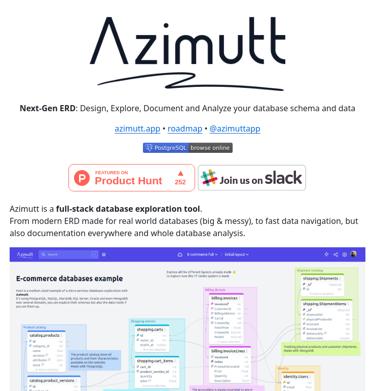

**Source:** [https://twitter.com/i/web/status/1878802958004957344](https://twitter.com/i/web/status/1878802958004957344)
**Original Post Date:** 2025-05-27 21:21:54

# Database Schema Exploration with Azimutt: Modern ERD Tool

## Introduction
Understanding complex database schemas is crucial for modern application development and maintenance. Traditional Entity-Relationship Diagrams (ERDs) often fall short when dealing with large-scale, multi-service architectures. Azimutt addresses this challenge by offering a full-stack exploration tool that combines visual schema representation, data navigation, and comprehensive documentation. This knowledge base item explores how Azimutt streamlines database understanding for developers and administrators.

## Core Functionality of Azimutt

Azimutt serves as a unified platform for exploring, documenting, and analyzing database schemas. It provides modern ERD visualization specifically designed to handle real-world databases that are often large-scale and complex.

The tool offers fast data navigation capabilities across tables and relationships, making it easier to understand database structures quickly.

- Real-time schema visualization
- Interactive table exploration
- Relationship mapping
- Automated documentation generation

## Database Compatibility and Support

Azimutt supports a wide range of database systems, making it versatile for different technical stacks. The tool is compatible with both SQL-based databases like PostgreSQL, MySQL, MariaDB, SQL Server, Oracle, as well as NoSQL solutions such as MongoDB.

This broad compatibility makes Azimutt valuable in organizations that maintain diverse database ecosystems.

## Visual Interface and User Experience

The interface is designed to be intuitive with features like a search bar for quick navigation, expandable sections for detailed table views, and clear visual representation of relationships between tables.

Using the E-commerce example from the documentation, we can see how Azimutt effectively displays interconnected tables such as catalog.products, shopping.carts, billing.invoices, and shipping.shipments.

## Key Takeaways

- Azimutt simplifies complex database schema exploration through modern ERD visualization
- The tool supports multiple database systems, making it versatile for different technical stacks
- Interactive features like search and expandable views enhance the user experience in understanding large schemas

## Conclusion
Azimutt represents a significant advancement in database schema exploration tools. By combining modern ERD design with practical navigation and documentation capabilities, it provides developers and DBAs with an effective solution for working with complex database architectures.

## External References

- [Official Azimutt Website](https://azimutt.app)
- [Azimutt Roadmap](https://azimutt.app/roadmap)

## Media

**Image Description:** The image is a promotional and informational page for a tool called **Azimutt**, which is described as a full-stack database exploration tool. Below is a detailed breakdown of the image:

### **Header Section**
1. **Logo and Branding**:
   - The top of the image prominently features the brand name **Azimutt** in a large, handwritten-style font.
   - Below the name, there is a signature-like design, adding a personal and creative touch to the branding.

2. **Tagline**:
   - The tagline reads: **"Next-Gen ERD: Design, Explore, Document and Analyze your database schema and data"**.
   - This highlights the primary purpose of Azimutt, which is to facilitate the exploration, documentation, and analysis of database schemas and data.

3. **Links**:
   - Below the tagline, there are links to:
     - **azimutt.app**: The main website or application.
     - **roadmap**: A link to the product roadmap, indicating transparency and future development plans.
     - **@azimuttapp**: A social media handle or community link, likely for engagement and updates.

### **Main Content**
1. **Description of Azimutt**:
   - The text describes Azimutt as a **full-stack database exploration tool**.
   - Key features highlighted include:
     - **Modern ERD (Entity-Relationship Diagram)**: Designed for real-world databases, which are often large, complex, and messy.
     - **Fast Data Navigation**: Enables quick exploration of database schemas and data.
     - **Documentation**: Provides comprehensive documentation for database schemas.
     - **Whole Database Analysis**: Offers tools for analyzing entire databases.

2. **Highlighted Features**:
   - The text emphasizes Azimutt's ability to handle modern databases, including those with microservices architectures, and its compatibility with various database systems (e.g., PostgreSQL, MySQL, MariaDB, SQL Server, Oracle, MongoDB).

### **Visual Elements**
1. **Screenshot of the Tool**:
   - The bottom half of the image shows a screenshot of Azimutt's interface, demonstrating its functionality.
   - The interface is clean and organized, with a focus on database exploration and visualization.
   - Key elements in the screenshot include:
     - **Tabs and Navigation**: The top bar shows navigation options such as "Azimutt," "Search," and "E-commerce full layout."
     - **Database Schema Visualization**:
       - The main section displays an **E-commerce databases example**, showcasing a structured view of database tables and relationships.
       - Tables such as `catalog.products`, `shopping.carts`, `billing.invoices`, and `shipping.shipments` are visualized with clear connections between them.
     - **Data Tables**:
       - Each table is represented with columns and sample data, providing a detailed view of the database schema.
       - For example:
         - `catalog.products` table includes columns like `id`, `name`, `price`, etc.
         - `billing.invoices` table includes columns like `id`, `invoice_number`, `total`, etc.
     - **Relationships**:
       - Relationships between tables are visually represented with lines and arrows, making it easy to understand the database schema.

2. **Interactive Features**:
   - The interface appears interactive, with features like:
     - **Search functionality** (indicated by a search bar at the top).
     - **Expandable/Collapsible sections** for tables and relationships.
     - **Detailed views** of individual tables and their data.

### **Additional Promotional Elements**
1. **Badges and Logos**:
   - **PostgreSQL**: A badge indicating compatibility with PostgreSQL.
   - **Product Hunt**: A badge showing that Azimutt is featured on Product Hunt, a platform for discovering new products.
   - **Slack**: A logo encouraging users to join the Azimutt community on Slack for support and discussions.

2. **Call-to-Action**:
   - The text and badges encourage users to explore Azimutt further, join the community, and engage with the product.

### **Technical Details**
1. **Database Schema Visualization**:
   - The tool provides a clear, graphical representation of database schemas, making it easier to understand complex relationships.
   - The example shown is an **E-commerce database**, which includes multiple interconnected tables such as product catalogs, shopping carts, invoices, and shipments.

2. **Compatibility**:
   - Azimutt supports a variety of database systems, including PostgreSQL, MySQL, MariaDB, SQL Server, Oracle, and MongoDB.

3. **Interactive and User-Friendly Interface**:
   - The interface is designed to be intuitive, with features like search, expandable sections, and detailed views of tables and relationships.

### **Overall Impression**
The image effectively communicates Azimutt's purpose as a powerful tool for database exploration, documentation, and analysis. The combination of text, visuals, and promotional elements makes it clear that Azimutt is designed for developers, database administrators, and anyone working with complex databases. The emphasis on modern ERDs, fast data navigation, and comprehensive documentation aligns with the needs of professionals dealing with large and intricate database systems.
