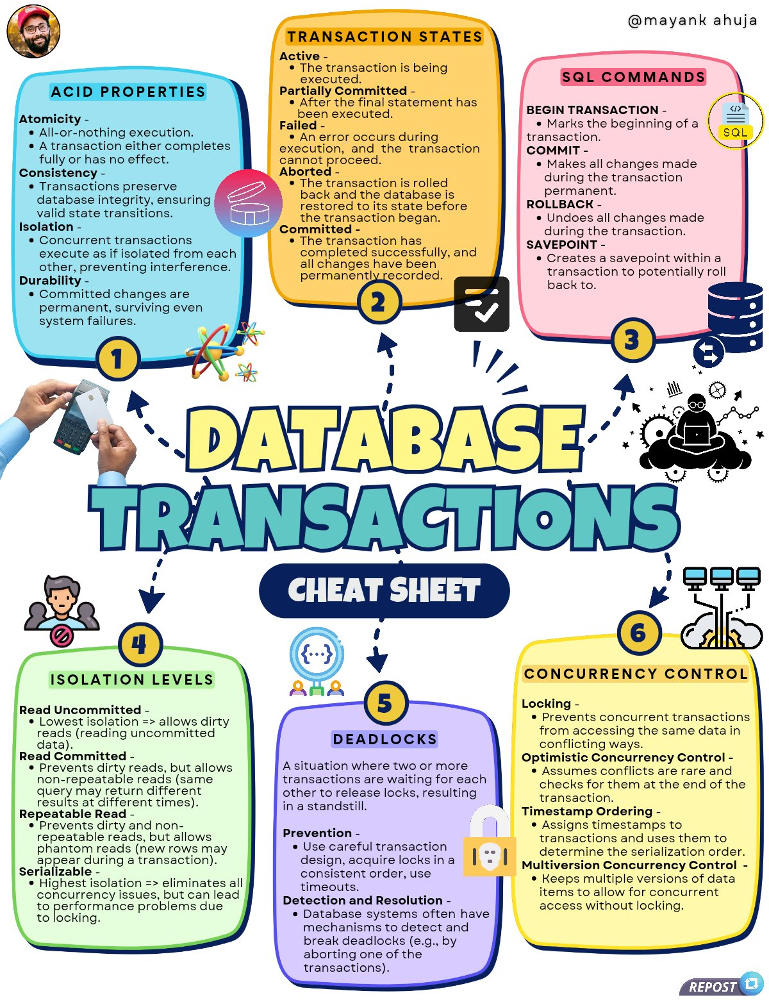

**Source:** [https://twitter.com/i/web/status/1885699330553643249](https://twitter.com/i/web/status/1885699330553643249)
**Original Post Date:** 2025-05-28 03:40:34

# Database Transactions: ACID Properties, States, Commands, and Concurrency Control

## Introduction
Database transactions are fundamental to maintaining data integrity and consistency in modern applications. This knowledge base item provides a detailed examination of core concepts including the essential ACID properties that define reliable transactions, various transaction states and their implications, SQL commands for transaction management, isolation levels with their trade-offs, deadlock prevention strategies, and advanced concurrency control mechanisms. Understanding these principles is crucial for designing robust database systems.

## ACID Properties

Atomicity ensures all-or-nothing execution of transactions, maintaining data consistency.

Consistency guarantees that each transaction preserves the validity of database constraints and business rules.

Isolation prevents interference between concurrent transactions by controlling visibility of intermediate results.

Durability ensures committed changes persist despite system failures through write-ahead logging.

- Transactions must complete fully or have no effect (Atomicity)
- Database transitions between valid states only (Consistency)
- Concurrent transactions appear to execute sequentially (Isolation)
- Committed changes survive system failures (Durability)

> **Note/Tip:** Always test transactions under failure scenarios to ensure durability

> **Note/Tip:** Consider isolation level trade-offs between consistency and performance

## Transaction States

Transactions progress through distinct states from active execution to either commit or rollback.

Partial commits indicate completion of statements but pending validation.

1. Active - Transaction in progress executing SQL commands
1. Partially Committed - Final statement executed awaiting validation
1. Failed - Error encountered during execution
1. Aborted - Changes rolled back to pre-transaction state
1. Committed - Permanent changes recorded

## SQL Commands for Transaction Management

Core SQL commands provide granular control over transaction lifecycle and recovery points.

_Basic transaction flow demonstrating start, execution, and commit/rollback_

```sql
-- Start transaction
BEGIN TRANSACTION;
-- Perform operations
COMMIT;
-- Alternative rollback
ROLLBACK;
```

_Using savepoints to recover from partial failures while preserving earlier changes_

```sql
SAVEPOINT my_savepoint;
-- Operations that may fail
ROLLBACK TO SAVEPOINT my_savepoint;
```

## Key Takeaways

- Transactions must follow ACID properties for reliable data management
- Isolation levels balance consistency requirements with system performance
- Proper transaction state management prevents data corruption and ensures recovery

## Conclusion
Understanding database transactions is crucial for developing robust applications. By mastering ACID principles, SQL commands, isolation levels, and concurrency control mechanisms, developers can design systems that maintain data integrity while maximizing performance.

## External References

- [PostgreSQL Transaction Documentation](https://www.postgresql.org/docs/current/tutorial-transactions.html)
- [ACID Properties - Microsoft Docs](https://learn.microsoft.com/en-us/sql/relational-databases/in-memory-oltp/acid-properties)


## Media

**Image Description:** This image is a detailed and colorful infographic that explains **Database Transactions**, focusing on key concepts such as ACID properties, transaction states, SQL commands, isolation levels, concurrency control, and deadlocks. Below is a detailed breakdown of the image:

---

### **1. ACID Properties (Section 1)**
- **Atomicity**: 
  - All-or-nothing execution.
  - A transaction either completes fully or has no effect.
- **Consistency**: 
  - Transactions preserve database integrity, ensuring valid state transitions.
- **Isolation**: 
  - Concurrent transactions execute as if isolated from each other, preventing interference.
- **Durability**: 
  - Committed changes are permanent, surviving even system failures.

### **2. Transaction States (Section 2)**
- **Active**: 
  - The transaction is being executed.
- **Partially Committed**: 
  - After the final statement has been executed.
- **Failed**: 
  - An error occurs during execution, and the transaction cannot proceed.
- **Aborted**: 
  - The transaction is rolled back, and the database is restored to its state before the transaction began.
- **Committed**: 
  - The transaction has completed successfully, and all changes have been permanently recorded.

### **3. SQL Commands (Section 3)**
- **BEGIN TRANSACTION**: 
  - Marks the beginning of a transaction.
- **COMMIT**: 
  - Makes all changes made during the transaction permanent.
- **ROLLBACK**: 
  - Undoes all changes made during the transaction.
- **SAVEPOINT**: 
  - Creates a savepoint within a transaction to roll back to a specific point.

### **4. Isolation Levels (Section 4)**
- **Read Uncommitted**: 
  - Lowest isolation level; allows dirty reads (reading uncommitted data).
- **Read Committed**: 
  - Prevents dirty reads but allows non-repeatable reads.
- **Repeatable Read**: 
  - Prevents dirty reads and non-repeatable reads but allows phantom reads.
- **Serializable**: 
  - Highest isolation level; eliminates all concurrency issues but can lead to performance problems.

### **5. Deadlocks (Section 5)**
- **Definition**: 
  - A situation where two or more transactions are waiting for each other to release locks, resulting in a standstill.
- **Prevention**: 
  - Use careful transaction design, acquire locks in a consistent order, and use timeouts.
- **Detection and Resolution**: 
  - Database systems often have mechanisms to detect and break deadlocks (e.g., by aborting one of the transactions).

### **6. Concurrency Control (Section 6)**
- **Locking**: 
  - Prevents concurrent transactions from accessing the same data in conflicting ways.
- **Optimistic Concurrency Control**: 
  - Assumes conflicts are rare and checks for them at the end of the transaction.
- **Timestamp Ordering**: 
  - Assigns timestamps to transactions to determine the serialization order.
- **Multiversion Concurrency Control (MVCC)**: 
  - Keeps multiple versions of data items to allow concurrent access without locking.

---

### **Visual Elements**
- **Color Coding**: 
  - Each section is color-coded for easy differentiation:
    - ACID Properties: Blue
    - Transaction States: Yellow
    - SQL Commands: Pink
    - Isolation Levels: Green
    - Deadlocks: Purple
    - Concurrency Control: Yellow
- **Icons and Illustrations**: 
  - Icons and illustrations are used to represent concepts, such as locks, database tables, and transaction flow.
  - A person holding a calculator is shown, symbolizing transaction management.
- **Arrows and Flow**: 
  - Arrows connect sections to show the flow of information and relationships between concepts.
- **Typography**: 
  - Bold and clear fonts are used for headings and key terms.
  - Bullet points are used to list properties and commands for clarity.

---

### **Overall Layout**
- The infographic is structured in a logical flow, starting from the fundamental properties (ACID) and moving through transaction states, SQL commands, isolation levels, deadlocks, and concurrency control.
- The use of bright colors, icons, and concise text makes the information visually engaging and easy to understand.

---

### **Additional Notes**
- The infographic is attributed to **@mayankahuja** (as seen in the top-right corner).
- The bottom of the image includes a "Repost" icon, indicating it might be shared or repurposed from another source.

This infographic serves as a comprehensive cheat sheet for understanding database transactions and related concepts.
