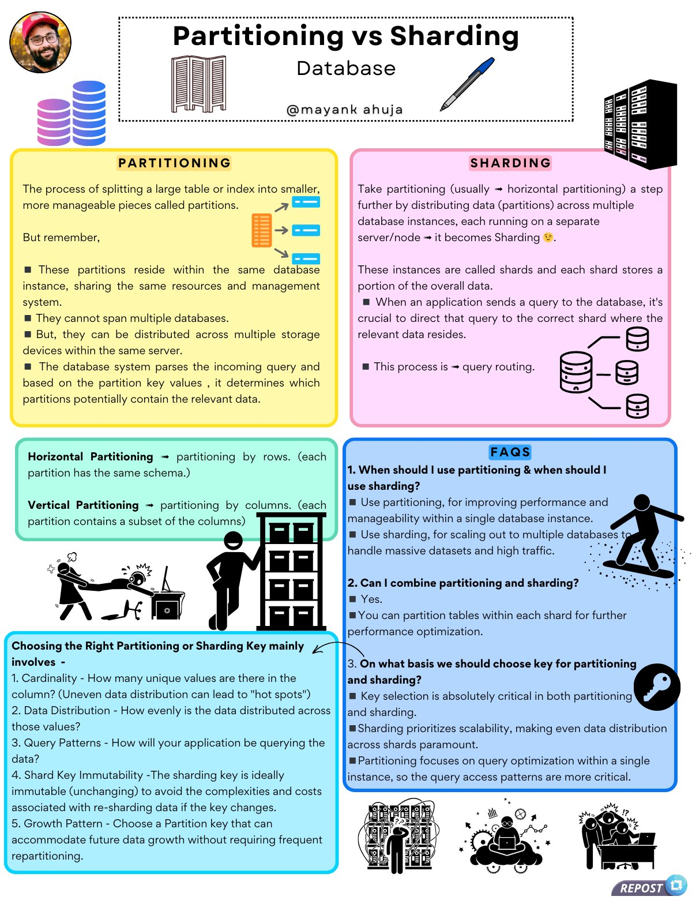

**Source:** [https://twitter.com/i/web/status/1886292559145918555](https://twitter.com/i/web/status/1886292559145918555)
**Original Post Date:** 2025-05-28 06:01:16

# Database Partitioning vs Sharding: A Comprehensive Technical Comparison

## Introduction
As modern applications scale to handle massive datasets and high traffic loads, efficient data distribution mechanisms become critical. Database partitioning and sharding are two fundamental approaches for managing large-scale databases, each with distinct characteristics, use cases, and technical considerations. This knowledge base article provides a detailed comparison of these techniques, including implementation details, key differences, and practical guidance on when to apply each approach.

## Partitioning: Definition and Core Concepts

Partitioning is the process of splitting a large database table or index into smaller, more manageable pieces called partitions. Each partition contains data that satisfies specific criteria based on the chosen partition key.

A key characteristic of partitioning is that all partitions reside within the same database instance and share the same resource pool (CPU, memory, storage). This makes partitioning ideal for improving query performance while maintaining transactional consistency across a single database node.

_This SQL demonstrates range partitioning by date, a common use case for time-series data._

```SQL
-- Example of range partitioning on an orders table
CREATE TABLE orders (
    order_id INT,
    customer_id INT,
    order_date DATE,
    amount DECIMAL(10,2)
) PARTITION BY RANGE (order_date);

-- Create individual partitions for different date ranges
CREATE TABLE orders_2023_q1 PARTITION OF orders FOR VALUES FROM ('2023-01-01') TO ('2023-04-01');
CREATE TABLE orders_2023_q2 PARTITION OF orders FOR VALUES FROM ('2023-04-01') TO ('2023-07-01');
```

- Horizontal Partitioning splits rows across partitions while maintaining the same schema
- Vertical Partitioning splits columns across partitions to optimize storage and access patterns

## Sharding: Architecture and Implementation

Sharding extends partitioning by distributing data across multiple independent database instances, each running on separate physical or virtual servers. Each shard is a complete database instance with its own resources.

Query routing becomes crucial in sharded environments, as the application must determine which shard contains the requested data based on the shard key.

_This pseudo-code demonstrates basic shard key calculation and routing logic._

```Python
# Example of simple shard key calculation

def calculate_shard_key(customer_id):
    # Use modulo to distribute customers across 8 shards
    return customer_id % 8

# Determine which database to query
shard_number = calculate_shard_key(12345)
database_host = f'db-shard-{shard_number}.example.com'
```

- Sharding enables horizontal scaling by adding more database instances
- Each shard operates independently, improving concurrent access patterns

## Key Selection Criteria for Partitioning and Sharding

The choice of partition key or shard key is critical for the success of any data distribution strategy. Key selection affects performance, scalability, and operational complexity.

Consider these factors when choosing keys:

- **Cardinality**: High cardinality ensures even data distribution
- **Query Patterns**: Keys should align with common query access patterns
- **Growth Pattern**: The key must accommodate future data growth
- **Immutability**: For sharding, the shard key should be immutable to avoid costly re-sharding operations

1. Evaluate cardinality of candidate columns for even distribution
1. Analyze application query patterns to identify natural partition boundaries
1. Test scaling scenarios with different key choices using representative data volumes

> **Note/Tip:** Shard keys should be immutable as re-sharding is extremely costly and complex

> **Note/Tip:** Monitor partition/shard sizes regularly to prevent imbalanced growth patterns

## Use Cases and Trade-offs

Choose **partitioning** when:

- Managing large tables within a single database instance
- Need transactional consistency across the entire dataset
- Workload can be optimized by isolating frequently accessed data subsets

Choose **sharding** when:

- Handling massive datasets that exceed single-node capacity
- Require horizontal scaling to meet high read/write throughput demands
- Can accept eventual consistency and manage distributed transactions

## Key Takeaways

- Partitioning maintains a single database instance while sharding distributes data across multiple instances
- Shard key selection is critical as changing shard keys requires costly re-sharding operations
- Consider query patterns, growth projections, and operational complexity when choosing between partitioning and sharding

## Conclusion
The choice between partitioning and sharding depends on your specific scaling requirements. Partitioning offers simpler management within a single instance while sharding enables true horizontal scaling but introduces complexity in query routing and distributed operations. Understanding the technical differences, implementation considerations, and key selection criteria is essential for designing efficient database architectures that can scale with your application's growth.

## External References

- [PostgreSQL Partitioning Documentation](https://www.postgresql.org/docs/current/ddl-partitioning.html)
- [MongoDB Sharding Guide](https://docs.mongodb.com/manual/sharding/)


## Media

**Image Description:** ### Image Description

The image is an infographic titled **"Partitioning vs Sharding"** by **@mayankahuja**, which compares and contrasts two database optimization techniques: **Partitioning** and **Sharding**. The infographic is visually organized into sections with distinct colors and icons to differentiate the concepts. Below is a detailed breakdown of the content:

---

### **Main Sections**

#### **1. Partitioning**
- **Definition**: Partitioning is the process of splitting a large table or index into smaller, more manageable pieces called partitions.
- **Key Points**:
  - Partitions reside within the same database instance, sharing the same resources and management system.
  - Partitions cannot span multiple databases but can be distributed across multiple storage devices within the same server.
  - The database system parses incoming queries and determines which partitions potentially contain the relevant data based on partition key values.
- **Types of Partitioning**:
  - **Horizontal Partitioning**: Partitioning by rows (each partition has the same schema).
  - **Vertical Partitioning**: Partitioning by columns (each partition contains a subset of the columns).
- **Illustration**: A visual representation of horizontal and vertical partitioning is provided, showing how data is split into smaller chunks.

#### **2. Sharding**
- **Definition**: Sharding is an extension of partitioning where data is distributed across multiple database instances, each running on a separate server/node.
- **Key Points**:
  - Shards are the distributed database instances, each storing a portion of the overall data.
  - Query routing is crucial to direct queries to the correct shard where the relevant data resides.
  - Sharding is used for scaling out to handle massive datasets and high traffic.
- **Illustration**: A visual representation shows multiple shards (database instances) distributed across different servers/nodes.

#### **3. FAQs**
- **Q1: When should I use partitioning and when should I use sharding?**
  - Use partitioning for improving performance and manageability within a single database instance.
  - Use sharding for scaling out to multiple databases to handle massive datasets and high traffic.
- **Q2: Can I combine partitioning and sharding?**
  - Yes, you can partition tables within each shard for further optimization.
- **Q3: On what basis should we choose the key for partitioning and sharding?**
  - Key selection is critical in both partitioning and sharding. Factors include:
    - **Cardinality**: How many unique values are in the column.
    - **Data Distribution**: How evenly the data is distributed.
    - **Query Patterns**: How the application queries the data.
    - **Shard Key Immutability**: The shard key should be immutable to avoid re-sharding.
    - **Growth Pattern**: Choose a partition key that can accommodate future data growth.

#### **4. Choosing the Right Partitioning or Sharding Key**
- **Factors to Consider**:
  - **Cardinality**: Uneven data distribution can lead to "hot spots."
  - **Data Distribution**: Even distribution is important to avoid performance bottlenecks.
  - **Query Patterns**: How the application queries the data.
  - **Shard Key Immutability**: Avoid frequent re-sharding.
  - **Growth Pattern**: Ensure the key can accommodate future data growth.

---

### **Visual Elements**
- **Color Coding**:
  - **Partitioning**: Yellow background.
  - **Sharding**: Pink background.
  - **Horizontal Partitioning**: Green background.
  - **Vertical Partitioning**: Light blue background.
  - **FAQs**: Dark blue background.
- **Icons and Illustrations**:
  - Database icons represent partitioning and sharding.
  - Arrows and flowcharts illustrate the distribution of data.
  - Human figures and symbols depict query routing and scaling.
- **Author Information**: The top left corner includes a profile picture of the author, **@mayankahuja**, along with a pen and notebook icon, suggesting a focus on technical writing or explanation.

---

### **Overall Layout**
The infographic is structured in a grid format with clear headings, bullet points, and visual aids. The use of contrasting colors and icons helps differentiate between partitioning and sharding, making the content easy to follow. The FAQs section provides practical guidance, while the detailed explanation of choosing the right key ensures a comprehensive understanding of the concepts.

---

### **Summary**
The infographic effectively compares **Partitioning** and **Sharding**, highlighting their definitions, use cases, and key differences. It also addresses common questions and provides guidance on selecting appropriate partitioning or sharding keys, making it a valuable resource for database administrators and developers. The visual elements enhance comprehension and make the technical content accessible.
