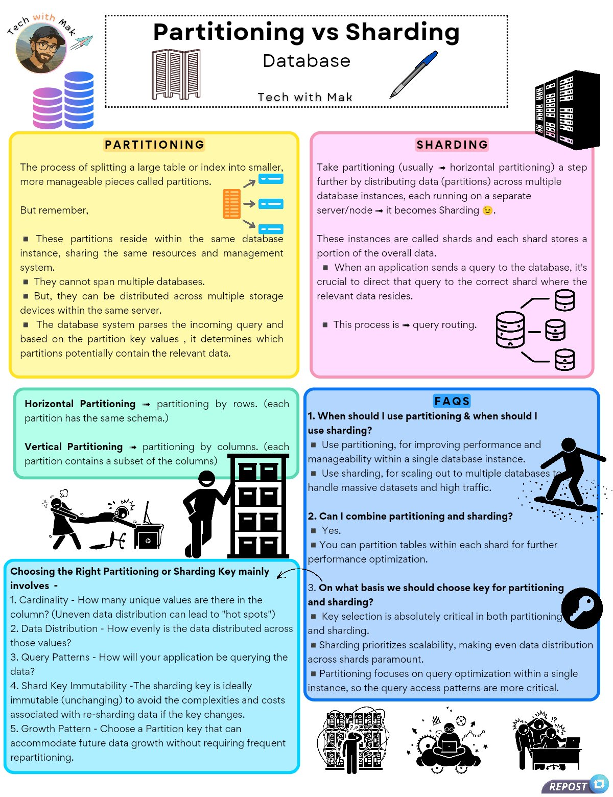

**Source:** [https://twitter.com/i/web/status/1918895825310089634](https://twitter.com/i/web/status/1918895825310089634)
**Original Post Date:** 2025-05-28 06:18:58

# Partitioning vs Sharding: Deep Dive into Database Distribution Strategies

## Introduction
Database management often requires efficient data distribution strategies for optimal performance and scalability. Partitioning and sharding are two fundamental approaches that serve distinct purposes in this context. Understanding when to apply each strategy, or combine them effectively, is crucial for building robust database systems. This article explores their definitions, differences, implementation considerations, and practical applications.

## Fundamental Concepts

Partitioning involves dividing a large table into smaller, manageable pieces called partitions within the same database instance. These partitions share resources but operate as independent units for queries and maintenance.

- Partitions reside in the same database instance
- Shares management system and resources
- Cannot span multiple databases

## Sharding: A Deeper Level of Distribution

Sharding extends partitioning by distributing data across multiple independent database instances. Each shard operates as a separate entity, enabling horizontal scaling for massive datasets and high-traffic applications.

- Distributed across multiple servers/nodes
- Requires query routing to correct shards
- Enables true scalability beyond single instance

> **Note/Tip:** Proper shard key selection is critical for optimal performance.

## Partitioning Types: Horizontal vs Vertical

Horizontal partitioning divides data by rows, maintaining identical schemas across partitions. Vertical partitioning splits columns, distributing different subsets of attributes.

1. Horizontal: Splits rows based on criteria like date ranges or geographic regions
1. Vertical: Distributes columns based on access patterns or performance needs

## Key Selection Best Practices

Choosing appropriate partitioning and sharding keys is crucial for system performance. Poor key selection can lead to uneven data distribution and hotspots.

- Consider cardinality of the column
- Evaluate query patterns and access frequency
- Assess future growth projections

> **Note/Tip:** Avoid frequently changing shard keys to prevent expensive re-sharding operations.

## Implementation Considerations

When deciding between partitioning and sharding, consider your scalability needs. Partitioning is ideal for managing large datasets within a single instance, while sharding enables horizontal scaling across multiple instances.

- Partitioning: Use for performance optimization within single instance
- Sharding: Implement when data volume exceeds single-instance capacity
- Combined approach: Leverage both techniques for complex scaling requirements

> **Note/Tip:** Regular monitoring and rebalancing may be necessary as data grows.

## Key Takeaways

- Partitioning is ideal for managing large datasets within a single database instance
- Sharding enables horizontal scaling by distributing data across multiple instances
- Proper key selection is critical for optimal performance in both strategies
- Consider combining partitioning and sharding for complex scaling requirements

## Conclusion
Understanding the distinction between partitioning and sharding, along with their appropriate use cases, empowers database architects to design scalable solutions that meet specific application needs. Proper implementation of these techniques can significantly improve system performance and manageability.

## Media

**Image Description:** ### Image Description: Partitioning vs Sharding in Databases

The image is an informative infographic titled **"Partitioning vs Sharding"** by **Tech with Mak**, which explains the concepts of database partitioning and sharding, their differences, and their applications. The infographic is visually organized into four main sections, each with distinct colors and icons to highlight key points. Below is a detailed breakdown:

---

### **1. Title and Header**
- **Title**: "Partitioning vs Sharding" is prominently displayed at the top in bold black text.
- **Subtitle**: "Database" is written below the title, indicating the focus of the content.
- **Logo**: On the top left, there is a circular avatar of a person with glasses and a beard, labeled "Tech with Mak," along with a rocket icon, suggesting a tech-focused content creator.
- **Icons**: 
  - A stack of colorful cylinders (purple and blue) on the left represents partitioning.
  - A stack of black servers on the right represents sharding.
  - A pen and a door icon are also present, symbolizing technical writing and database management.

---

### **2. Partitioning Section**
- **Color**: Yellow background with black text.
- **Title**: "PARTITIONING" in bold black text.
- **Definition**: 
  - Partitioning is defined as the process of splitting a large table or index into smaller, more manageable pieces called partitions.
  - These partitions reside within the same database instance, sharing the same resources and management system.
- **Key Points**:
  - Partitions cannot span multiple databases but can be distributed across multiple storage devices within the same server.
  - The database system parses incoming queries and determines which partitions potentially contain the relevant data based on partition key values.
- **Icons**:
  - A stack of colored cylinders (purple and blue) represents partitions.
  - Arrows and lines illustrate the distribution of data within the same database instance.

---

### **3. Sharding Section**
- **Color**: Pink background with black text.
- **Title**: "SHARDING" in bold black text.
- **Definition**:
  - Sharding is an extension of partitioning, where data is distributed across multiple database instances, each running on a separate server/node.
  - These instances are called shards, and each shard stores a portion of the overall data.
- **Key Points**:
  - When an application sends a query to the database, it is crucial to direct the query to the correct shard where the relevant data resides. This process is called **query routing**.
  - Sharding is used for scaling out to multiple databases to handle massive datasets and high traffic.
- **Icons**:
  - A stack of black servers represents shards.
  - Arrows and lines illustrate the distribution of data across multiple servers.

---

### **4. Horizontal and Vertical Partitioning**
- **Color**: Green background with black text.
- **Title**: "Horizontal Partitioning" and "Vertical Partitioning."
- **Horizontal Partitioning**:
  - Defined as partitioning by rows, where each partition has the same schema.
  - Illustrated with a diagram showing rows being distributed across partitions.
- **Vertical Partitioning**:
  - Defined as partitioning by columns, where each partition contains a subset of the columns.
  - Illustrated with a diagram showing columns being distributed across partitions.
- **Icons**:
  - A person holding a stack of books and another person holding a stack of papers visually represent the distribution of rows and columns.

---

### **5. FAQs Section**
- **Color**: Blue background with black text.
- **Title**: "FAQs" in bold black text.
- **Questions and Answers**:
  1. **When should I use partitioning and when should I use sharding?**
     - Use partitioning for improving performance and manageability within a single database instance.
     - Use sharding for scaling out to multiple databases to handle massive datasets and high traffic.
  2. **Can I combine partitioning and sharding?**
     - Yes, you can partition tables within each shard for further optimization.
  3. **On what basis should we choose the key for partitioning and sharding?**
     - Key selection is critical in both partitioning and sharding.
     - Factors include:
       - **Cardinality**: How many unique values are in the column.
       - **Data Distribution**: How evenly the data is distributed.
       - **Query Patterns**: How the data will be queried.
       - **Shard Key Immutability**: Avoid frequent re-sharding.
       - **Growth Pattern**: Choose a partition key that can accommodate future data growth.
- **Icons**:
  - A key icon represents the importance of key selection.
  - A person surfing on a wave visually represents scaling and optimization.

---

### **6. Choosing the Right Partitioning or Sharding Key**
- **Color**: Light blue background with black text.
- **Title**: "Choosing the Right Partitioning or Sharding Key."
- **Key Points**:
  - **Cardinality**: Uneven data distribution can lead to "hot spots."
  - **Data Distribution**: Even distribution is crucial.
  - **Query Patterns**: Understand how the application will query the data.
  - **Shard Key Immutability**: Avoid frequent re-sharding.
  - **Growth Pattern**: Choose a key that can accommodate future data growth.
- **Icons**:
  - A person standing next to a stack of buildings represents scalability.
  - A person working on a laptop with gears and clocks represents optimization and performance.

---

### **7. Visual Elements**
- **Icons and Illustrations**:
  - A person holding a stack of books and another holding a stack of papers illustrates horizontal and vertical partitioning.
  - A person surfing on a wave represents scaling and optimization.
  - A person working on a laptop with gears and clocks represents performance optimization.
  - A group of people working together represents collaboration and planning.

---

### **8. Footer**
- **Repost Button**: A blue button labeled "REPOST" with a share icon is present in the bottom right corner.

---

### **Overall Design**
- The infographic uses a clean, organized layout with contrasting colors (yellow, pink, green, blue) to differentiate sections.
- Icons and illustrations are used effectively to convey technical concepts in a visually appealing manner.
- The content is structured logically, starting with definitions, moving to types of partitioning, and ending with FAQs and best practices.

This infographic serves as an educational resource for understanding the differences between partitioning and sharding in databases, along with their applications and considerations.
