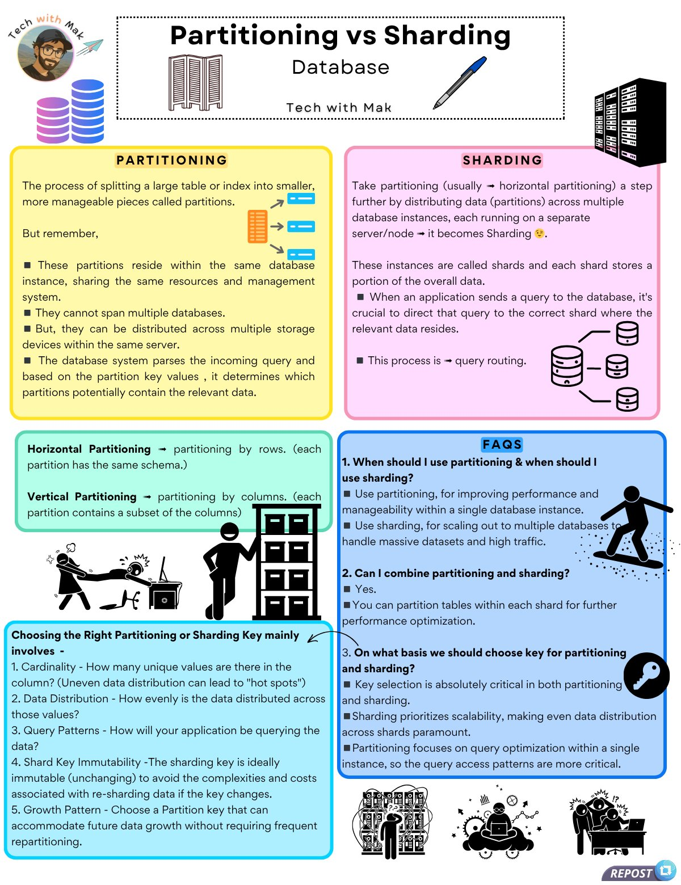

**Source:** [https://twitter.com/i/web/status/1941016152828006407](https://twitter.com/i/web/status/1941016152828006407)
**Original Post Date:** 2025-07-14 20:31:02

# Partitioning vs Sharding in Database Systems: Key Differences and Best Practices

## Introduction
In database systems, partitioning and sharding are techniques used to manage large datasets efficiently. Partitioning involves splitting a table into smaller pieces within the same database instance, while sharding distributes data across multiple database instances. This article delves into these concepts, their differences, and how to choose the right partition or shard key.

## Partitioning in Databases

Partitioning is a technique where a large table or index is divided into smaller, more manageable pieces called partitions. These partitions reside within the same database instance and share the same resources and management system.

Partitions cannot span multiple databases but can be distributed across multiple storage devices within the same server. The database system parses incoming queries and determines which partitions potentially contain the relevant data based on partition key values.

> **Note/Tip:** Partitioning is useful for improving performance and manageability within a single database instance.

> **Note/Tip:** Ensure that partition keys are chosen carefully to avoid uneven distribution of data across partitions.

## Sharding in Databases

Sharding extends the concept of partitioning by distributing data across multiple database instances, each running on a separate server/node. These instances are called shards, and each shard stores a portion of the overall data.

When an application sends a query, it must be directed to the correct shard where the relevant data resides (query routing). Sharding is essential for scaling out to handle massive datasets and high traffic.

> **Note/Tip:** Sharding is crucial for horizontal scaling in distributed database systems.

> **Note/Tip:** Query routing can add complexity, so ensure that your application can efficiently direct queries to the correct shard.

## Horizontal vs Vertical Partitioning

Horizontal partitioning involves splitting data by rows, where each partition has the same schema. This is useful when different subsets of data are accessed frequently.

Vertical partitioning involves splitting data by columns, where each partition contains a subset of the columns. This is beneficial when certain columns are accessed more often than others.

- Horizontal partitioning: Split by rows.
- Vertical partitioning: Split by columns.

## Choosing the Right Partitioning or Sharding Key

The choice of partition or shard key is critical for performance and scalability. Consider factors such as cardinality, data distribution, query patterns, key immutability, and growth pattern.

1. Cardinality: Ensure the key has enough unique values to distribute data evenly.
1. Data Distribution: Choose a key that results in an even distribution of data across partitions/shards.
1. Query Patterns: Consider how your application will query the data.
1. Shard Key Immutability: The shard key should be immutable to avoid re-sharding complexities.
1. Growth Pattern: Choose a partition key that can accommodate future data growth without frequent re-partitioning.

> **Note/Tip:** Uneven distribution of data across partitions/shards can lead to 'hot spots' and performance bottlenecks.

> **Note/Tip:** Regularly review and adjust your partition or shard keys as your data grows and query patterns evolve.

## FAQs on Partitioning vs Sharding

When should I use partitioning and when should I use sharding? Use partitioning for improving performance and manageability within a single database instance. Use sharding for scaling out to multiple databases to handle massive datasets and high traffic.

- Can I combine partitioning and sharding? Yes, you can partition tables within each shard for further optimization.
- On what basis should we choose the key for partitioning and sharding? Key selection is critical. Sharding prioritizes scalability, while partitioning focuses on query optimization within a single instance. The query access patterns are more critical for partitioning.

## Key Takeaways

- Partitioning splits data within the same database instance, improving performance and manageability.
- Sharding distributes data across multiple database instances, enabling horizontal scaling.
- Horizontal partitioning splits data by rows, while vertical partitioning splits data by columns.
- Choosing the right partition or shard key involves considering cardinality, data distribution, query patterns, immutability, and growth potential.
- Combine partitioning and sharding for optimal performance in large-scale database systems.

## Conclusion
Partitioning and sharding are essential techniques for managing large datasets efficiently. Partitioning improves performance within a single instance, while sharding enables horizontal scaling across multiple instances. Choosing the right partition or shard key is crucial for optimal performance and scalability.

## External References

- [Tech with Mak - Partitioning vs Sharding](https://techwithmak.com/partitioning-vs-sharding)

## Media

**Image Description:** ### Image Description: Partitioning vs Sharding in Databases

The image is an infographic titled **"Partitioning vs Sharding"** by **Tech with Mak**, designed to explain the concepts of database partitioning and sharding. The infographic is visually organized into sections with distinct colors, icons, and text to differentiate between the two concepts. Below is a detailed breakdown:

---

#### **Header Section**
- **Title**: "Partitioning vs Sharding" is prominently displayed at the top.
- **Subtitle**: "Database" is written below the title.
- **Logo**: On the top left, there is a circular avatar of a person wearing glasses, with the text "Tech with Mak" and a rocket icon, indicating the creator or brand.
- **Icons**: 
  - A stack of colorful cylinders (representing data or partitions) on the left.
  - A folding door icon in the center, symbolizing separation or division.
  - A pen icon on the right, possibly representing writing or explanation.
  - A server icon on the far right, representing database infrastructure.

---

#### **Main Content Sections**

##### **1. Partitioning (Yellow Section)**
- **Definition**: 
  - Partitioning is the process of splitting a large table or index into smaller, more manageable pieces called partitions.
  - These partitions reside within the same database instance, sharing the same resources and management system.
- **Key Points**:
  - Partitions cannot span multiple databases but can be distributed across multiple storage devices within the same server.
  - The database system parses incoming queries and determines which partitions potentially contain the relevant data based on partition key values.
- **Icons**:
  - A stack of colored bars (representing partitions).
  - Arrows pointing to a dashed line, symbolizing division.

##### **2. Sharding (Pink Section)**
- **Definition**:
  - Sharding is an extension of partitioning where data is distributed across multiple database instances, each running on a separate server/node.
  - These instances are called shards, and each shard stores a portion of the overall data.
- **Key Points**:
  - When an application sends a query, it must be directed to the correct shard where the relevant data resides (query routing).
  - Sharding is used for scaling out to handle massive datasets and high traffic.
- **Icons**:
  - Multiple server icons connected by lines, representing distributed shards.
  - A database icon with arrows pointing to different shards.

##### **3. Horizontal Partitioning (Green Section)**
- **Definition**:
  - Horizontal partitioning involves splitting data by rows, where each partition has the same schema.
- **Illustration**:
  - A cartoon of a person splitting a large dataset into smaller parts, symbolizing horizontal partitioning.

##### **4. Vertical Partitioning (Green Section)**
- **Definition**:
  - Vertical partitioning involves splitting data by columns, where each partition contains a subset of the columns.
- **Illustration**:
  - A cartoon of a person splitting a dataset into columns, symbolizing vertical partitioning.

##### **5. Choosing the Right Partitioning or Sharding Key (Blue Section)**
- **Key Considerations**:
  1. **Cardinality**: How many unique values are in the column? Uneven distribution can lead to "hot spots."
  2. **Data Distribution**: How evenly is the data distributed across partitions/shards?
  3. **Query Patterns**: How will the application query the data?
  4. **Shard Key Immutability**: The shard key should be immutable to avoid re-sharding complexities.
  5. **Growth Pattern**: Choose a partition key that can accommodate future data growth without frequent re-partitioning.
- **Icons**:
  - A database icon with a key symbol, emphasizing the importance of the partition/shard key.

##### **6. FAQs (Blue Section)**
- **Q1: When should I use partitioning and when should I use sharding?**
  - Use partitioning for improving performance and manageability within a single database instance.
  - Use sharding for scaling out to multiple databases to handle massive datasets and high traffic.
- **Q2: Can I combine partitioning and sharding?**
  - Yes, you can partition tables within each shard for further optimization.
- **Q3: On what basis should we choose the key for partitioning and sharding?**
  - Key selection is critical. Sharding prioritizes scalability, while partitioning focuses on query optimization within a single instance.
  - The query access patterns are more critical for partitioning.

---

#### **Visual Elements**
- **Color Coding**:
  - Partitioning: Yellow.
  - Sharding: Pink.
  - Horizontal Partitioning: Green.
  - Vertical Partitioning: Green.
  - FAQs: Blue.
- **Icons and Illustrations**:
  - Server icons, database icons, key icons, and human illustrations to represent concepts.
- **Arrows and Lines**:
  - Used to show relationships between concepts, such as data distribution and query routing.

---

#### **Footer**
- **Repost Icon**: A small icon in the bottom right corner with the text "REPOST," indicating that the infographic can be shared or reposted.

---

### Summary
The infographic provides a clear and structured comparison of **partitioning** and **sharding** in databases. It explains the definitions, key differences, and considerations for choosing the right partitioning or sharding key. The use of visuals, icons, and FAQs enhances understanding, making it an effective educational resource for database professionals and learners.
