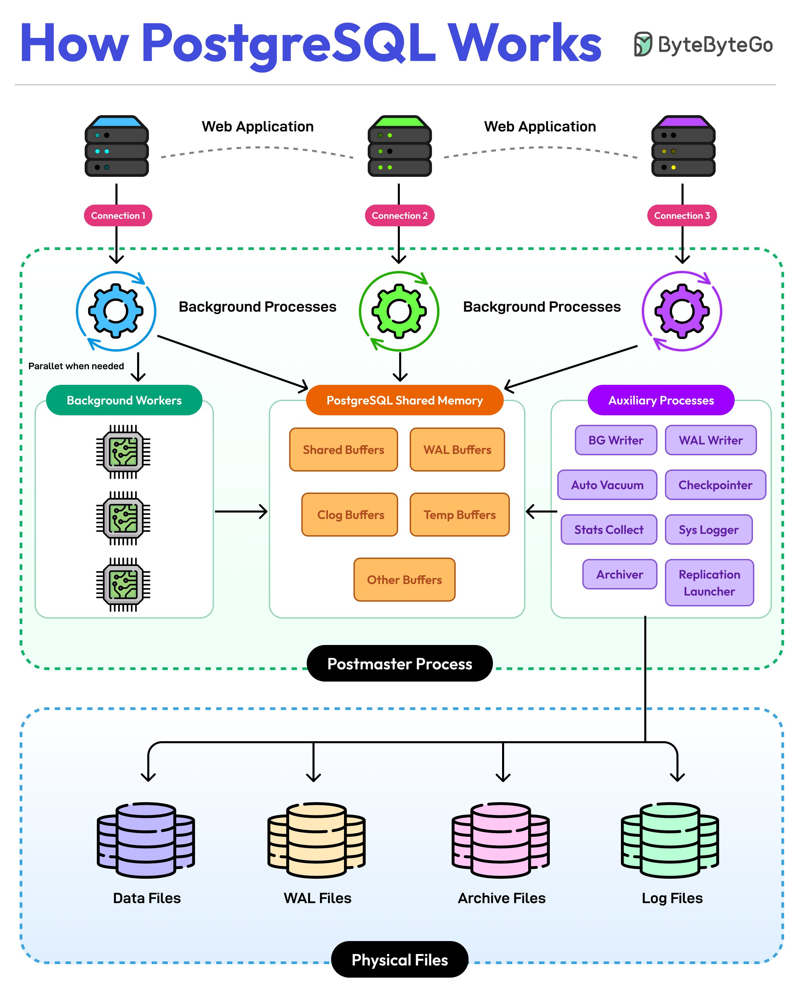

**Source:** [https://twitter.com/i/web/status/1911995656820105278](https://twitter.com/i/web/status/1911995656820105278)
**Original Post Date:** 2025-05-27 22:25:54

# PostgreSQL Architecture: Processes, Memory Management, and Storage Components

## Introduction
PostgreSQL is a sophisticated relational database system with a carefully designed architecture that balances performance, reliability, and scalability. Understanding its internal structure is crucial for optimal configuration and troubleshooting. This knowledge base article explores the core components of PostgreSQL's architecture, from web application connections to physical storage mechanisms, highlighting how these elements work together to deliver robust database operations.

## Web Applications & Connection Management

PostgreSQL manages client connections through a connection pool mechanism. Each incoming request from web applications (represented by server icons) is handled via dedicated background processes, ensuring efficient resource utilization.

The three primary types of connections shown in the diagram demonstrate how PostgreSQL can handle concurrent requests while maintaining thread safety and process isolation.

- Connection pooling for optimal resource usage
- Process-per-connection architecture
- Thread-safe operation environment

## Background Processes and Shared Memory Architecture

PostgreSQL's shared memory component (shown in orange) serves as a critical communication hub between processes. It includes various buffers for different purposes: shared buffers for data caching, WAL buffers for transaction logging, clog buffers for tracking transaction states, temp buffers for temporary operations, and additional specialized buffers.

Background workers handle parallel tasks such as query execution and vacuuming, while auxiliary processes like the BG Writer, WAL Writer, and Checkpointer ensure efficient data persistence.

1. Shared Buffers: Data cache management
1. WAL Buffers: Transaction logging
1. Clog Buffers: Commit log tracking

> **Note/Tip:** Monitor shared memory usage using pg_stat_shared_memory for performance optimization

## Physical Storage Components and Data Persistence

The physical storage layer consists of several critical components: data files containing actual database content, WAL files ensuring transaction durability through write-ahead logging, archive files supporting backup and replication, and log files for system monitoring.

The postmaster process coordinates all activities, overseeing the lifecycle of background processes and ensuring consistent operation across the entire PostgreSQL instance.

_Commands to inspect storage configuration and monitor archiving processes_

```sql
SHOW data_directory;
SELECT pg_ls_dir('base');
SELECT * FROM pg_stat_archiver;
```

## Key Technical Considerations

Write-Ahead Logging (WAL) is fundamental to PostgreSQL's reliability, ensuring data durability by logging changes before modifying the database. The background process hierarchy ensures efficient operation through parallel processing capabilities and automatic vacuuming.

- WAL for transaction durability
- Background workers for parallel operations
- Automatic vacuum management

## Key Takeaways

- PostgreSQL's architecture leverages shared memory and background processes to achieve high concurrency and performance.
- Write-Ahead Logging is essential for data consistency and recovery operations.
- The physical storage structure supports efficient backup, recovery, and replication strategies.

## Conclusion
Understanding PostgreSQL's architectural components - from web application connections through shared memory management to physical storage - is crucial for system administration and optimization. This knowledge enables engineers to make informed decisions about configuration, monitoring, and scaling strategies.

## External References

- [PostgreSQL Documentation: Architecture](https://www.postgresql.org/docs/current/architecture.html)
- [PostgreSQL Wiki: Shared Memory Management](https://wiki.postgresql.org/wiki/Shared_memory_management)


## Media

**Image Description:** The image is a detailed diagram illustrating the architecture and workflow of the PostgreSQL database system. It provides an overview of how PostgreSQL operates, including its processes, memory management, and file storage. Below is a detailed breakdown of the image:

### **Main Title**
- The title at the top reads: **"How PostgreSQL Works"**, indicating the focus of the diagram.

### **Top Section: Web Applications and Connections**
1. **Web Applications**:
   - Three web applications are shown at the top, each represented by a server icon.
   - These applications interact with the PostgreSQL database system.
2. **Connections**:
   - Each web application establishes a connection to the PostgreSQL system:
     - **Connection 1**, **Connection 2**, and **Connection 3** are labeled.
   - These connections are represented by dashed lines, indicating communication between the applications and the database.

### **Middle Section: PostgreSQL Processes and Shared Memory**
1. **Background Processes**:
   - Each connection is linked to a set of **Background Processes**, represented by gear icons in different colors (blue, green, and purple).
   - These processes handle various tasks required for database operations.
2. **Background Workers**:
   - The **Background Workers** are shown as CPU-like icons, indicating parallel processing when needed.
   - These workers handle tasks such as query execution, background operations, and other parallelizable tasks.
3. **PostgreSQL Shared Memory**:
   - A central component labeled **"PostgreSQL Shared Memory"** is depicted in orange.
   - This shared memory area is used by all database processes and includes:
     - **Shared Buffers**: Cache for database pages.
     - **WAL Buffers**: Write-Ahead Logging (WAL) buffers for transaction logging.
     - **Clog Buffers**: Commit log buffers for tracking transaction states.
     - **Temp Buffers**: Temporary storage for operations.
     - **Other Buffers**: Additional buffers for various purposes.
4. **Auxiliary Processes**:
   - These are additional processes that support the database operations:
     - **BG Writer**: Writes data from shared buffers to disk.
     - **WAL Writer**: Writes WAL records to disk.
     - **Auto Vacuum**: Manages vacuuming (cleaning up dead rows).
     - **Checkpointer**: Ensures that data is flushed to disk.
     - **Stats Collector**: Collects statistics for query optimization.
     - **Sys Logger**: Handles system logging.
     - **Archiver**: Manages WAL archive files for backup and replication.
     - **Replication Launcher**: Manages replication processes.
     - **Launcher**: Launches auxiliary processes as needed.

### **Bottom Section: Physical Files**
1. **Postmaster Process**:
   - The **Postmaster Process** is the main process that manages all other processes in the PostgreSQL system.
   - It oversees the entire database operation and coordinates the background processes.
2. **Physical Files**:
   - The diagram shows the physical storage components of PostgreSQL:
     - **Data Files**: Store the actual database data.
     - **WAL Files**: Write-Ahead Logging files for transaction logging and recovery.
     - **Archive Files**: Archived WAL files for backup and replication.
     - **Log Files**: System and error logs for debugging and monitoring.

### **Overall Flow**
- The diagram illustrates a flow from the top (web applications) to the bottom (physical files):
  1. Web applications connect to PostgreSQL.
  2. Connections are handled by background processes.
  3. Background processes utilize shared memory and auxiliary processes for efficient operation.
  4. The Postmaster process coordinates all activities.
  5. Data is stored in physical files, including data files, WAL files, archive files, and log files.

### **Key Technical Details**
1. **Shared Memory**:
   - PostgreSQL uses shared memory to improve performance by allowing multiple processes to access the same data without repeated disk I/O.
2. **Write-Ahead Logging (WAL)**:
   - WAL ensures data consistency and durability by logging all changes before they are applied to the database.
3. **Background Processes**:
   - These processes handle tasks such as writing data to disk, managing transactions, and cleaning up dead rows.
4. **Replication and Archiving**:
   - PostgreSQL supports replication and archiving for high availability and disaster recovery.

### **Color Coding**
- The use of different colors (e.g., blue, green, purple) helps differentiate between various processes and components, making the diagram easier to understand.

### **Conclusion**
The diagram provides a comprehensive view of PostgreSQL's architecture, highlighting the interaction between web applications, background processes, shared memory, auxiliary processes, and physical storage. It emphasizes the importance of shared memory, background workers, and WAL for efficient database operations. The flow from connections to physical files illustrates the end-to-end process of how PostgreSQL manages data and ensures reliability and performance.
