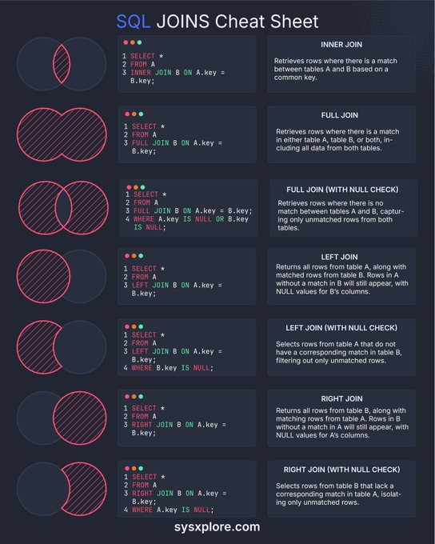

**Source:** [https://twitter.com/i/web/status/1891946149730451954](https://twitter.com/i/web/status/1891946149730451954)
**Original Post Date:** 2025-05-27 18:13:12

# SQL JOIN Operations: Comprehensive Reference Guide

## Introduction
SQL JOIN operations are fundamental to relational database management systems, enabling efficient data combination from multiple tables. This reference guide provides a comprehensive overview of different JOIN types, their syntax, and practical applications through visual representations and example queries.

## Understanding SQL JOINs

SQL JOIN operations combine rows from two or more tables based on specified conditions. The choice of JOIN type depends on the desired data output and relationship between source tables.

- INNER JOIN: Returns matching records only
- LEFT/RIGHT JOIN: Includes unmatched records from respective table
- FULL JOIN: Includes all records from both tables

## Standard Join Types

These operations form the core of SQL data combination. Each has specific use cases and implications for result set composition.

_Returns matching records from both tables_

```sql
SELECT * FROM TableA INNER JOIN TableB ON TableA.id = TableB.id;
```

_Identifies unmatched records in left table_

```sql
SELECT * FROM TableA LEFT JOIN TableB ON TableA.id = TableB.id WHERE TableB.id IS NULL;
```

## Advanced Join Techniques

Beyond basic joins, there are specialized use cases for filtering unmatched data and handling complex relationships.

_Retrieves all records from both tables_

```sql
SELECT * FROM TableA FULL JOIN TableB ON TableA.id = TableB.id;
```

## Key Takeaways

- INNER JOIN is ideal for data validation and filtering common elements
- LEFT/RIGHT JOINs are essential for maintaining master table integrity
- FULL JOIN provides comprehensive dataset coverage
- NULL checks in joins help identify orphaned records

## Conclusion
Mastering SQL JOIN operations is crucial for effective database design and query optimization. Understanding the nuances of each join type enables developers to create efficient, maintainable database solutions.

## External References

- [SQL Join Visual Guide](https://sysxexplore.com)


## Media

**Image Description:** ### Description of the Image

The image is a **SQL JOINS Cheat Sheet**, designed to provide a concise and visual guide to understanding different types of SQL JOIN operations. The layout is clean, organized, and uses a combination of text, code snippets, and Venn diagram-like visuals to explain each JOIN type. Below is a detailed breakdown:

---

#### **Header**
- The title at the top reads: **"SQL JOINS Cheat Sheet"** in bold, white text.
- The background is dark (black or dark gray), which contrasts well with the white and colored text, making it visually appealing and easy to read.

---

#### **Visual Layout**
- The sheet is divided into **seven sections**, each representing a different type of SQL JOIN.
- Each section includes:
  1. **A Venn diagram-like visual** to illustrate the relationship between two tables (labeled as **Table A** and **Table B**).
  2. **SQL code** demonstrating how to write the JOIN query.
  3. **A description** explaining the behavior and purpose of the JOIN type.

---

#### **Sections and Details**

1. **INNER JOIN**
   - **Visual**: Two overlapping circles, with the intersection shaded in red, indicating the matched rows.
   - **SQL Code**:
     ```sql
     SELECT *
     FROM A
     INNER JOIN B ON A.key = B.key;
     ```
   - **Description**: Retrieves rows where there is a match between tables A and B based on a common key.

2. **FULL JOIN**
   - **Visual**: Two overlapping circles, with all areas (intersection and non-overlapping parts) shaded in red, indicating all rows from both tables.
   - **SQL Code**:
     ```sql
     SELECT *
     FROM A
     FULL JOIN B ON A.key = B.key;
     ```
   - **Description**: Retrieves rows where there is a match in either table A, table B, or both, including all data from both tables.

3. **FULL JOIN (WITH NULL CHECK)**
   - **Visual**: Two overlapping circles, with the non-overlapping parts shaded in red, indicating unmatched rows.
   - **SQL Code**:
     ```sql
     SELECT *
     FROM A
     FULL JOIN B ON A.key = B.key
     WHERE A.key IS NULL OR B.key IS NULL;
     ```
   - **Description**: Retrieves rows where there is no match between tables A and B, capturing only unmatched rows from both tables.

4. **LEFT JOIN**
   - **Visual**: Two overlapping circles, with the entire left circle shaded in red, indicating all rows from Table A, along with matching rows from Table B.
   - **SQL Code**:
     ```sql
     SELECT *
     FROM A
     LEFT JOIN B ON A.key = B.key;
     ```
   - **Description**: Returns all rows from Table A, along with matching rows from Table B. Rows in A without a match in B will still appear, with NULL values for B's columns.

5. **LEFT JOIN (WITH NULL CHECK)**
   - **Visual**: Two overlapping circles, with the non-overlapping part of the left circle shaded in red, indicating unmatched rows from Table A.
   - **SQL Code**:
     ```sql
     SELECT *
     FROM A
     LEFT JOIN B ON A.key = B.key
     WHERE B.key IS NULL;
     ```
   - **Description**: Selects rows from Table A that do not have a corresponding match in Table B, filtering only unmatched rows.

6. **RIGHT JOIN**
   - **Visual**: Two overlapping circles, with the entire right circle shaded in red, indicating all rows from Table B, along with matching rows from Table A.
   - **SQL Code**:
     ```sql
     SELECT *
     FROM A
     RIGHT JOIN B ON A.key = B.key;
     ```
   - **Description**: Returns all rows from Table B, along with matching rows from Table A. Rows in B without a match in A will still appear, with NULL values for A's columns.

7. **RIGHT JOIN (WITH NULL CHECK)**
   - **Visual**: Two overlapping circles, with the non-overlapping part of the right circle shaded in red, indicating unmatched rows from Table B.
   - **SQL Code**:
     ```sql
     SELECT *
     FROM A
     RIGHT JOIN B ON A.key = B.key
     WHERE A.key IS NULL;
     ```
   - **Description**: Selects rows from Table B that lack a corresponding match in Table A, isolating only unmatched rows.

---

#### **Footer**
- At the bottom of the image, there is a website URL: **sysxexplore.com**, written in white text.

---

#### **Design Elements**
- **Colors**:
  - The background is dark, providing high contrast.
  - The Venn diagram visuals use red shading to highlight the relevant areas.
  - SQL code is written in a monospace font with syntax highlighting (e.g., keywords in white, table names in green, and column names in pink).
- **Typography**:
  - The text is clear and legible, with a mix of bold and regular fonts to emphasize headings and descriptions.
- **Organization**:
  - Each section is neatly separated, making it easy to navigate and understand the different JOIN types.

---

### Summary
The image is a well-structured and visually appealing cheat sheet that effectively explains the various SQL JOIN operations using a combination of Venn diagrams, SQL code, and descriptive text. It is designed to be a quick reference for developers and database professionals working with SQL.
