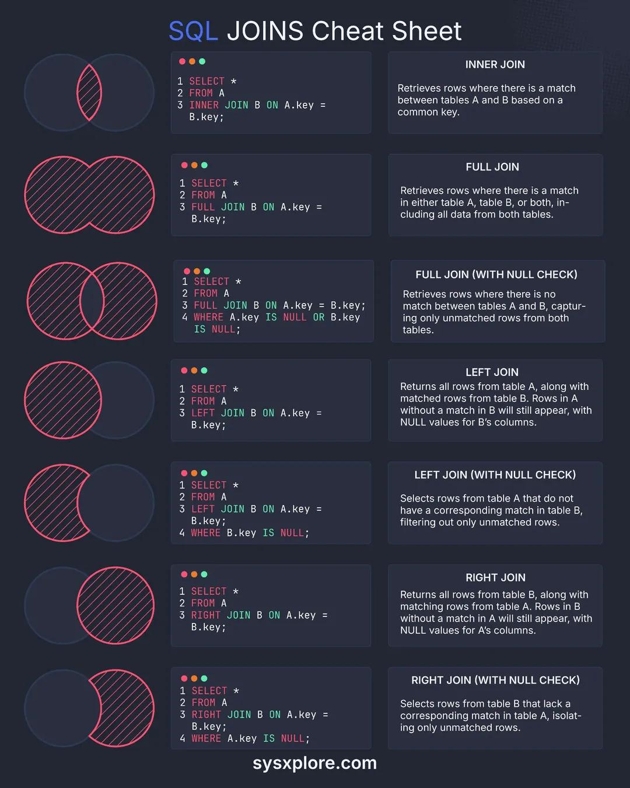

**Source:** [https://twitter.com/i/web/status/1878513153492877751](https://twitter.com/i/web/status/1878513153492877751)
**Original Post Date:** 2025-05-27 17:26:58

# SQL Joins Cheat Sheet: Mastering Join Operations for Database Queries

## Introduction
Database joins are fundamental operations in retrieving related data across multiple tables. Understanding the different join types is crucial for efficient query writing and data analysis. This cheat sheet provides a visual and practical reference for mastering INNER JOINs, OUTER JOINs (LEFT/RIGHT), and FULL JOINs with real-world syntax examples and behavior explanations.

## INNER JOIN

Retrieves only matching rows between two tables based on a specified condition. It's the most commonly used join type when you need exact matches across related data.

_Returns only rows where keys exist in both tables_

```sql
SELECT * FROM A INNER JOIN B ON A.key = B.key;
```

> **Note/Tip:** Use when you need complete matches between tables

> **Note/Tip:** Most performant join type for filtering related data

## OUTER JOINS

LEFT JOIN returns all records from the left table and matching records from the right. RIGHT JOIN is the reverse. FULL OUTER JOIN combines both behaviors.

_Retrieves all rows from table A, with matching rows from B_

```sql
SELECT * FROM A LEFT JOIN B ON A.key = B.key;
```

_Retrieves all rows from table B, with matching rows from A_

```sql
SELECT * FROM A RIGHT JOIN B ON A.key = B.key;
```

- Use LEFT JOIN when you need all records from the primary table
- RIGHT JOIN is less common but useful for data analysis

## FULL OUTER JOIN

Combines results of both left and right joins, showing all rows from both tables with matching where possible.

_Includes unmatched records from both tables_

```sql
SELECT * FROM A FULL JOIN B ON A.key = B.key;
```

> **Note/Tip:** Useful for data quality checks

> **Note/Tip:** Most resource-intensive join type

## Key Takeaways

- INNER JOIN is the default choice for exact matches
- LEFT/RIGHT JOINs handle partial matches by preserving unmatched rows from respective tables
- FULL OUTER JOIN provides complete view but with highest performance cost
- NULL checks can be added to isolate unmatched records

## Conclusion
Understanding join types enables precise control over data retrieval and manipulation. Selecting the appropriate join ensures optimal query performance while achieving desired results.

## External References

- [SQL Joins Cheat Sheet Source](https://sysxplore.com/sql-joins-cheat-sheet)


## Media

**Image Description:** ### Description of the Image

The image is a **SQL Joins Cheat Sheet** designed to provide a concise overview of various SQL JOIN operations. The layout is clean and organized, with a dark background and colorful elements to highlight different sections. The main subject of the image is the explanation and syntax of SQL JOIN types, accompanied by Venn diagram-like visual representations for each type of join.

#### **Header**
- The title at the top reads: **"SQL JOINS Cheat Sheet"** in bold white text.
- The website attribution at the bottom reads: **"sysxplore.com"** in white text.

#### **Sections**
The image is divided into **seven sections**, each corresponding to a different type of SQL JOIN. Each section includes:
1. **A Venn diagram-like visual representation** of the join type.
2. **SQL query syntax** for the join.
3. **A brief explanation** of the join type and its behavior.

Below is a detailed breakdown of each section:

---

### **1. INNER JOIN**
- **Visual Representation**: Two overlapping circles, with the overlapping area shaded in red, indicating the matched rows.
- **SQL Syntax**:
  ```sql
  SELECT *
  FROM A
  INNER JOIN B ON A.key = B.key;
  ```
- **Explanation**: Retrieves rows where there is a match between tables A and B based on a common key.

---

### **2. FULL JOIN**
- **Visual Representation**: Two overlapping circles, with both circles and the overlapping area shaded in red, indicating all rows from both tables.
- **SQL Syntax**:
  ```sql
  SELECT *
  FROM A
  FULL JOIN B ON A.key = B.key;
  ```
- **Explanation**: Retrieves rows where there is a match in either table A, table B, or both, including all data from both tables.

---

### **3. FULL JOIN (WITH NULL CHECK)**
- **Visual Representation**: Two overlapping circles, with the non-overlapping parts of both circles shaded in red, indicating unmatched rows.
- **SQL Syntax**:
  ```sql
  SELECT *
  FROM A
  FULL JOIN B ON A.key = B.key
  WHERE A.key IS NULL OR B.key IS NULL;
  ```
- **Explanation**: Retrieves rows where there is no match between tables A and B, capturing only unmatched rows from both tables.

---

### **4. LEFT JOIN**
- **Visual Representation**: Two overlapping circles, with the entire left circle shaded in red, indicating all rows from table A, including unmatched rows.
- **SQL Syntax**:
  ```sql
  SELECT *
  FROM A
  LEFT JOIN B ON A.key = B.key;
  ```
- **Explanation**: Returns all rows from table A, along with matched rows from table B. Rows in A without a match in B will still appear, with NULL values for B's columns.

---

### **5. LEFT JOIN (WITH NULL CHECK)**
- **Visual Representation**: Two overlapping circles, with the non-overlapping part of the left circle shaded in red, indicating unmatched rows from table A.
- **SQL Syntax**:
  ```sql
  SELECT *
  FROM A
  LEFT JOIN B ON A.key = B.key
  WHERE B.key IS NULL;
  ```
- **Explanation**: Selects rows from table A that do not have a corresponding match in table B, filtering out only unmatched rows.

---

### **6. RIGHT JOIN**
- **Visual Representation**: Two overlapping circles, with the entire right circle shaded in red, indicating all rows from table B, including unmatched rows.
- **SQL Syntax**:
  ```sql
  SELECT *
  FROM A
  RIGHT JOIN B ON A.key = B.key;
  ```
- **Explanation**: Returns all rows from table B, along with matching rows from table A. Rows in B without a match in A will still appear, with NULL values for A's columns.

---

### **7. RIGHT JOIN (WITH NULL CHECK)**
- **Visual Representation**: Two overlapping circles, with the non-overlapping part of the right circle shaded in red, indicating unmatched rows from table B.
- **SQL Syntax**:
  ```sql
  SELECT *
  FROM A
  RIGHT JOIN B ON A.key = B.key
  WHERE A.key IS NULL;
  ```
- **Explanation**: Selects rows from table B that lack a corresponding match in table A, isolating only unmatched rows.

---

### **Design Elements**
- **Color Scheme**:
  - The background is dark (black or dark gray).
  - The text is primarily white, making it highly readable.
  - Key elements (e.g., SQL syntax, Venn diagrams) are highlighted with red and blue colors for emphasis.
- **Venn Diagrams**: Each join type is visually represented using overlapping circles, with shaded areas indicating the rows retrieved by the join.
- **Syntax Highlighting**: The SQL syntax is color-coded:
  - Keywords (e.g., `SELECT`, `FROM`, `JOIN`) are in green.
  - Table names (`A`, `B`) are in blue.
  - Column names (`A.key`, `B.key`) are in red.
  - Conditions (e.g., `IS NULL`) are in red.

---

### **Overall Structure**
The image is well-organized, with each section clearly separated and visually distinct. The combination of visual aids (Venn diagrams) and concise explanations makes it an effective reference for understanding SQL JOIN operations.

---

### **Summary**
This SQL Joins Cheat Sheet is a comprehensive and visually appealing resource for developers and database professionals. It effectively explains seven different types of SQL JOINs using a combination of Venn diagrams, SQL syntax, and clear explanations. The use of color and structure enhances readability and makes it easy to understand the behavior of each join type.
