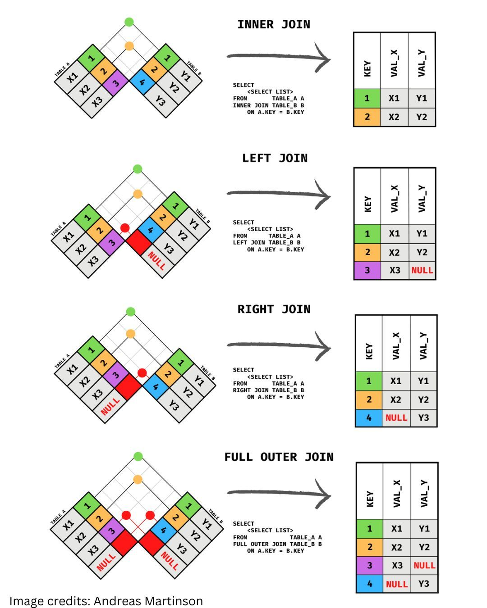

**Source:** [https://twitter.com/i/web/status/1867871911637557685](https://twitter.com/i/web/status/1867871911637557685)
**Original Post Date:** 2025-05-28 06:15:17

# Understanding SQL Join Operations: A Comprehensive Guide to INNER, LEFT, RIGHT, and FULL OUTER JOINS

## Introduction
SQL joins are fundamental operations in relational databases that combine data from multiple tables. Understanding different join types is crucial for efficient querying and data manipulation. This article provides a detailed exploration of INNER JOIN, LEFT JOIN, RIGHT JOIN, and FULL OUTER JOIN, using visual diagrams and concrete examples to illustrate their behavior and practical applications.

## Inner Join

INNER JOIN returns only the rows that have matching values in both tables. It eliminates non-matching rows from the result set.

The join condition is typically specified using an ON clause, comparing a common column between the two tables.

_This query retrieves matching rows from both tables based on the KEY column_

```sql
SELECT * FROM TABLE_A A
INNER JOIN TABLE_B B ON A.KEY = B.KEY;
```

- Matching rows only included in result set
- Excludes unmatched rows from both tables

> **Note/Tip:** Use INNER JOIN when you need complete matches between tables

## Left Join

LEFT JOIN returns all records from the left table and matching records from the right table.

When no match is found in the right table, NULL values are returned for those columns.

_This query returns all records from TABLE_A and matching records from TABLE_B_

```sql
SELECT * FROM TABLE_A A
LEFT JOIN TABLE_B B ON A.KEY = B.KEY;
```

## Right Join

RIGHT JOIN returns all records from the right table and matching records from the left table.

Non-matching rows from the left table appear with NULL values.

_This query returns all records from TABLE_B and matching records from TABLE_A_

```sql
SELECT * FROM TABLE_A A
RIGHT JOIN TABLE_B B ON A.KEY = B.KEY;
```

## Full Outer Join

FULL OUTER JOIN returns all records when there is a match in either left or right table.

Non-matching rows from both tables are included with NULL values for missing columns.

_This query returns all records from both tables, including non-matches_

```sql
SELECT * FROM TABLE_A A
FULL OUTER JOIN TABLE_B B ON A.KEY = B.KEY;
```

## Color Coding and Visual Representation

Visual diagrams use color coding to represent join operations:

Green indicates matching rows between tables.

Red highlights non-matching rows.

Gray shows background or non-relevant areas in the Venn diagram.

- Matching rows (Green) - Present in both tables
- Non-matching rows (Red) - Exclusive to one table
- Background areas (Gray) - Non-relevant portions

## Key Takeaways

- INNER JOIN returns only complete matches between two tables
- LEFT/RIGHT JOINs preserve all records from their respective sides, adding NULL for non-matches
- FULL OUTER JOIN combines all records from both tables, handling non-matches appropriately

## Conclusion
Understanding these join types is essential for effective database querying. By mastering INNER, LEFT, RIGHT, and FULL OUTER joins, developers can create precise queries that accurately combine data across multiple tables while maintaining data integrity.

## External References

- [Original Visual Explanation](#)


## Media

**Image Description:** This image is a detailed visual explanation of different types of SQL joins, specifically focusing on **INNER JOIN**, **LEFT JOIN**, **RIGHT JOIN**, and **FULL OUTER JOIN**. The image uses a combination of diagrams, SQL queries, and result tables to illustrate how these joins work. Below is a detailed breakdown:

---

### **1. General Layout**
The image is divided into four sections, each representing a different type of join. Each section contains:
- A **Venn diagram-like visualization** of two tables (`TABLE_A` and `TABLE_B`) with colored cells indicating matching and non-matching rows.
- An **SQL query** demonstrating how to perform the join.
- A **result table** showing the output of the join operation.

---

### **2. Key Components**
#### **Tables (`TABLE_A` and `TABLE_B`)**:
- **`TABLE_A`**:
  - Columns: `KEY`, `VAL_X`.
  - Rows: `(1, X1)`, `(2, X2)`, `(3, X3)`.
- **`TABLE_B`**:
  - Columns: `KEY`, `VAL_Y`.
  - Rows: `(1, Y1)`, `(2, Y2)`, `(3, Y3)`, `(4, Y3)`.

#### **Matching Logic**:
- The `KEY` column is used as the join condition (`ON A.KEY = B.KEY`).
- Matching rows are highlighted in the Venn diagram, while non-matching rows are shown in red or gray.

#### **Result Tables**:
- The result tables show the combined columns (`KEY`, `VAL_X`, `VAL_Y`) based on the type of join performed.

---

### **3. Detailed Breakdown of Each Join Type**

#### **(a) INNER JOIN**
- **Visualization**:
  - The Venn diagram shows overlapping regions in green, indicating matching rows between `TABLE_A` and `TABLE_B`.
  - Non-matching rows in both tables are grayed out.
- **SQL Query**:
  ```sql
  SELECT <SELECT LIST>
  FROM TABLE_A A
  INNER JOIN TABLE_B B
  ON A.KEY = B.KEY;
  ```
- **Result Table**:
  - Only rows with matching `KEY` values are included.
  - Rows: `(1, X1, Y1)`, `(2, X2, Y2)`, `(3, X3, Y3)`.

#### **(b) LEFT JOIN**
- **Visualization**:
  - The Venn diagram shows all rows from `TABLE_A` (left side) and matching rows from `TABLE_B`.
  - Non-matching rows in `TABLE_B` are shown in red.
- **SQL Query**:
  ```sql
  SELECT <SELECT LIST>
  FROM TABLE_A A
  LEFT JOIN TABLE_B B
  ON A.KEY = B.KEY;
  ```
- **Result Table**:
  - All rows from `TABLE_A` are included, with `NULL` values for `VAL_Y` where there is no match in `TABLE_B`.
  - Rows: `(1, X1, Y1)`, `(2, X2, Y2)`, `(3, X3, NULL)`.

#### **(c) RIGHT JOIN**
- **Visualization**:
  - The Venn diagram shows all rows from `TABLE_B` (right side) and matching rows from `TABLE_A`.
  - Non-matching rows in `TABLE_A` are shown in red.
- **SQL Query**:
  ```sql
  SELECT <SELECT LIST>
  FROM TABLE_A A
  RIGHT JOIN TABLE_B B
  ON A.KEY = B.KEY;
  ```
- **Result Table**:
  - All rows from `TABLE_B` are included, with `NULL` values for `VAL_X` where there is no match in `TABLE_A`.
  - Rows: `(1, X1, Y1)`, `(2, X2, Y2)`, `(3, X3, Y3)`, `(4, NULL, Y3)`.

#### **(d) FULL OUTER JOIN**
- **Visualization**:
  - The Venn diagram shows all rows from both `TABLE_A` and `TABLE_B`, with matching rows in green and non-matching rows in red.
- **SQL Query**:
  ```sql
  SELECT <SELECT LIST>
  FROM TABLE_A A
  FULL OUTER JOIN TABLE_B B
  ON A.KEY = B.KEY;
  ```
- **Result Table**:
  - All rows from both tables are included, with `NULL` values for unmatched columns.
  - Rows: `(1, X1, Y1)`, `(2, X2, Y2)`, `(3, X3, Y3)`, `(4, NULL, Y3)`.

---

### **4. Color Coding**
- **Green**: Matching rows between `TABLE_A` and `TABLE_B`.
- **Red**: Non-matching rows in either table.
- **Gray**: Background or non-relevant areas in the Venn diagram.

---

### **5. Summary**
The image effectively uses visual aids and SQL queries to explain how different join types work:
- **INNER JOIN**: Only matching rows.
- **LEFT JOIN**: All rows from the left table, with `NULL` for unmatched right-side columns.
- **RIGHT JOIN**: All rows from the right table, with `NULL` for unmatched left-side columns.
- **FULL OUTER JOIN**: All rows from both tables, with `NULL` for unmatched columns.

This visual representation is highly useful for understanding the behavior of SQL joins in database queries. 

---

### **Image Credits**
The image credits are attributed to **Andreas Martinsson** at the bottom of the image. 

---

This detailed explanation should provide a clear understanding of the image and its technical content.
